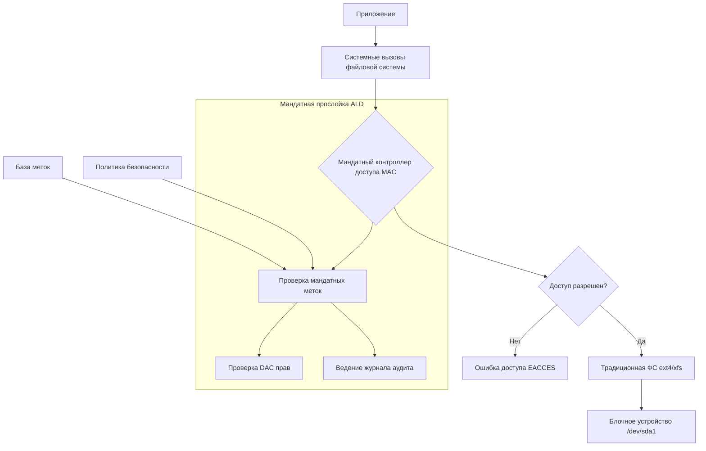
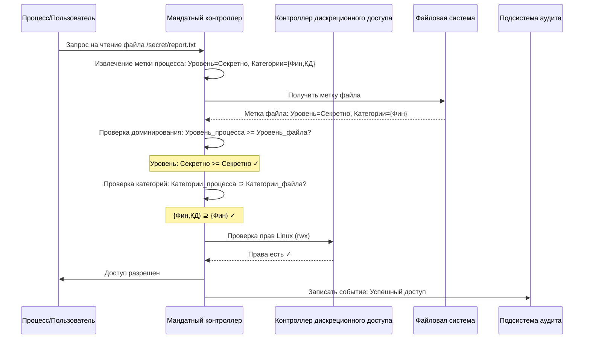
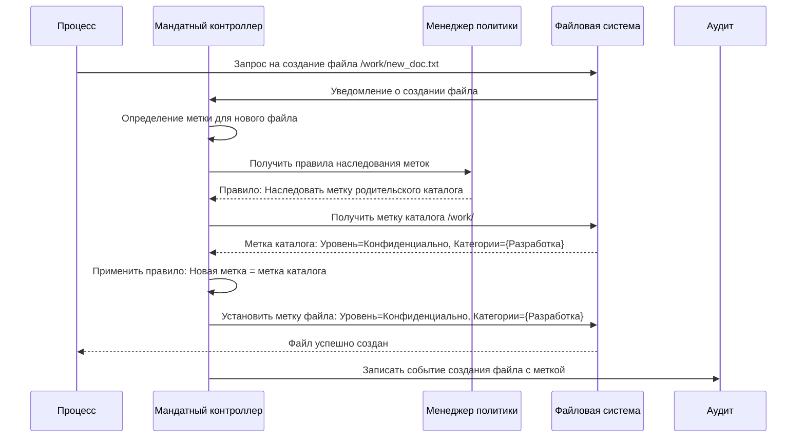
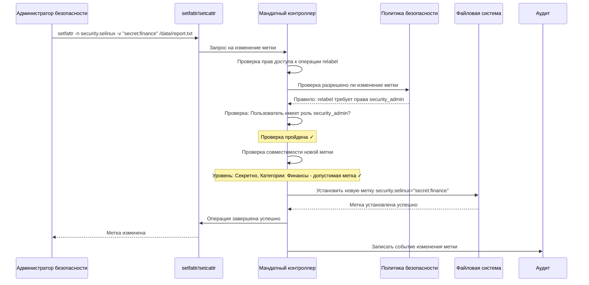
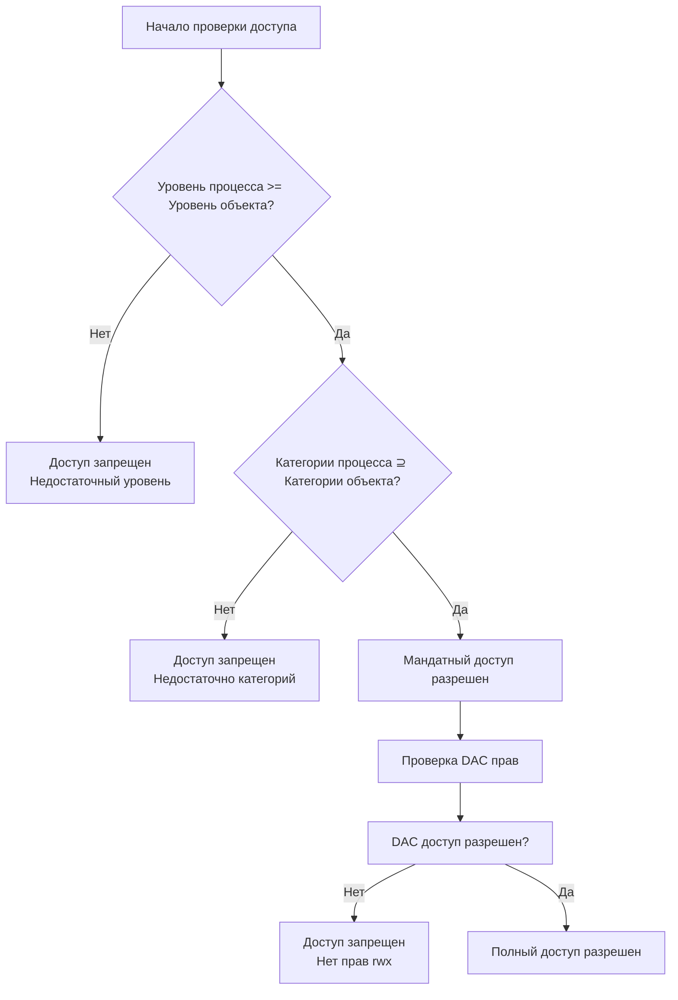

### **ALD (Advanced Linux Defense): Обзор**

#### **1. Установка, настройка, работа в среде с мандатным разграничением**

**Философия и принцип работы**

Представьте, что ваша операционная система — это правительство, а файлы и программы — это документы и министерства. В обычной системе права доступа определяются по принципу «кто есть кто» (дискреционный контроль): если вы «министр» (пользователь root), вы можете делать что угодно. ALD вводит более сложную и безопасную систему, похожую на реальные государственные институты — **мандатное управление**.

Здесь каждый субъект (пользователь, процесс) и каждый объект (файл, сокет, папка) получают специальные **метки безопасности**. Эти метки имеют иерархическую структуру (например, «Секретно», «Совершенно секретно») и категории («Финансы», «Разработка», «Кадры»).

**Процесс установки и настройки**

1.  **Установка «поверх» ОС:** ALD не является самостоятельной операционной системой. Это набор патчей и инструментов, которые **интегрируются в ядро стандартного Linux-дистрибутива** (например, Astra Linux, RED OS, ALT Linux). Представьте, что вы устанавливаете официальное дополнение к законодательству, которое меняет все правила безопасности в стране.

2.  **Настройка политики безопасности (ПБ):** Это самый сложный и ответственный этап. Администратор безопасности определяет:
    *   **Иерархию уровней конфиденциальности:** Например, `0: Общедоступно < 1: Конфиденциально < 2: Секретно`.
    *   **Набор категорий (неиерархических меток):** Например, «Бухгалтерия», «НИОКР», «Отдел кадров».
    *   **Правила доступа:** Как субъекты с определенными метками могут взаимодействовать с объектами с другими метками.

    Настройка происходит через специализированные утилиты, где администратор «рисует» матрицу доступа, прописывая, кто, к чему и при каких условиях имеет доступ.

3.  **Работа в среде с МРД:**
    *   **Для пользователя:** При входе в систему пользователю присваивается определенная метка безопасности (например, `Уровень: Конфиденциально, Категории: Бухгалтерия, Финансы`). Вся его работа в системе — открытие файлов, запуск программ, отправка данных в сеть — будет ограничена этой меткой.
    *   **«Принцип нужного знать» (Need to Know):** Пользователь с меткой «Бухгалтерия» не сможет прочитать файл, помеченный меткой «НИОКР», даже если права доступа в классическом понимании (rwx) ему это формально разрешают. Система сначала проверяет мандатную метку, и только потом — классические права.
    *   **Изоляция:** Если в системе работает вредоносная программа, она будет ограничена меткой безопасности пользователя, который ее запустил. Она не сможет прочитать конфиденциальные документы с более высоким уровнем секретности или из других отделов.

#### **2. Особенности, недостатки и перспективы развития**

**Особенности и сильные стороны**

1.  **Гарантированное предотвращение утечек:** Это главная особенность. ALD защищает информацию даже от администратора системы. Админ может иметь все технические права (root), но не сможет прочитать файл с более высоким уровнем секретности без наличия соответствующей мандатной метки.
2.  **Соответствие требованиям регуляторов:** Решение изначально создано для выполнения строгих требований российских стандартов (ФСТЭК, ФСБ) и защиты конфиденциальной информации, особенно в государственных структурах и на объектах КИИ.
3.  **Изоляция сессий:** На одном рабочем месте можно одновременно работать с несколькими сессиями, имеющими разные уровни доступа. Например, в одной вкладке терминала работать с данными «Для служебного пользования», а в другой — с «Секретными» данными, без риска смешивания.
4.  **Аудит и протоколирование:** Система ведет детальный журнал всех событий безопасности, включая попытки нарушения мандатной политики. Это необходимо для расследования инцидентов и соответствия законодательству.

**Недостатки и сложности**

1.  **Высокая сложность администрирования:** Настройка и поддержание политики безопасности требуют глубоких знаний и тщательного планирования. Ошибка в настройке ПБ может либо заблокировать легитимные бизнес-процессы, либо создать «дыру» в безопасности.
2.  **Накладные расходы:** Постоянная проверка мандатных меток для каждой операции ввода-вывода создает дополнительную нагрузку на систему, что может незначительно снизить производительность.
3.  **Сложность интеграции:** Не все стороннее программное обеспечение (особенно западное) корректно работает в условиях мандатного контроля. Требуется его дополнительная сертификация и адаптация.
4.  **«Человеческий фактор» политики:** Безопасность системы напрямую зависит от качества разработанной политики безопасности. Неправильно настроенная ПБ бесполезна или вредна.

**Перспективы развития**

1.  **Интеграция с облачными технологиями:** Один из ключевых векторов — распространение принципов мандатного контроля на виртуализированные и облачные среды. Это позволит строить защищенные частные и гибридные облака, соответствующие требованиям российского законодательства.
2.  **Развитие инструментов управления:** Упрощение процессов администрирования за счет создания более дружелюбных и автоматизированных систем управления политиками безопасности, включая графические конструкторы ПБ.
3.  **Расширение поддержки аппаратных технологий:** Более тесная интеграция с аппаратными механизмами безопасности современных процессоров (например, Intel SGX, TrustZone) для создания более надежных и производительных решений.
4.  **Адаптация под Zero Trust:** Принципы ALD органично вписываются в современную архитектуру безопасности **Zero Trust** («Никому не доверяй, проверяй все»). Мандатные метки становятся идеальным инструментом для реализации строгого контекстного доступа в Zero Trust-средах.
5.  **Развитие для Интернета Вещей (IoT):** Адаптация легковесных версий МРД для защиты критической инфраструктуры и промышленных систем управления (АСУ ТП), где количество устройств огромно, а риски крайне высоки.

**Итог:**

ALD — это не просто «программа», это **архитектурный подход к безопасности**, перестраивающий саму основу операционной системы. Он обеспечивает максимальный уровень защиты для работы с информацией, представляющей государственную, коммерческую и иную тайну, ценой повышенной сложности администрирования. Его развитие напрямую связано с цифровым суверенитетом и необходимостью создания защищенных отечественных ИТ-решений.

### **Организация файловой системы в ALD с мандатным управлением**

## **1. Архитектура файловой системы ALD**

В ALD файловая система работает по принципу **"мандатной прослойки"** между ядром ОС и традиционной файловой системой (ext4, xfs).



**Ключевые компоненты:**
- **Мандатные метки** хранятся как расширенные атрибуты файлов (xattr)
- **Политика безопасности** загружается в ядро при старте системы
- **Контроллер доступа** проверяет каждую операцию с файлом

## **2. Алгоритм мандатного управления доступом**

### **2.1. Последовательность проверки доступа к файлу**



### **2.2. Алгоритм создания нового файла**



### **2.3. Алгоритм изменения мандатной метки**



## **3. Иерархия мандатных меток в ALD**

### **3.1. Структура метки безопасности**

```
Метка = Уровень_конфиденциальности : Набор_категорий

Примеры:
s0::c0,c2          # Уровень 0, категории 0 и 2
s2:c1,c3,c5        # Уровень 2, категории 1,3,5
s4:allcategories    # Уровень 4, все категории
```

### **3.2. Алгоритм проверки доминирования меток**



## **4. Особенности реализации в ALD**

**1. Хранение меток:**
- Метки хранятся как расширенные атрибуты файловой системы
- Для каждого файла/каталога: `security.selinux`, `security.ald`
- Метки кэшируются в памяти для производительности

**2. Производительность:**
- Проверки доступа происходят на уровне VFS (Virtual File System)
- Используется кэширование решений по доступу
- Минимизация накладных расходов через оптимизацию алгоритмов

**3. Аудит и мониторинг:**
- Все попытки нарушения мандатной политики логируются
- Ведутся журналы изменения меток
- Мониторинг целостности меток

**4. Совместимость:**
- Обратная совместимость с традиционными правами Linux
- Постепенное внедрение мандатного контроля
- Возможность работы в смешанном режиме

