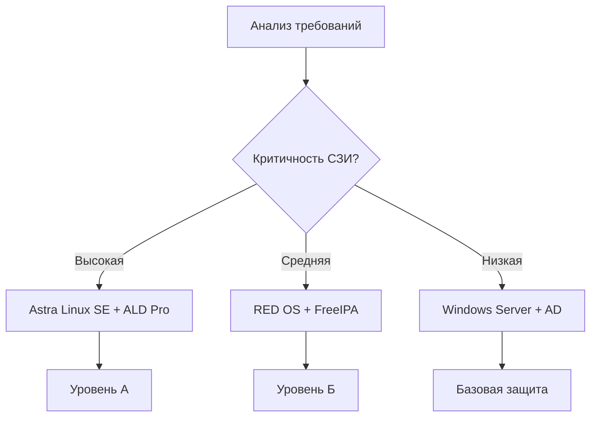
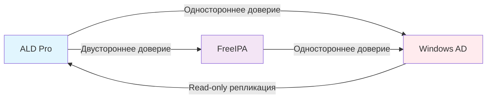

# Практическое руководство по проектированию корпоративной архитектуры с интеграцией FreeIPA, ALD, Samba DC и Microsoft AD

## 1. Анализ бизнес-требований и нормативных ограничений

### Требования регуляторов для российской компании
```yaml
# Обязательные требования
ФСТЭК:
  - Сертификация СЗИ: ✅ Обязательно
  - Мандатный контроль: ✅ Уровень А
  - Аудит действий: ✅ Полный мониторинг
  - Криптография: ✅ ГОСТ-2012

ФСБ:
  - Шифрование трафика: ✅ TLS 1.2+
  - Аутентификация: ✅ Многофакторная
  - Управление ключами: ✅ Криптопровайдер

Роскомнадзор:
  - Локализация данных: ✅ Российские сервера
  - Резервное копирование: ✅ Геораспределение
```

### Матрица выбора доменной технологии


## 2. Проектирование эталонной архитектуры

### Физическая схема развертывания
```bash
# Директория проекта
corp-domain-architecture/
├── network/
│   ├── vlans.conf           # Конфигурация VLAN
│   ├── firewall-rules.conf  # Правила межсетевого экрана
│   └── dns-zones.conf       # DNS зоны
├── domains/
│   ├── ald/                 # ALD Pro домен
│   ├── freeipa/             # FreeIPA домен  
│   ├── samba/               # Samba DC домен
│   └── windows/             # Windows AD домен
└── migration/
    ├── users-mapping.csv    # Соответствие пользователей
    ├── groups-mapping.csv   # Соответствие групп
    └── policies-mapping.xml # Конвертация политик
```

### Сетевые настройки для каждого домена
```yaml
# ALD Pro домен (Высокая безопасность)
ald.corp.local:
  network: "192.168.10.0/24"
  dc_primary: "192.168.10.10"
  dc_secondary: "192.168.10.11"
  dns: ["192.168.10.10", "192.168.10.11"]
  gateway: "192.168.10.1"
  vlan: 110

# FreeIPA домен (Стандартная безопасность)  
freeipa.corp.local:
  network: "192.168.20.0/24"
  servers: ["192.168.20.10", "192.168.20.11"]
  dns: ["192.168.20.10", "192.168.20.11"]
  gateway: "192.168.20.1"
  vlan: 120

# Samba DC домен (Совместимость)
samba.corp.local:
  network: "192.168.30.0/24"
  dc_primary: "192.168.30.10"
  dns: ["192.168.30.10"]
  gateway: "192.168.30.1"
  vlan: 130

# Windows AD домен (Легаси)
windows.corp.local:
  network: "192.168.40.0/24"
  dc_primary: "192.168.40.10"
  dc_secondary: "192.168.40.11"
  dns: ["192.168.40.10", "192.168.40.11"]
  gateway: "192.168.40.1"
  vlan: 140
```

## 3. Поэтапное развертывание доменов

### Этап 1: Развертывание ALD Pro на Astra Linux SE
```bash
#!/bin/bash
# deploy-ald-primary.sh

# Предварительная настройка Astra Linux SE
echo "=== Настройка Astra Linux SE ==="

# Проверка уровня безопасности
astra-mac-admin status
astra-secure-setup --level=5

# Установка ALD Pro
apt update && apt install -y ald-server ald-admin-center

# Настройка сети
hostnamectl set-hostname ald-dc01.ald.corp.local

cat > /etc/network/interfaces << EOF
auto eth0
iface eth0 inet static
    address 192.168.10.10
    netmask 255.255.255.0
    gateway 192.168.10.1
    dns-nameservers 192.168.10.10
    dns-search ald.corp.local
EOF

# Инициализация домена ALD
ald-server-init --domain=ald.corp.local \
    --admin-password='SecurePass123!' \
    --dns-forwarder=8.8.8.8 \
    --netbios-name=ALDCORP \
    --auto-config
```

### Этап 2: Настройка мандатного контроля
```bash
#!/bin/bash
# configure-mandatory-control.sh

# Настройка уровней целостности
echo "=== Конфигурация мандатного контроля ==="

# Создание уровней целостности
astra-mac-admin level add --name=secret --value=300
astra-mac-admin level add --name=confidential --value=200  
astra-mac-admin level add --name=public --value=100

# Назначение уровней категориям пользователей
astra-mac-admin user level set --user=admin --level=secret
astra-mac-admin user level set --group=managers --level=confidential
astra-mac-admin user level set --group=users --level=public

# Активация аудита
astra-audit-admin enable --category=all
systemctl enable auditd
systemctl start auditd
```

### Этап 3: Развертывание FreeIPA
```bash
#!/bin/bash
# deploy-freeipa.sh

# Установка FreeIPA на RED OS 8
dnf install -y freeipa-server freeipa-server-dns freeipa-admintools

# Настройка домена
ipa-server-install --domain=freeipa.corp.local \
    --realm=FREEIPA.CORP.LOCAL \
    --ds-password='SecureDS123!' \
    --admin-password='SecureAdmin123!' \
    --hostname=ipa01.freeipa.corp.local \
    --ip-address=192.168.20.10 \
    --setup-dns --auto-reverse \
    --forwarder=8.8.8.8 \
    --unattended

# Настройка доверия к ALD
ipa trust-add --type=ad ald.corp.local \
    --admin Administrator \
    --password='SecurePass123!'
```

## 4. Интеграция доменных служб

### Схема доверительных отношений


### Настройка синхронизации пользователей
```python
#!/usr/bin/env python3
# user-sync-engine.py

import ldap
from ldap3 import Server, Connection, ALL
import csv
from datetime import datetime

class UserSyncEngine:
    def __init__(self):
        self.ald_conn = self.connect_ald()
        self.freeipa_conn = self.connect_freeipa()
        self.ad_conn = self.connect_ad()
    
    def connect_ald(self):
        """Подключение к ALD Pro"""
        server = Server('192.168.10.10', use_ssl=True, get_info=ALL)
        return Connection(server, 'cn=admin,dc=ald,dc=corp,dc=local', 
                         'SecurePass123!', auto_bind=True)
    
    def sync_users_from_ad(self):
        """Синхронизация пользователей из AD"""
        ad_users = self.get_ad_users()
        
        for user in ad_users:
            if self.user_meets_policy(user):
                ald_user = self.transform_user_attributes(user)
                self.create_ald_user(ald_user)
                
    def transform_user_attributes(self, ad_user):
        """Трансформация атрибутов пользователя"""
        return {
            'cn': ad_user['displayName'],
            'uid': ad_user['sAMAccountName'],
            'mail': ad_user['mail'],
            'userPassword': self.generate_temp_password(),
            'loginShell': '/bin/bash',
            'uidNumber': self.get_next_uid(),
            'gidNumber': 10000,
            'macLevel': self.calculate_mac_level(ad_user)
        }
```

## 5. Миграционная стратегия

### План миграции по фазам
```yaml
# Фаза 1: Подготовка (1-2 недели)
phase_1:
  tasks:
    - inventory_existing_ad: "Инвентаризация AD"
    - design_ald_structure: "Проектирование ALD"
    - deploy_test_environment: "Тестовый стенд"
    - backup_existing_data: "Резервное копирование"

# Фаза 2: Пилотная миграция (2-3 недели)  
phase_2:
  tasks:
    - migrate_test_ou: "Миграция тестового подразделения"
    - configure_trust: "Настройка доверительных отношений"
    - test_authentication: "Тестирование аутентификации"
    - user_training: "Обучение пользователей"

# Фаза 3: Поэтапная миграция (1-3 месяца)
phase_3:
  tasks:
    - migrate_department_it: "ИТ отдел"
    - migrate_department_hr: "Отдел кадров" 
    - migrate_department_finance: "Финансовый отдел"
    - migrate_remaining_users: "Остальные пользователи"

# Фаза 4: Завершение (1-2 недели)
phase_4:
  tasks:
    - decommission_old_dc: "Вывод старых DC"
    - update_dns: "Обновление DNS"
    - final_testing: "Финальное тестирование"
    - documentation: "Документирование"
```

### Скрипт миграции пользователей
```bash
#!/bin/bash
# migrate-user-batch.sh

BATCH_SIZE=50
LOG_FILE="/var/log/migration/migration_$(date +%Y%m%d).log"

log_message() {
    echo "$(date): $1" >> $LOG_FILE
}

migrate_user() {
    local username=$1
    local source_domain=$2
    
    log_message "Начало миграции пользователя: $username из $source_domain"
    
    # Экспорт данных из источника
    case $source_domain in
        "windows")
            user_data=$(export_user_from_ad "$username")
            ;;
        "freeipa") 
            user_data=$(export_user_from_freeipa "$username")
            ;;
    esac
    
    # Трансформация данных
    ald_user_data=$(transform_user_data "$user_data")
    
    # Импорт в ALD
    if import_user_to_ald "$ald_user_data"; then
        log_message "Успешная миграция пользователя: $username"
        return 0
    else
        log_message "Ошибка миграции пользователя: $username"
        return 1
    fi
}

# Основной цикл миграции
while read -r user domain; do
    migrate_user "$user" "$domain" &
    
    # Ограничение параллельных миграций
    while [ $(jobs -r | wc -l) -ge $BATCH_SIZE ]; do
        sleep 1
    done
done < users_to_migrate.list

wait
log_message "Миграция завершена"
```

## 6. Мониторинг и управление

### Дашборд мониторинга доменных служб
```python
#!/usr/bin/env python3
# domain-monitoring-dashboard.py

from prometheus_client import start_http_server, Gauge, Counter
import requests
import json

class DomainServicesMonitor:
    def __init__(self):
        self.ald_health = Gauge('ald_health', 'ALD Pro Health Status')
        self.freeipa_health = Gauge('freeipa_health', 'FreeIPA Health Status') 
        self.ad_health = Gauge('ad_health', 'AD Health Status')
        self.trust_health = Gauge('trust_health', 'Trust Relationship Health')
        
    def check_ald_health(self):
        """Проверка здоровья ALD Pro"""
        try:
            response = requests.get('https://192.168.10.10/ald/health', 
                                  verify=False, timeout=5)
            if response.status_code == 200:
                self.ald_health.set(1)
            else:
                self.ald_health.set(0)
        except:
            self.ald_health.set(0)
    
    def check_trust_relationships(self):
        """Проверка доверительных отношений"""
        services = [
            ('ald-freeipa', '192.168.10.10', 'freeipa'),
            ('ald-windows', '192.168.10.10', 'windows')
        ]
        
        for trust_name, server, target in services:
            try:
                # Проверка через LDAP или DNS
                trust_status = self.verify_trust(server, target)
                self.trust_health.labels(trust=trust_name).set(trust_status)
            except Exception as e:
                self.trust_health.labels(trust=trust_name).set(0)

if __name__ == '__main__':
    start_http_server(8000)
    monitor = DomainServicesMonitor()
    
    while True:
        monitor.check_ald_health()
        monitor.check_trust_relationships()
        time.sleep(60)
```

## 7. Безопасность и соответствие требованиям

### Политика безопасности доменной инфраструктуры
```yaml
# Политика паролей
password_policy:
  minimum_length: 12
  complexity: true
  history: 10
  maximum_age: 90
  minimum_age: 1
  lockout_threshold: 5
  lockout_duration: 30

# Мандатный контроль
mandatory_access_control:
  enabled: true
  levels:
    - name: "secret"
      value: 300
      departments: ["руководство", "финансы"]
    - name: "confidential" 
      value: 200
      departments: ["отдел кадров", "юридический"]
    - name: "public"
      value: 100
      departments: ["все"]

# Аудит и мониторинг
audit_policy:
  enabled: true
  retention_days: 365
  monitored_events:
    - user_authentication
    - privilege_escalation  
    - policy_changes
    - object_access
```

## 8. Резервное копирование и аварийное восстановление

### Скрипт резервного копирования
```bash
#!/bin/bash
# domain-backup-script.sh

BACKUP_DIR="/backup/domains/$(date +%Y%m%d)"
RETENTION_DAYS=30

create_backup() {
    local domain=$1
    local server=$2
    
    echo "Создание бэкапа домена: $domain"
    
    case $domain in
        "ald")
            # Бэкап ALD Pro
            ald-server-backup --full --output=$BACKUP_DIR/ald
            ;;
        "freeipa")
            # Бэкап FreeIPA
            ipa-backup --data --full $BACKUP_DIR/freeipa
            ;;
        "windows")
            # Бэкап AD через Windows tools
            scp administrator@$server:'C:\Windows\NTDS\*.edb' $BACKUP_DIR/windows/
            ;;
    esac
}

# Основной процесс бэкапа
mkdir -p $BACKUP_DIR

create_backup "ald" "192.168.10.10"
create_backup "freeipa" "192.168.20.10" 
create_backup "windows" "192.168.40.10"

# Очистка старых бэкапов
find /backup/domains -type d -mtime +$RETENTION_DAYS -exec rm -rf {} \;
```

## 9. Чеклист развертывания

```markdown
# Чеклист завершения проекта

## Предварительные требования
- [ ] Получены все необходимые лицензии
- [ ] Закуплено оборудование
- [ ] Подготовлена серверная комната
- [ ] Настроены сетевые коммутаторы

## Развертывание инфраструктуры  
- [ ] Установлены серверы Astra Linux SE
- [ ] Развернут ALD Pro домен
- [ ] Настроен мандатный контроль
- [ ] Развернут FreeIPA домен
- [ ] Настроены доверительные отношения

## Миграция данных
- [ ] Мигрированы пользователи
- [ ] Мигрированы группы
- [ ] Перенесены групповые политики
- [ ] Настроена синхронизация паролей

## Тестирование
- [ ] Проверена аутентификация
- [ ] Проверен доступ к ресурсам
- [ ] Проверена работа СЗИ
- [ ] Проверено аварийное восстановление

## Документирование
- [ ] Создана архитектурная документация
- [ ] Написаны инструкции для пользователей
- [ ] Созданы регламенты для администраторов
- [ ] Подготовлены отчеты для регуляторов
```

Данное практическое руководство позволяет спроектировать и реализовать комплексную доменную инфраструктуру, соответствующую требованиям российских компаний, с постепенной миграцией на отечественные решения на базе Astra Linux SE.