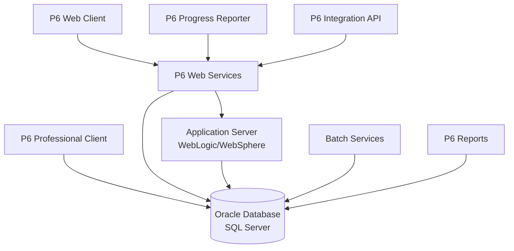
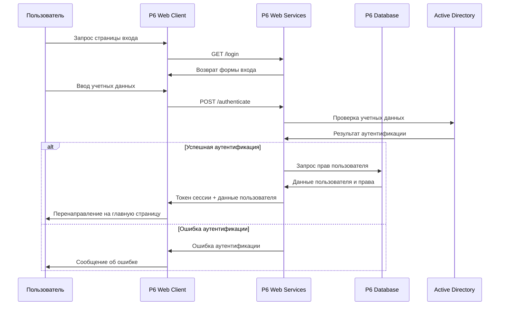
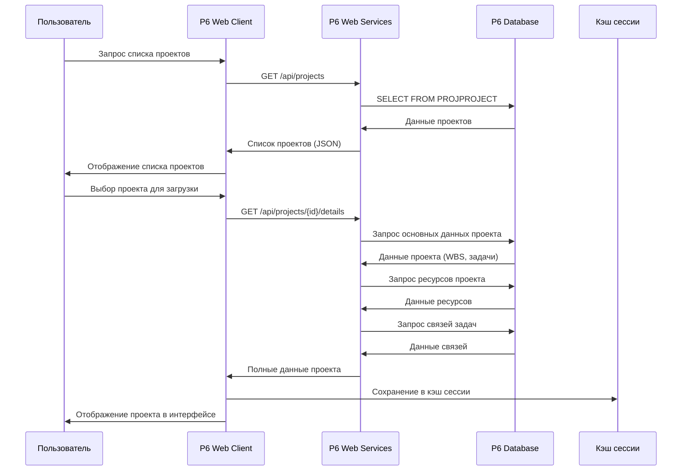
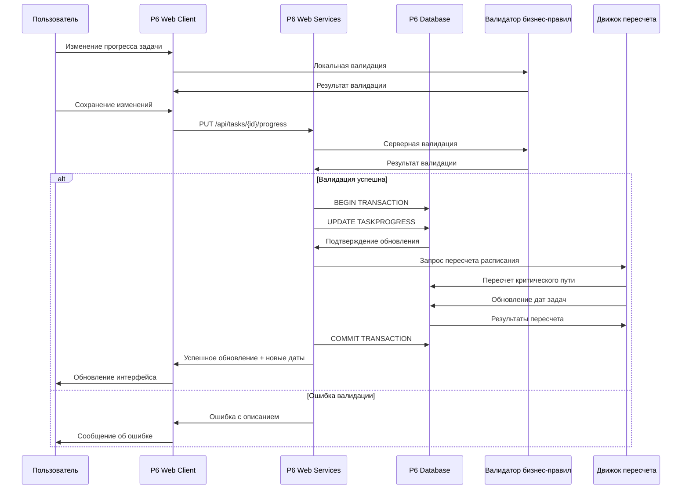
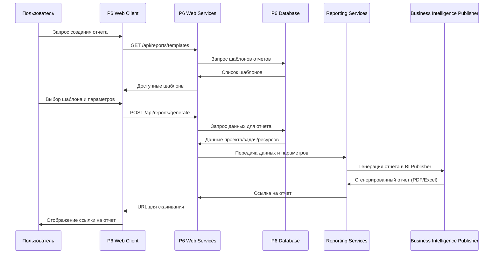
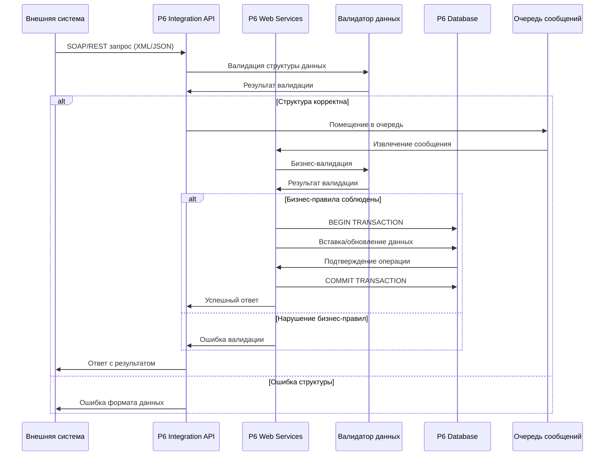
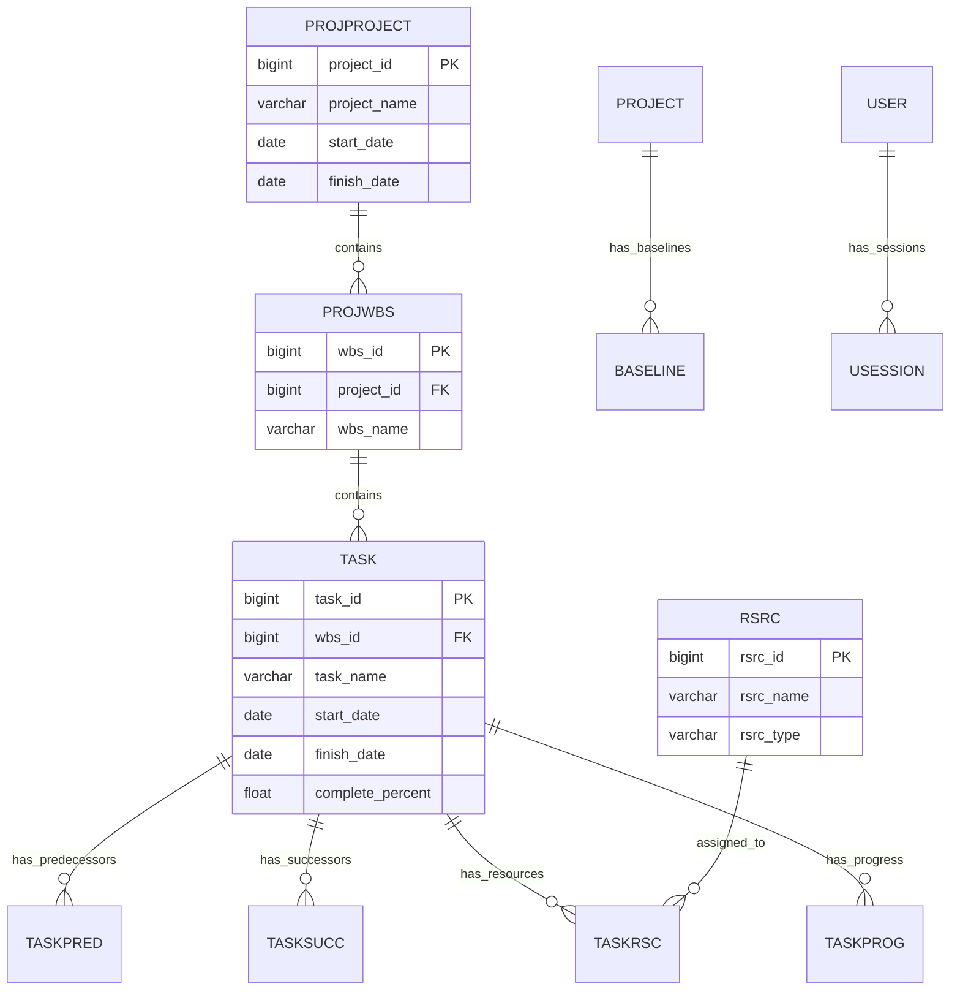

## Архитектура Oracle Primavera P6 EPPM R8.3

### Основные компоненты системы

## Диаграммы последовательности

### 1. Последовательность входа пользователя в систему

### 2. Последовательность загрузки проекта

### 3. Последовательность обновления прогресса задачи

### 4. Последовательность генерации отчета

### 5. Последовательность интеграции с внешними системами

### 6. Архитектура базы данных P6

## Ключевые особенности архитектуры:

1. **Многоуровневая архитектура** с разделением на клиентский, серверный и базу данных уровни
2. **Сервис-ориентированная архитектура** через P6 Web Services
3. **Поддержка различных клиентов**: Web, Professional, Mobile
4. **Интеграция через API** для связи с внешними системами
5. **Сложная бизнес-логика** с валидацией и движком пересчета расписания
6. **Масштабируемость** через кэширование и очереди сообщений

Эта архитектура обеспечивает надежную работу системы управления проектами с поддержкой сложных вычислений расписания и интеграционных возможностей.
