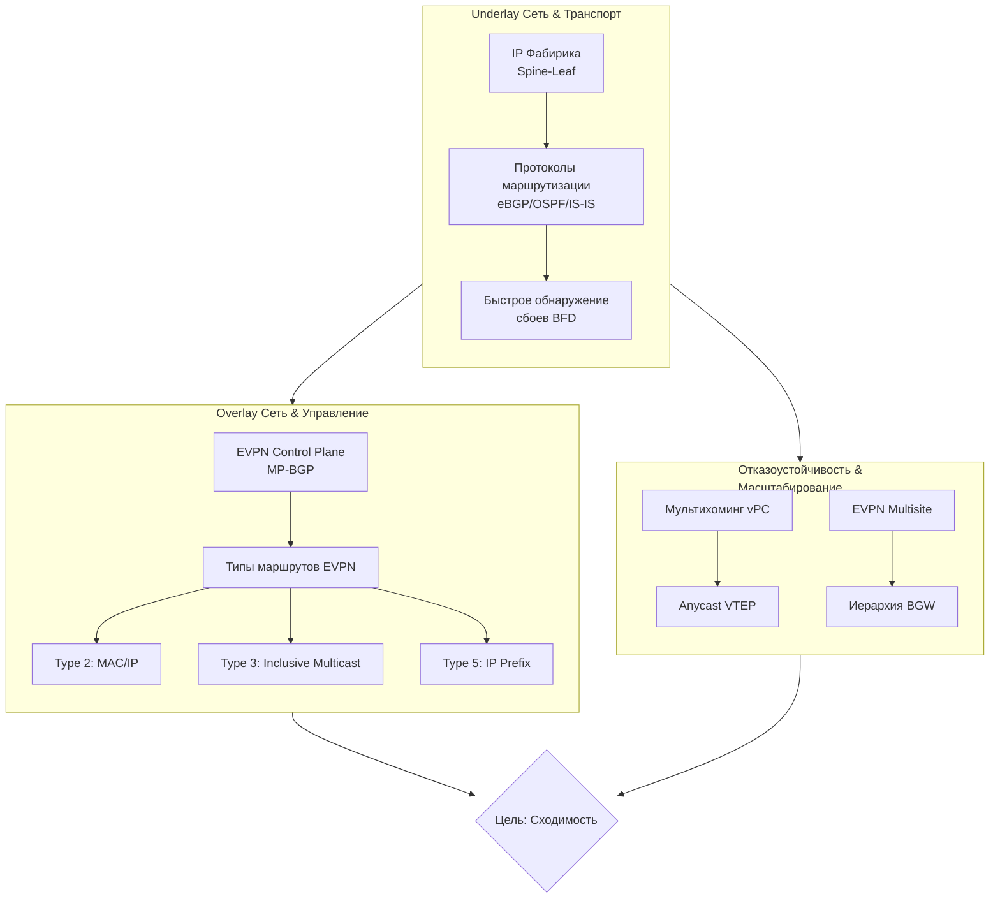

Проектирование сети VXLAN EVPN для достижения быстрой сходимости требует комплексного подхода, который объединяет надежный транспортный уровень (Underlay), интеллектуальную систему управления (Overlay) и отказоустойчивые схемы подключения. Вот ключевые принципы и практики.

Для начала, вот общая карта, которая показывает, как различные компоненты такой сети взаимодействуют для достижения сходимости:

### 🚀 Проектирование Underlay сети для быстрой сходимости

Underlay-сеть — это фундамент, от которого напрямую зависит скорость и стабильность всей VXLAN-фабрики.

*   **Стабильная IP-фабрика**: Разверните отказоустойчиственную IP-сеть по схеме **Spine-Leaf** с использованием протоколов **eBGP**, **OSPF** или **IS-IS**. Эта архитектура обеспечивает множество равнозначных путей (ECMP), что предотвращает блокировку линков и распределяет нагрузку.
*   **Быстрое обнаружение сбоев**: Настройте **Bidirectional Forwarding Detection (BFD)** на всех линках между Spine и Leaf коммутаторами. BFD позволяет обнаружить обрыв линка за миллисекунды, а не секунды, что критически важно для мгновенной активации механизмов восстановления.
*   **Согласованные метрики**: Убедитесь, что все линки в Underlay-сети имеют правильные и согласованные метрики. Это гарантирует, что протоколы маршрутизации выберут оптимальные пути и резервные маршруты будут предсказуемыми.

### 🧠 Организация Overlay сети и управления

Control Plane в VXLAN EVPN отвечает за распространение информации о хостах и сетях, заменяя собой неэффективный механизм "flood-and-learn".

*   **EVPN как Control Plane**: Используйте **MP-BGP** в качестве плоскости управления для обмена информацией о MAC- и IP-адресах между VTEP. Это позволяет каждому VTEP заранее знать, где находится получатель, и отправлять трафик напрямую, без лишнего широковещательного трафика.
*   **Роль Route Reflector**: Для масштабирования настройте Spine-коммутаторы в качестве **Route Reflector (RR)**. Это избавляет от необходимости организовывать полносвязную BGP-матрицу между всеми Leaf, уменьшая нагрузку на оборудование и упрощая управление.
*   **Ключевые типы маршрутов EVPN**:
    *   **Type 2 (MAC/IP Advertisement)**: Основной маршрут для объявления MAC-адресов и их привязки к IP-адресам (ARP-таблицы).
    *   **Type 3 (Inclusive Multicast Ethernet Tag)**: Управляет широковещательным и мультивещательным трафиком (BUM). Вместо использования multicast в underlay можно применять **Ingress Replication**, когда исходный VTEP сам создает копии пакета для каждого удаленного VTEP.
    *   **Type 5 (IP Prefix Route)**: Используется для анонсирования IP-префиксов (подсетей) между VXLAN-сегментами (L3-маршрутизация) и для связи с внешними сетями.

### 🔄 Обеспечение отказоустойчивости и оптимизации

*   **Мультихоминг и vPC**: Технология **vPC** позволяет подключить сервер к двум разным Leaf-коммутаторам, которые работают в режиме **Active-Active**. Для остальной фабрики эта пара представляется как один логический VTEP с общим **Anycast IP-адресом**. Это не только обеспечивает отказоустойчивость, но и позволяет балансировать нагрузку входящего трафика благодаря ECMP в underlay.
*   **Оптимизация таблиц маршрутизации**: Для сокращения объема рассылаемой информации используйте **супрессию ARP** (ARP Suppression). При этой настройке локальные ARP-запросы обрабатываются непосредственно VTEP на основе данных из EVPN, что значительно снижает широковещательный трафик в overlay.
*   **Масштабирование на несколько площадок (Multisite)**: Архитектура **EVPN Multisite** позволяет соединять несколько независимых VXLAN-фабрик. Ключевым элементом являются **Border Gateways (BGW)**, которые устанавливают eBGP-сессии между сайтами. BGW маскируют внутренние VTEP каждого сайта, создавая четкие границы и изолируя отказы, что критически важно для управления крупными распределенными сетями.

### ⚙️ Практические шаги настройки

1.  **Построить Underlay**: Настроить IP-связность между всеми Spine и Leaf коммутаторами, используя eBGP или IGP. Активировать BFD на всех линках.
2.  **Развернуть EVPN Control Plane**: Настроить MP-BGP между Spine и Leaf, назначив Spine роль Route Reflector. Активировать адресное семейство `l2vpn evpn`.
3.  **Настроить Overlay (NVE интерфейс)**: На каждом Leaf (VTEP) создать интерфейс NVE, указав в качестве источника Loopback-адрес и задав `host-reachability protocol bgp`.
4.  **Интегрировать vPC**: Для пар Leaf-коммутаторов настроить общий Anycast VTEP адрес на Loopback-интерфейсе, чтобы фабрика видела их как единую точку.
5.  **Настроить Multisite (если требуется)**: Развернуть BGW на каждом сайте и установить между ними eBGP-сессии для обмена маршрутами EVPN.
