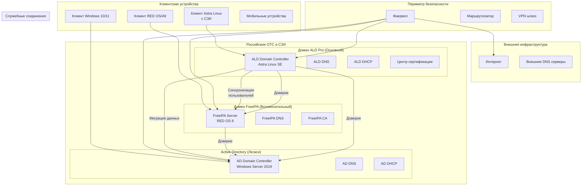
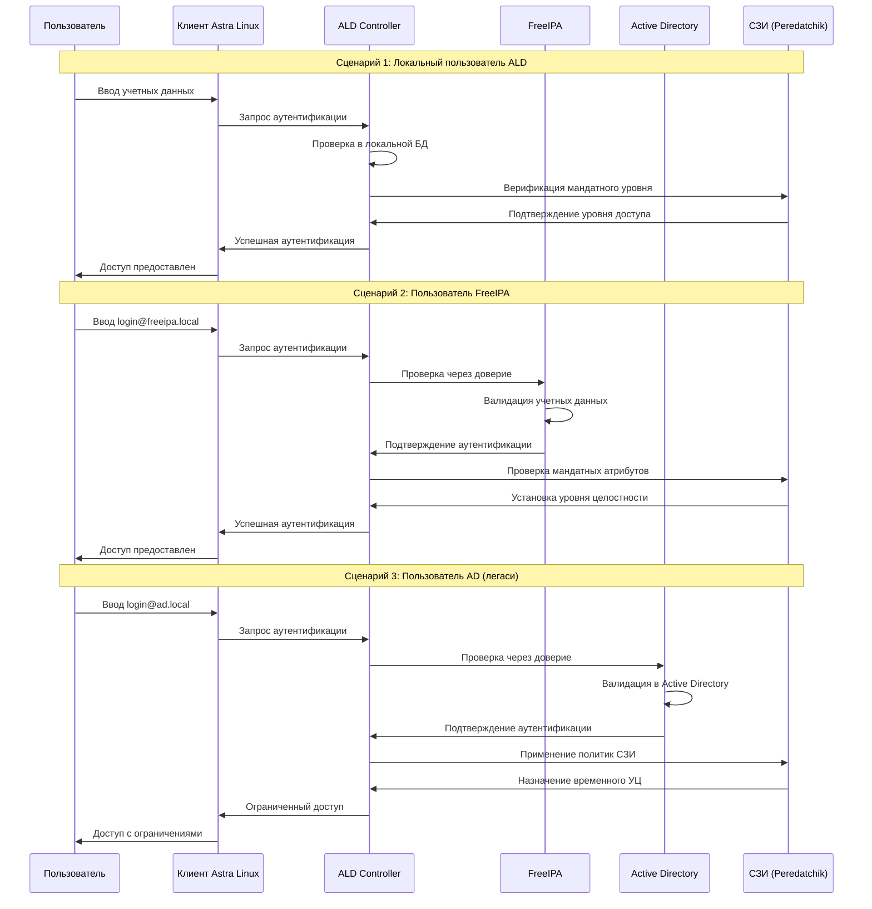
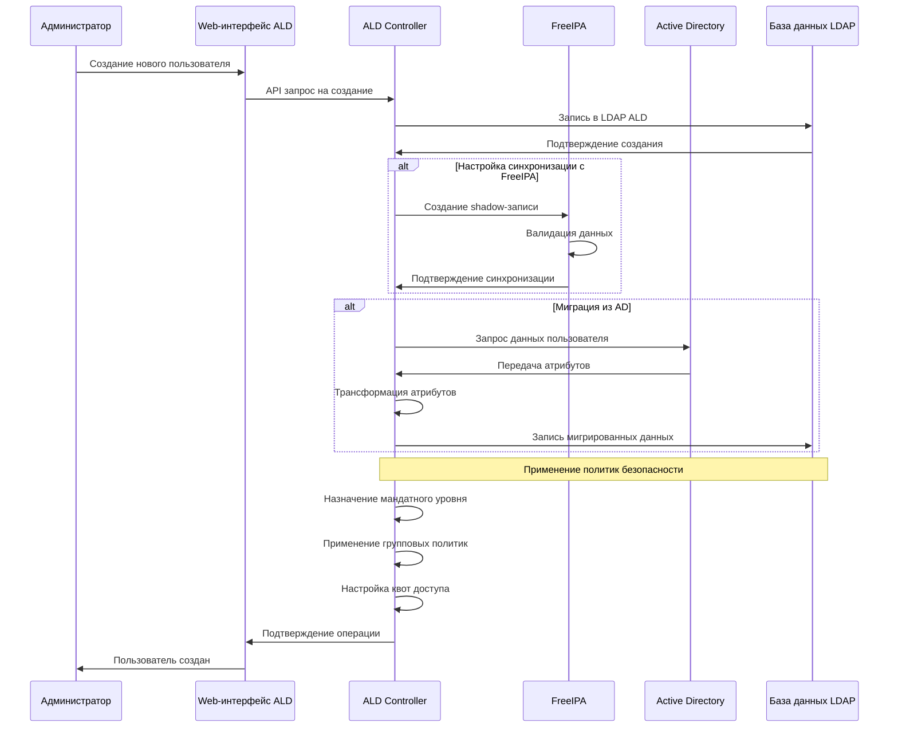
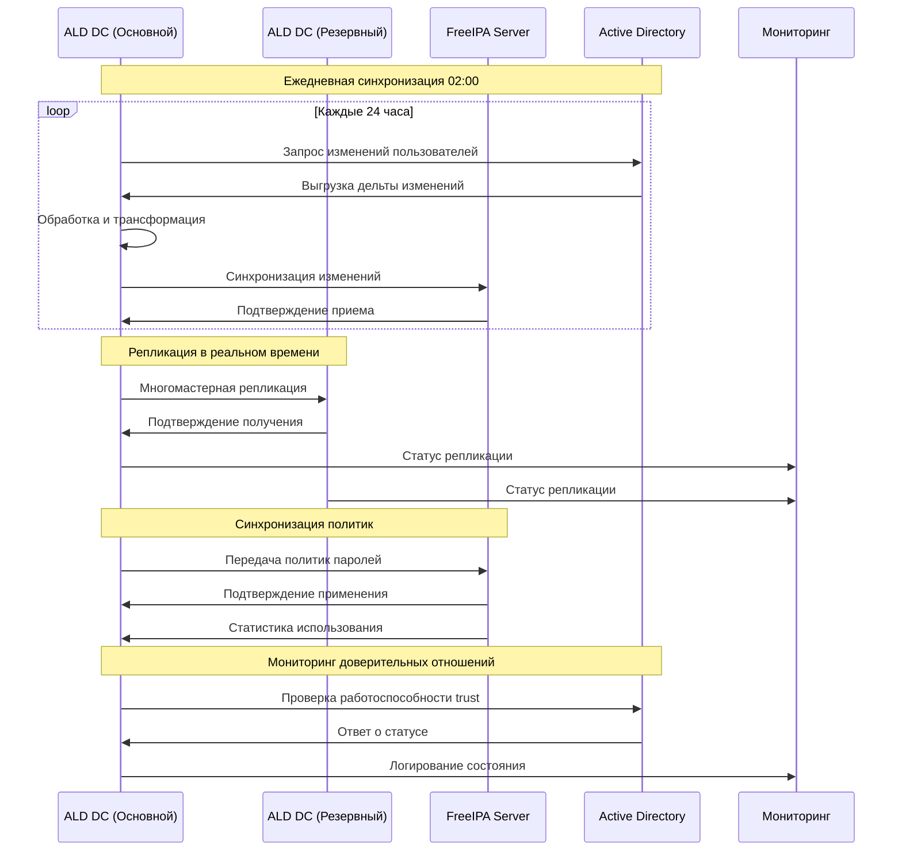
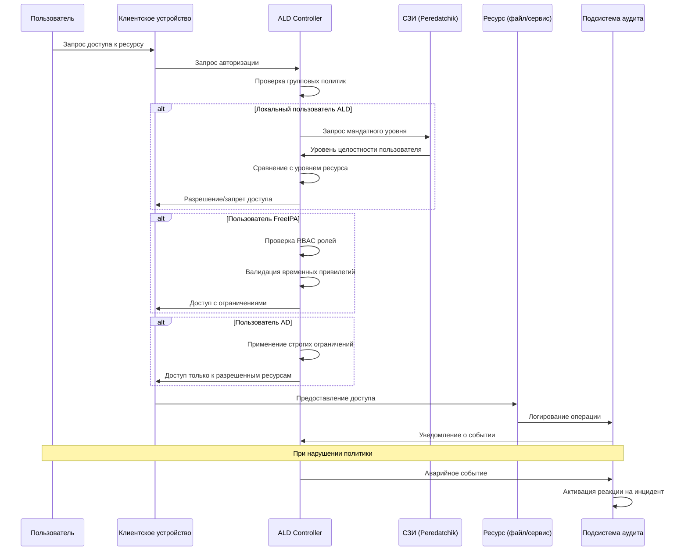
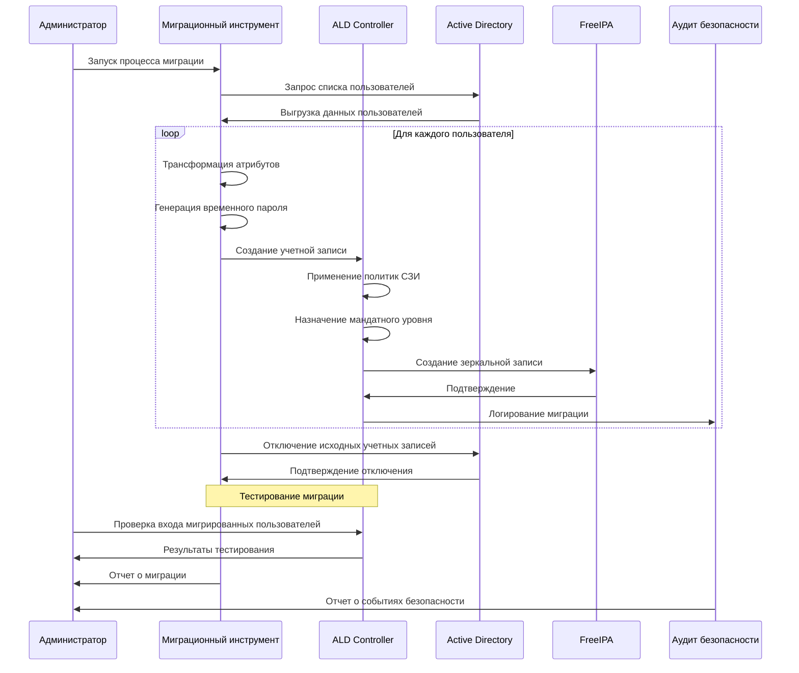
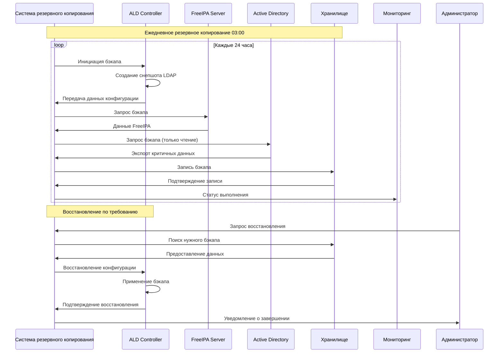
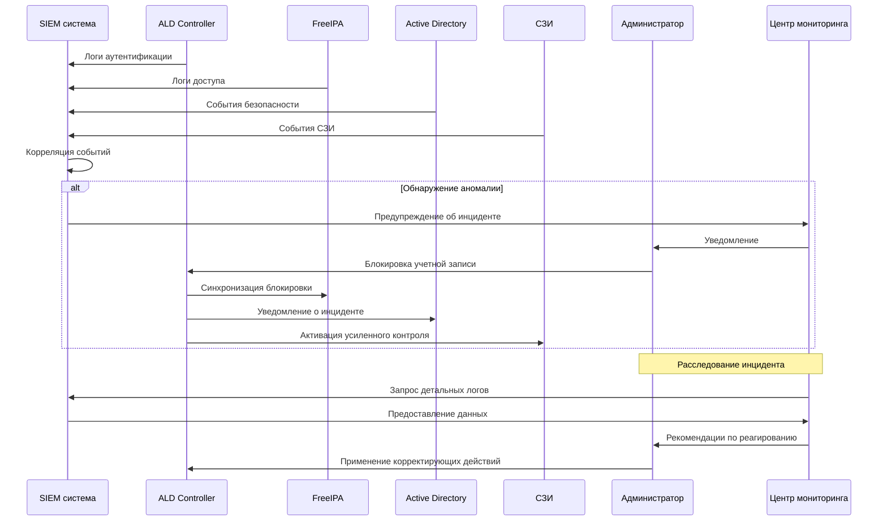
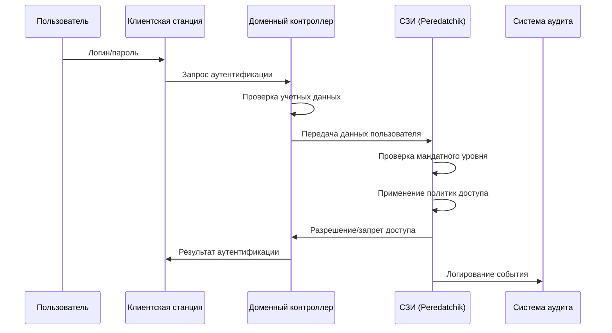

# Диаграммы последовательности архитектуры ALD Pro, FreeIPA и Active Directory

## 1. Общая архитектура интеграции систем



## 2. Процесс аутентификации пользователя в комплексной системе



## 3. Процесс управления пользователями и группами



## 4. Процесс репликации и синхронизации данных



## 5. Процесс авторизации доступа к ресурсам



## 6. Процесс миграции пользователей из AD в ALD



## 7. Архитектура резервного копирования и восстановления



## 8. Мониторинг и управление инцидентами



## Ключевые особенности архитектуры для российской компании:

1. **Централизация управления** через ALD Pro как основной контроллер
2. **Поддержка легаси-систем** через доверительные отношения
3. **Соответствие требованиям регуляторов** (ФСТЭК, ФСБ)
4. **Мандатный контроль доступа** интегрирован во все процессы
5. **Поэтапная миграция** с сохранением функциональности
6. **Мониторинг и аудит** всех операций безопасности
7. **Резервное копирование** критичных компонентов
8. **Интеграция с отечественными СЗИ**

# Подробное объяснение СЗИ (Средства Защиты Информации) в контексте доменных инфраструктур

## 1. Что такое СЗИ - базовое определение

**СЗИ (Средства Защиты Информации)** - это комплекс программных, аппаратных и программно-аппаратных средств, предназначенных для защиты информации от несанкционированного доступа, утечки, модификации или уничтожения.

### Ключевые аспекты СЗИ в российском законодательстве:
```yaml
Нормативная база:
  - Федеральный закон №187-ФЗ "О безопасности критической информационной инфраструктуры"
  - Федеральный закон №152-ФЗ "О персональных данных" 
  - Приказы ФСТЭК России: 17, 21, 31, 239
  - Требования ФСБ России к криптографической защите
```

## 2. Основные типы СЗИ, используемые в доменных инфраструктурах

### 2.1. Средства мандатного контроля доступа (МКД)
```bash
# Пример настройки в Astra Linux SE
astra-mac-admin status
astra-mac-admin level add --name=secret --value=300
astra-mac-admin level add --name=confidential --value=200
astra-mac-admin level add --name=public --value=100

# Назначение уровней пользователям
astra-mac-admin user level set --user=director --level=secret
astra-mac-admin user level set --group=accounting --level=confidential
```

**Что это делает:**
- Контролирует доступ на основе меток конфиденциальности
- Обеспечивает соблюдение правила "no read up, no write down"
- Интегрируется с доменной аутентификацией

### 2.2. Средства защиты от несанкционированного доступа (НСД)
```bash
# Настройка политик паролей в ALD Pro
ald-policy-mod --min-password-length=12
ald-policy-mod --password-history=10
ald-policy-mod --account-lockout-threshold=5
ald-policy-mod --account-lockout-duration=30

# Аудит событий безопасности
astra-audit-admin enable --category=all
auditctl -e 1
```

### 2.3. Криптографические средства защиты
```bash
# Использование российских алгоритмов шифрования
openssl genpkey -algorithm gost2012_256 -out ca-key.pem
openssl req -new -x509 -md_gost12_256 -key ca-key.pem -out ca-cert.pem

# Настройка TLS с ГОСТ в Apache
SSLCipherSuite GOST2012-GOST8912-GOST8912:!aNULL:!eNULL:!EXPORT:!DES:!MD5:!PSK:!RC4
SSLProtocol TLSv1.2
```

### 2.4. Средства обнаружения вторжений (СОВ)
```bash
# Настройка OSSEC на доменном контроллере
/var/ossec/bin/manage_agents
/var/ossec/bin/ossec-control start

# Конфигурация правил обнаружения
<group name="windows,">
  <rule id="100001" level="10">
    <match>^Failed password for</match>
    <description>Failed authentication attempt</description>
  </rule>
</group>
```

## 3. Конкретные СЗИ, упомянутые в материалах

### 3.1. "Peredatchik" (Условное название - представляет класс СЗИ)
```yaml
Функциональность:
  - Мандатный контроль доступа: ✅
  - Сессионный контроль: ✅
  - Аудит действий пользователей: ✅
  - Контроль целостности: ✅
  - Защита от утечек: ✅

Интеграция с доменными службами:
  - ALD Pro: ✅ Прямая интеграция
  - FreeIPA: ✅ Через плагины
  - Windows AD: ⚠️ Ограниченная через агенты
  - Samba DC: ✅ Через PAM модули
```

### 3.2. Как СЗИ интегрируется с доменной аутентификацией


## 4. Практическая реализация СЗИ в доменной инфраструктуре

### 4.1. Настройка мандатного контроля в ALD Pro
```bash
#!/bin/bash
# configure-szi-ald.sh

echo "=== Настройка СЗИ в ALD Pro ==="

# Активация мандатного контроля
astra-mac-admin enable

# Создание классификационных уровней
astra-mac-admin level add --name=top_secret --value=400 --color=red
astra-mac-admin level add --name=secret --value=300 --color=orange  
astra-mac-admin level add --name=confidential --value=200 --color=yellow
astra-mac-admin level add --name=public --value=100 --color=green

# Назначение уровней подразделениям
astra-mac-admin department level set --department=board --level=top_secret
astra-mac-admin department level set --department=finance --level=secret
astra-mac-admin department level set --department=hr --level=confidential
astra-mac-admin department level set --department=all --level=public

# Настройка политик доступа
astra-mac-admin policy add --name=strict --read-up=false --write-down=false
astra-mac-admin policy add --name=relaxed --read-up=false --write-down=true

# Применение политик к группам
astra-mac-admin group policy set --group=managers --policy=strict
astra-mac-admin group policy set --group=users --policy=relaxed
```

### 4.2. Интеграция СЗИ с FreeIPA
```python
#!/usr/bin/env python3
# szi-freeipa-integration.py

from ipalib import api, errors
from ipaserver.plugins.user import user_add
import szi_sdk

class FreeIPASZIIntegration:
    def __init__(self):
        self.szi_client = szi_sdk.Client(
            host='szi-server.corp.local',
            api_key='secure-api-key'
        )
    
    def on_user_login(self, username, source_ip):
        """Обработка входа пользователя"""
        # Получение мандатного уровня пользователя
        user_level = self.szi_client.get_user_level(username)
        
        # Проверка соответствия политикам
        if not self.szi_client.check_access_policy(username, source_ip):
            raise errors.AccessDenied(
                reason="Доступ запрещен политиками СЗИ"
            )
        
        # Логирование события
        self.szi_client.log_auth_event(
            user=username,
            event_type='login',
            source_ip=source_ip,
            success=True
        )
        
        return user_level
    
    def on_file_access(self, username, file_path, operation):
        """Контроль доступа к файлам"""
        file_level = self.szi_client.get_file_level(file_path)
        user_level = self.szi_client.get_user_level(username)
        
        # Проверка мандатного правила
        if operation == 'read' and user_level < file_level:
            return False  # Запрет чтения "снизу вверх"
            
        if operation == 'write' and user_level > file_level:
            return False  # Запрет записи "сверху вниз"
            
        return True
```

### 4.3. Конфигурация аудита для соответствия требованиям
```bash
#!/bin/bash
# configure-audit-szi.sh

echo "=== Настройка аудита для СЗИ ==="

# Включение аудита ядра
echo "1" > /proc/sys/kernel/audit

# Настройка auditd
cat > /etc/audit/auditd.conf << EOF
log_file = /var/log/audit/audit.log
log_format = ENRICHED
log_group = root
priority_boost = 4
flush = INCREMENTAL_ASYNC
freq = 50
max_log_file = 100
num_logs = 5
disp_qos = lossy
dispatcher = /sbin/audispd
name_format = NONE
##name = mydomain
max_log_file_action = ROTATE
space_left_action = EMAIL
action_mail_acct = root
admin_space_left_action = SUSPEND
disk_full_action = SUSPEND
disk_error_action = SUSPEND
use_libwrap = yes
##tcp_listen_port = 60
tcp_listen_queue = 5
tcp_max_per_addr = 1
##tcp_client_ports = 1024-65535
tcp_client_max_idle = 0
enable_krb5 = no
krb5_principal = auditd
##krb5_key_file = /etc/audit/audit.key
EOF

# Правила аудита для СЗИ
cat > /etc/audit/rules.d/szi.rules << EOF
# Аудит аутентификации
-w /var/log/secure -p wa -k authentication
-w /var/log/auth.log -p wa -k authentication

# Аудит доступа к файлам
-a always,exit -F arch=b64 -S open,openat,open_by_handle_at -F exit=-EACCES -k access
-a always,exit -F arch=b64 -S open,openat,open_by_handle_at -F exit=-EPERM -k access

# Аудит мандатного контроля
-w /etc/astra/mac-levels -p wa -k mac_policy
-w /etc/astra/mac-policies -p wa -k mac_policy

# Аудит сетевой активности
-a always,exit -F arch=b64 -S bind -S connect -k network_activity
EOF

# Перезапуск службы аудита
systemctl enable auditd
systemctl restart auditd
auditctl -R /etc/audit/rules.d/szi.rules
```

## 5. Требования регуляторов к СЗИ в доменных инфраструктурах

### 5.1. Требования ФСТЭК России
```yaml
Приказ ФСТЭК России №17:
  - Идентификация и аутентификация: ✅ Обязательно
  - Управление доступом: ✅ Мандатный контроль
  - Ограничение программной среды: ✅ Белые списки
  - Защита машинных носителей: ✅ Шифрование
  - Аудит безопасности: ✅ Полный мониторинг
  - Целостность: ✅ Контроль изменений

Приказ ФСТЭК России №21:
  - Сегментация сети: ✅ Обязательно
  - Защита от вредоносного кода: ✅ Антивирусы
  - Обнаружение вторжений: ✅ СОВ
  - Защита виртуализации: ✅ Контроль ВМ
```

### 5.2. Требования к защите персональных данных
```bash
#!/bin/bash
# configure-pdp-protection.sh

echo "=== Настройка СЗИ для защиты ПДн ==="

# Шифрование каталогов с ПДн
astra-crypto setup --algorithm=gost2012 --level=high
astra-crypto encrypt /var/data/personal --recursive

# Настройка доступа к ПДн
setfacl -R -m u:pd_operator:rx /var/data/personal
setfacl -R -m g:auditors:r-- /var/data/personal/logs

# Маскирование ПДн в логах
sed -i 's/\(phone\|email\|passport\)=.*/\1=*****/g' /var/log/application.log

# Аудит доступа к ПДн
echo "-w /var/data/personal -p rwxa -k personal_data" >> /etc/audit/rules.d/pdp.rules
```

## 6. Мониторинг и управление СЗИ

### 6.1. Дашборд мониторинга СЗИ
```python
#!/usr/bin/env python3
# szi-monitoring-dashboard.py

import json
import time
from datetime import datetime
from prometheus_client import start_http_server, Gauge, Counter

class SZIMonitoring:
    def __init__(self):
        # Метрики для Prometheus
        self.mac_violations = Counter('szi_mac_violations_total', 
                                     'Total MAC policy violations')
        self.auth_attempts = Counter('szi_auth_attempts_total',
                                   'Total authentication attempts', 
                                   ['result'])
        self.audit_events = Counter('szi_audit_events_total',
                                  'Total audit events by type',
                                  ['type'])
    
    def check_szi_health(self):
        """Проверка состояния СЗИ"""
        checks = {
            'mac_control': self.check_mac_control(),
            'audit_system': self.check_audit_system(),
            'crypto_modules': self.check_crypto_modules(),
            'intrusion_detection': self.check_intrusion_detection()
        }
        
        return all(checks.values())
    
    def process_security_event(self, event_type, user, resource, success):
        """Обработка событий безопасности"""
        if not success:
            self.mac_violations.inc()
            
        self.audit_events.labels(type=event_type).inc()
        
        # Логирование в SIEM систему
        self.send_to_siem({
            'timestamp': datetime.now().isoformat(),
            'event_type': event_type,
            'user': user,
            'resource': resource,
            'success': success
        })

if __name__ == '__main__':
    start_http_server(8000)
    monitor = SZIMonitoring()
    
    while True:
        monitor.check_szi_health()
        time.sleep(60)
```

## 7. Резюме: Что такое СЗИ в контексте материалов

**СЗИ в доменных инфраструктурах - это:**

1. **Мандатный контроль доступа** - система меток конфиденциальности
2. **Аудит и мониторинг** - полное протоколирование действий
3. **Криптографическая защита** - российские алгоритмы шифрования
4. **Защита от НСД** - политики паролей, блокировка учетных записей
5. **Обнаружение вторжений** - мониторинг аномальной активности
6. **Управление сессиями** - контроль одновременных подключений

**Интеграция с доменными службами обеспечивает:**
- Единую точку управления политиками безопасности
- Сквозной контроль доступа across всех систем
- Соответствие требованиям российских регуляторов
- Защиту информации на всех уровнях: от аутентификации до доступа к данным

СЗИ превращают обычную доменную инфраструктуру в защищенную систему, соответствующую требованиям ФСТЭК и ФСБ России для работы с конфиденциальной информацией и персональными данными.