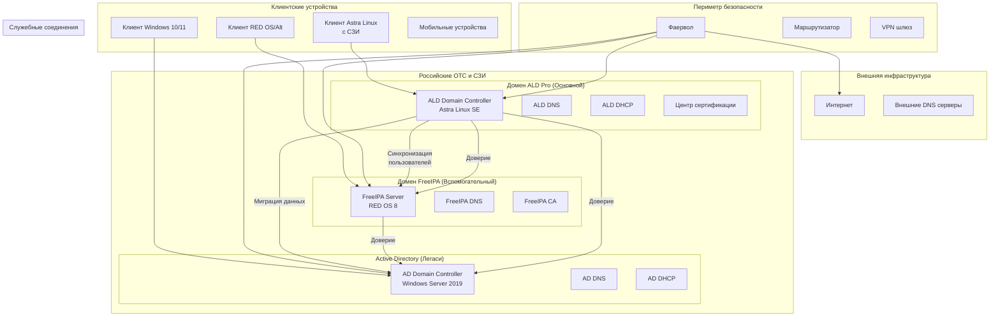
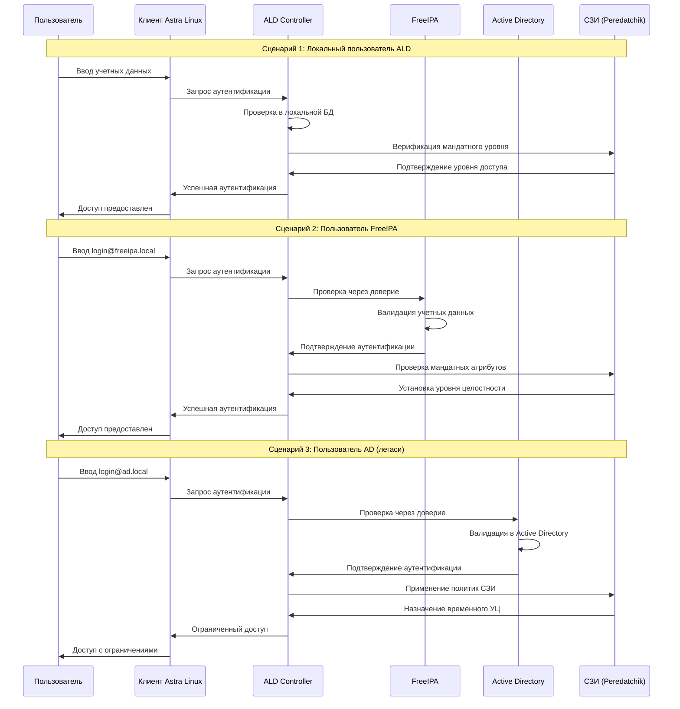
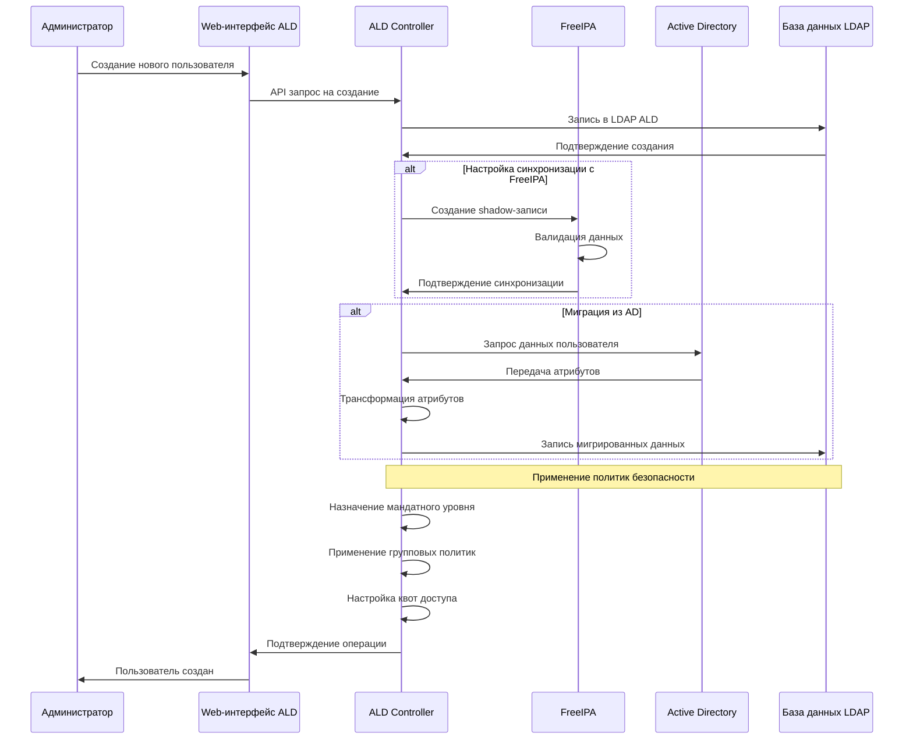
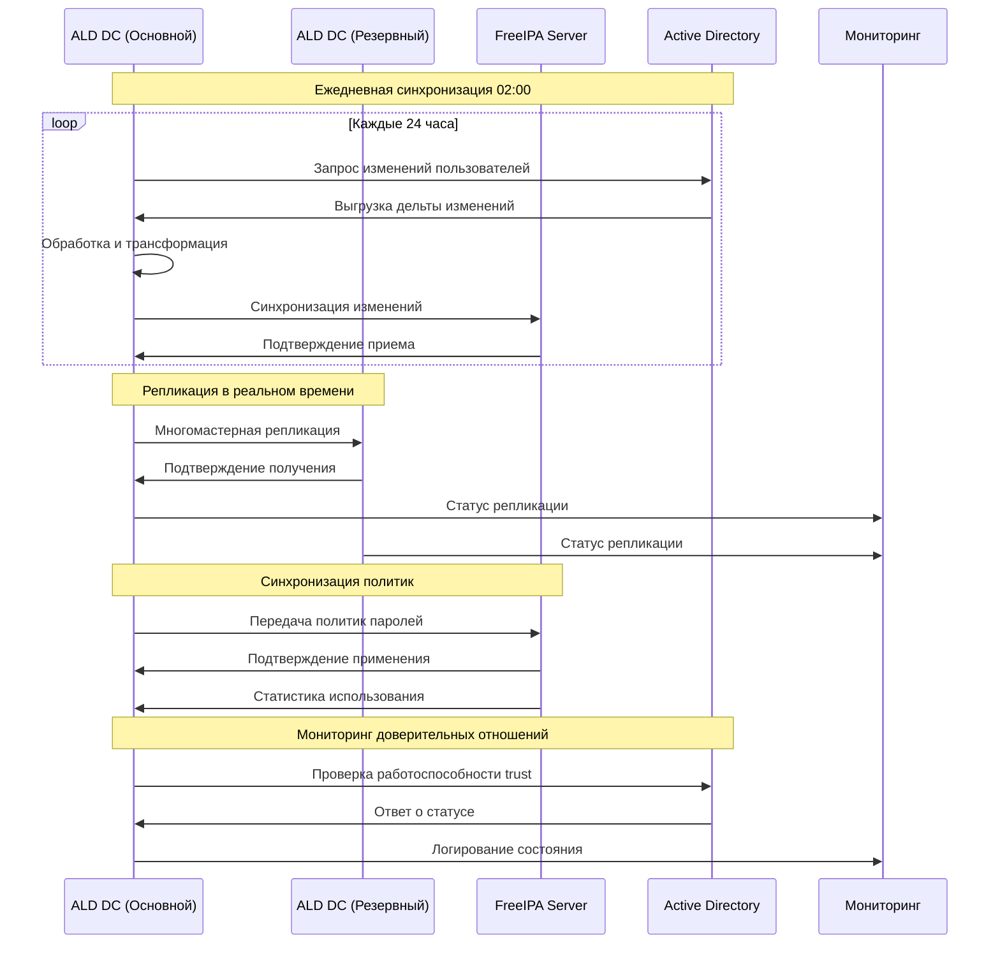
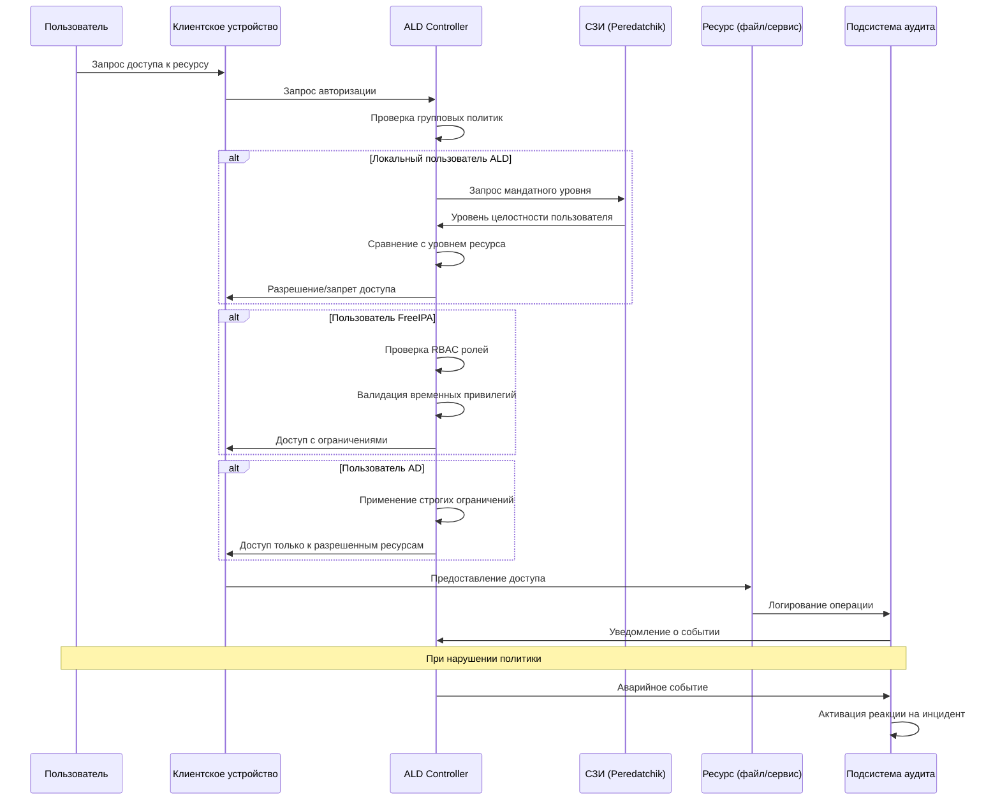
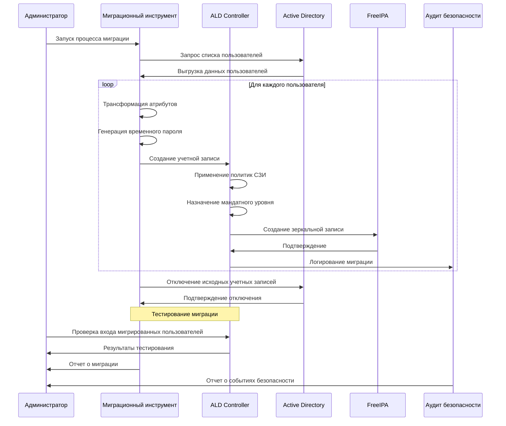
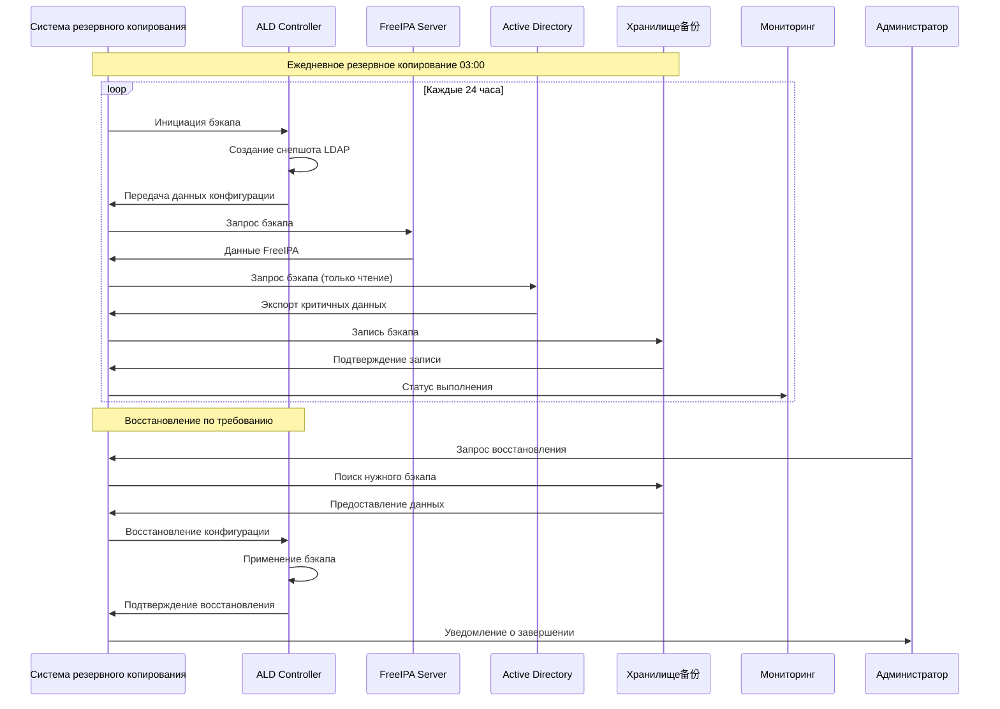
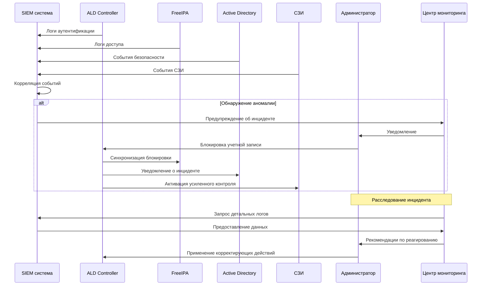

# Диаграммы последовательности архитектуры ALD Pro, FreeIPA и Active Directory

## 1. Общая архитектура интеграции систем

## 2. Процесс аутентификации пользователя в комплексной системе

## 3. Процесс управления пользователями и группами

## 4. Процесс репликации и синхронизации данных

## 5. Процесс авторизации доступа к ресурсам

## 6. Процесс миграции пользователей из AD в ALD

## 7. Архитектура резервного копирования и восстановления

## 8. Мониторинг и управление инцидентами

## Ключевые особенности архитектуры для российской компании:

1. **Централизация управления** через ALD Pro как основной контроллер
2. **Поддержка легаси-систем** через доверительные отношения
3. **Соответствие требованиям регуляторов** (ФСТЭК, ФСБ)
4. **Мандатный контроль доступа** интегрирован во все процессы
5. **Поэтапная миграция** с сохранением функциональности
6. **Мониторинг и аудит** всех операций безопасности
7. **Резервное копирование** критичных компонентов
8. **Интеграция с отечественными СЗИ**