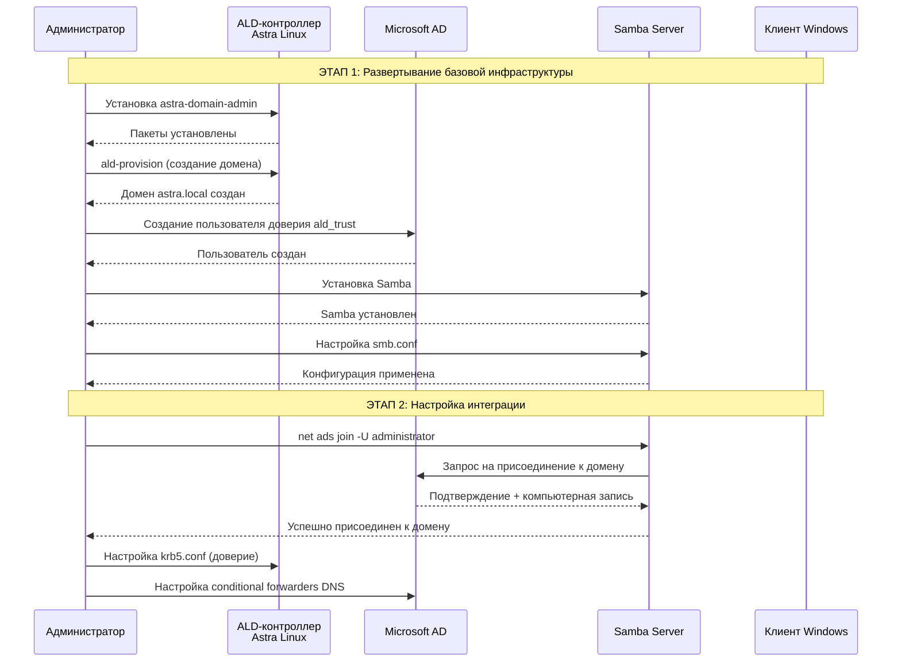
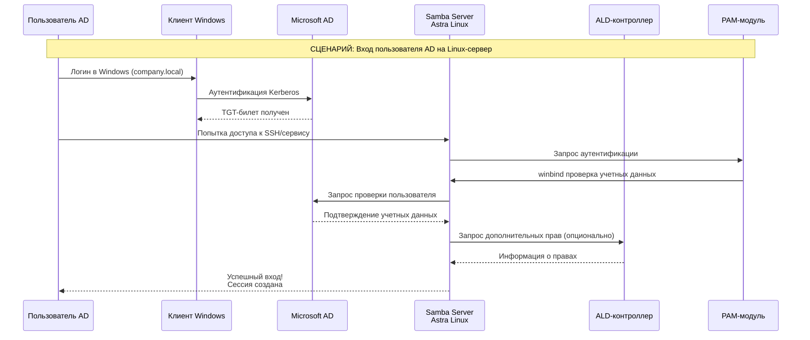
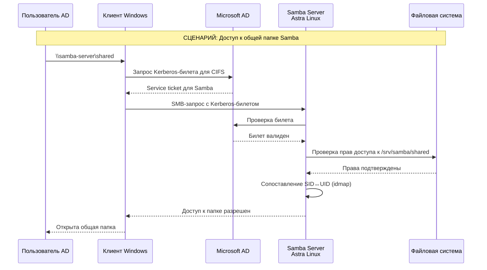
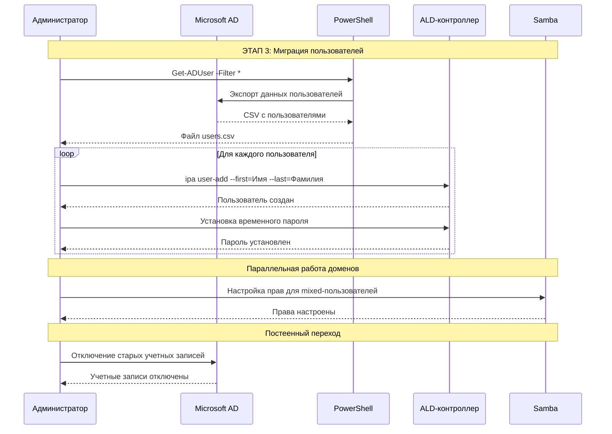
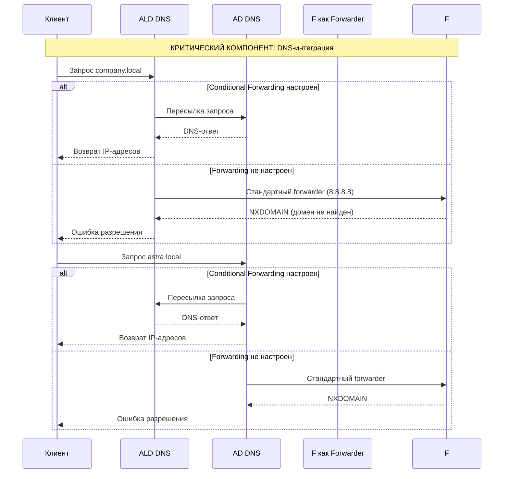
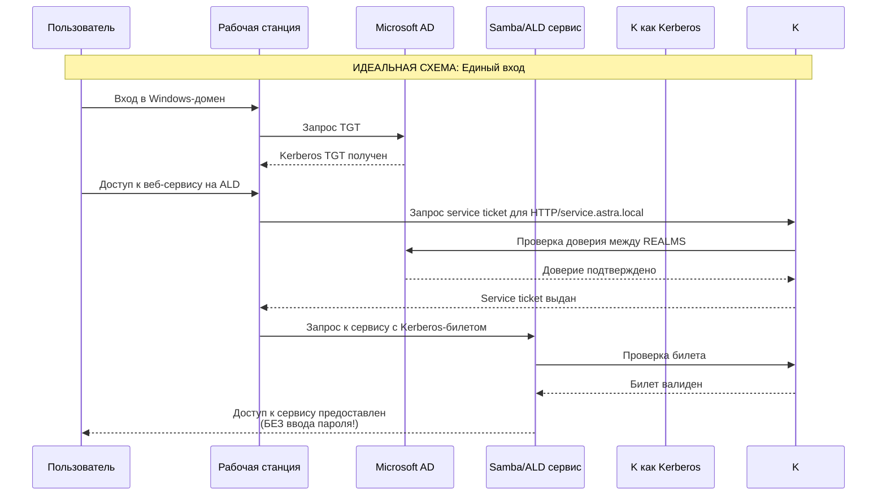
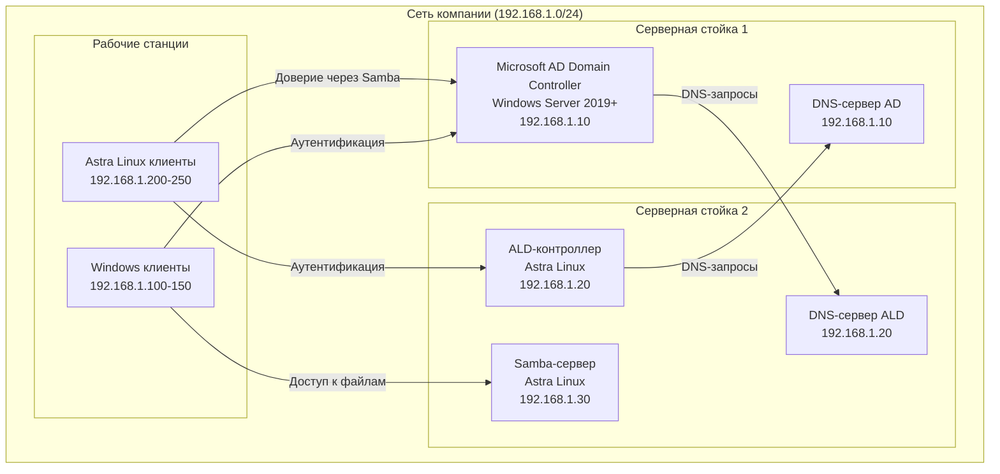
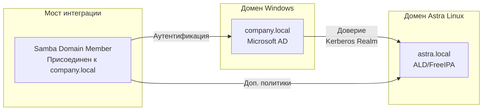
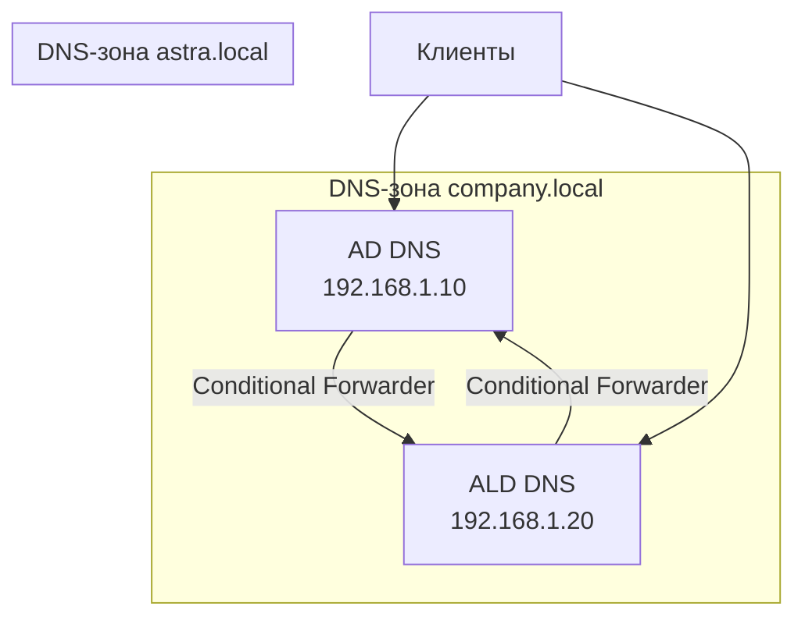
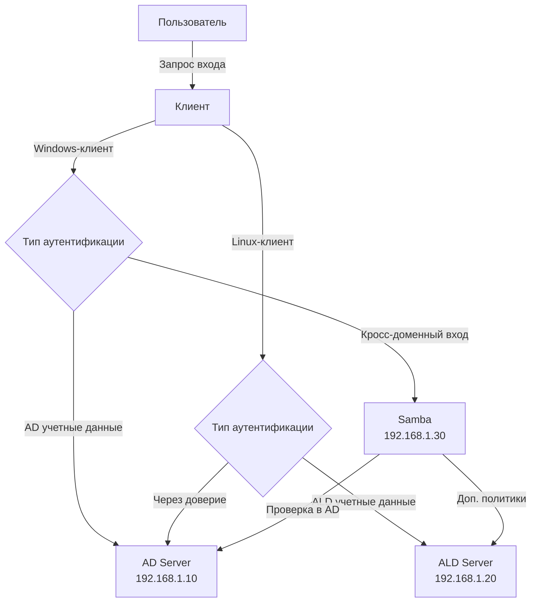

## 🔄 Общая схема интеграции доменов

### 1. Диаграмма начальной настройки инфраструктуры



### 2. Диаграмма аутентификации пользователя AD на Linux-хосте



### 3. Диаграмма доступа к общим ресурсам Samba



### 4. Диаграмма процесса миграции пользователей



### 5. Диаграмма DNS-резолвинга между доменами



### 6. Диаграмма сквозной аутентификации (Single Sign-On)



## 🎯 Ключевые точки интеграции:

1. **DNS** - основа всего, должен быть взаимный резолвинг
2. **Kerberos Trust** - обеспечивает единую аутентификацию  
3. **Samba Domain Member** - мост между мирами
4. **Winbind/PAM** - позволяет Linux "видеть" пользователей AD
5. **Idmap** - сопоставление идентификаторов между системами


### Общая концепция и термины

*   **FreeIPA / ALD (Astra Linux Domain)** — это домены на основе Linux, использующие протокол Kerberos и LDAP. ALD — это доработанная под требования российского законодательства FreeIPA.
*   **Microsoft AD (Active Directory)** — стандарт де-факто для управления пользователями и компьютерами в сетях Windows.
*   **Samba DC (Domain Controller)** — это реализация протоколов AD от проекта Samba. Она позволяет Linux-серверу стать полноценным контроллером домена AD, "говорящим" на том же языке, что и Windows-серверы.
*   **Интеграция** — когда две системы работают параллельно, обмениваются данными, но каждая управляет своими ресурсами.
*   **Миграция** — процесс переноса пользователей, компьютеров и данных из одной системы (обычно AD) в другую (обычно ALD/FreeIPA).

---

### План: Интеграция и Миграция на Astra Linux

Предположим, у нас есть существующий домен Microsoft AD и мы хотим внедрить Astra Linux Domain (ALD), интегрировать их, а затем постепенно мигрировать.

#### Этап 1: Подготовка инфраструктуры

1.  **Развертывание ALD-контроллера на Astra Linux.**
    *   Установите чистую Astra Linux (релиз "Смоленск" или "Орел").
    *   Используйте графический инструмент `astra-domain-admin` или утилиту `ald-provision` в командной строке.
    *   Создайте новый домен, например `astra.local`.
    *   Заведите первых пользователей и группы. Это будет ваш "плацдарм".

2.  **Подготовка Microsoft AD.**
    *   Убедитесь, что у вас есть права Администратора домена.
    *   Создайте в AD специального пользователя для доверия (например, `ald_trust`). Это понадобится для безопасного "рукопожатия" между доменами.

#### Этап 2: Интеграция через Доверие (Trust) и Samba

Это **ключевой этап** для совместной работы. Мы создадим "мост" между доменами.

1.  **Настройка Samba в роли Члена Домена (Domain Member) или самостоятельного контроллера с доверием.**
    *   На отдельном сервере Astra Linux (или на том же ALD-контроллере, но это менее правильно) установите и настройте Samba.
    *   **Сценарий А (Простой, для общего доступа к ресурсам):** Настройте Samba как член домена AD (`security = ads`). Это позволит пользователям из AD заходить на шары Astra Linux, используя свои AD-учетки.
    *   **Сценарий Б (Полноценная интеграция):** Настройте Samba для создания **доверия между лесами (Forest Trust)** между вашим ALD и AD. Это сложнее, но позволяет:
        *   Пользователям из AD входить на компьютеры в домене ALD (и наоборот).
        *   Единой аутентификации для веб-сервисов (например, через Kerberos).

2.  **Настройка кросс-реалмного доверия в Kerberos.**
    *   Вам нужно будет прописать в конфигурационных файлах Krb5 (`/etc/krb5.conf`) как на стороне ALD, так и (по возможности) на стороне AD, информацию о каждом из доменов, чтобы они могли находить контроллеры друг друга для аутентификации.

**Что мы получим после Этапа 2:**
Пользователи из AD смогут заходить на компьютеры под управлением Astra Linux (через PAM), получать доступ к общим папкам (Samba), аутентифицироваться в веб-приложениях. Системы будут "видеть" друг друга.

---

#### Этап 3: Миграция (Переселение пользователей и компьютеров)

Теперь, когда мост построен, можно начинать перенос.

1.  **Миграция пользователей и групп.**
    *   **Инструменты:** Используйте утилиты командной строки, такие как `ipa user-add` и `ldapadd`, или специализированные скрипты.
    *   **Процесс:**
        *   Экспортируйте данные пользователей из AD (можно использовать PowerShell: `Get-ADUser`).
        *   Преобразуйте данные в формат, понятный для ALD/FreeIPA.
        *   Импортируйте пользователей в ALD. **Важно:** Пароли не экспортируются! Вам нужно будет либо установить временные пароли, либо использовать специальные утилиты, требующие сложной настройки.
        *   Лучшая практика — завести пользователей в ALD, оставить их в AD, но изменить UPN (User Principal Name) или использовать разные логины для старых и новых систем на время перехода.

2.  **Присоединение Linux-компьютеров к ALD.**
    *   Это просто. На любой Astra Linux используйте `astra-domain-join` или `ipa-client-install`, чтобы компьютер стал членом домена ALD. После этого пользователи из ALD (и, благодаря доверию, из AD) смогут на него заходить.

3.  **Миграция общих папок и прав доступа (Samba).**
    *   Если у вас были файловые шары на Windows-серверах, их можно перенести на сервер с Samba под Astra Linux.
    *   Перенесите файлы.
    *   Внимательно настройте права доступа (ACL), используя инструменты вроде `getfacl` / `setfacl`, чтобы права, выданные для пользователей и групп AD, корректно работали и в новом домене.

---


## 🏗 Архитектура размещения компонентов

### 1. Физическая схема размещения



### 2. Логическая архитектура доменов



---

## 📍 Детальное размещение компонентов

### 🖥 Сервер Microsoft AD (company.local)
**Размещение:** Выделенный физический сервер или VM
**IP:** 192.168.1.10
**Роли:**
- ✅ **Active Directory Domain Services**
- ✅ **DNS-сервер** (обязательно!)
- ✅ **DHCP-сервер** (опционально)
- ⚠️ **Файловые службы** (можно перенести на Samba)

**Конфигурация:**
```powershell
# Проверка в PowerShell
Get-ADDomain | Format-List Name, Forest, DomainMode
Get-DnsServerForwarder
```

### 🐧 Сервер ALD (astra.local) 
**Размещение:** Выделенная виртуальная машина на Astra Linux
**IP:** 192.168.1.20
**Роли:**
- ✅ **ALD-контроллер домена**
- ✅ **FreeIPA-сервисы** (Kerberos, LDAP)
- ✅ **DNS-сервер** (BIND)
- ✅ **Веб-консоль управления** (https://ald-server.astra.local)

**Установка:**
```bash
# На ALD-сервере
sudo astra-domain-admin
# или
sudo ald-provision --domain astra.local --ip-address 192.168.1.20
```

### 🔗 Samba-сервер (мост интеграции)
**Размещение:** Отдельная виртуальная машина на Astra Linux
**IP:** 192.168.1.30
**Роли:**
- ✅ **Член домена company.local**
- ✅ **Файловый сервер** для обоих доменов
- ✅ **Прокси аутентификации** AD→Linux
- ✅ **Служба печати** (опционально)

**Конфигурация:**
```bash
# На Samba-сервере
sudo apt install samba winbind
sudo net ads join -U administrator -S 192.168.1.10
```

---

## 🌐 Сетевая архитектура

### DNS-инфраструктура


**Настройки DNS:**

**На AD-сервере (192.168.1.10):**
```powershell
# Добавляем conditional forwarder для astra.local
Add-DnsServerConditionalForwarderZone -Name "astra.local" -MasterServers 192.168.1.20
```

**На ALD-сервере (192.168.1.20):**
```bash
# В /etc/named/astra.local.forwarders.conf
zone "company.local" {
    type forward;
    forwarders { 192.168.1.10; };
};
```

### Клиентские рабочие станции

#### Windows-клиенты (192.168.1.100-150)
**DNS-настройки:**
- Основной DNS: 192.168.1.10 (AD)
- Альтернативный DNS: 192.168.1.20 (ALD)

**Принадлежность:** Домен `company.local`

#### Astra Linux-клиенты (192.168.1.200-250) 
**DNS-настройки:**
- Основной DNS: 192.168.1.20 (ALD)
- Альтернативный DNS: 192.168.1.10 (AD)

**Принадлежность:** Домен `astra.local`

---

## 📊 Размещение служб и данных

### Файловые ресурсы
| Ресурс | Размещение | Доступ для | Путь |
|--------|------------|------------|------|
| Общие папки Windows | Samba-сервер (192.168.1.30) | AD + ALD пользователи | `/srv/samba/shared/` |
| Домашние каталоги AD | Samba-сервер | AD пользователи | `/home/company/` |
| Домашние каталоги ALD | ALD-сервер | ALD пользователи | `/home/astra/` |
| Резервные копии | Отдельный NAS | Администраторы | `/backup/` |

### Службы аутентификации


---

## 🔧 Конфигурационные файлы

### На Samba-сервере (192.168.1.30)
**/etc/samba/smb.conf:**
```ini
[global]
    workgroup = COMPANY
    realm = COMPANY.LOCAL
    security = ads
    dns forwarder = 192.168.1.10
    
    # Интеграция с ALD
    idmap config * : backend = tdb
    idmap config * : range = 10000-999999

[shared]
    path = /srv/samba/shared
    valid users = @"COMPANY+Domain Users", @"astra.local+users"
```

### На всех Linux-машинах
**/etc/krb5.conf:**
```ini
[libdefaults]
    default_realm = COMPANY.LOCAL
    dns_lookup_realm = true
    dns_lookup_kdc = true

[realms]
    COMPANY.LOCAL = {
        kdc = 192.168.1.10
        admin_server = 192.168.1.10
    }
    ASTRA.LOCAL = {
        kdc = 192.168.1.20
        admin_server = 192.168.1.20
    }
```

### На всех клиентах
**/etc/resolv.conf:**
```bash
# Для Windows-клиентов (через DHCP/DNS-настройки)
nameserver 192.168.1.10
nameserver 192.168.1.20
search company.local astra.local
```

---

## 🎯 Итоговая карта размещения:

| Компонент | IP-адрес | Роль | Размещение |
|-----------|----------|------|------------|
| **Microsoft AD** | 192.168.1.10 | Контроллер домена | Выделенный сервер |
| **ALD-контроллер** | 192.168.1.20 | Домен Astra Linux | VM на Astra Linux |
| **Samba-сервер** | 192.168.1.30 | Мост интеграции | VM на Astra Linux |
| **Windows-клиенты** | 192.168.1.100-150 | Рабочие станции | Физические компьютеры |
| **Linux-клиенты** | 192.168.1.200-250 | Рабочие станции | Физические компьютеры |


## 🎯 Что мы будем делать

**Цель:** Настроить простейшую связку между доменом Windows и доменом Astra Linux, чтобы пользователи из Windows могли заходить на Linux-компьютеры.

---

## 📋 ШАГ 0: Подготовка

### Что вам понадобится:
1. **Сервер Windows** с Active Directory (уже должен быть)
2. **Чистая Astra Linux** (установите как обычную ОС)
3. **Сетевые настройки**: все компьютеры должны быть в одной сети

### Предположим наши данные:
- **Домен Windows**: `company.local`
- **Домен Astra Linux**: `astra.local`
- **IP Windows DC**: 192.168.1.10
- **IP Astra Linux**: 192.168.1.20

---

## 🐧 ШАГ 1: Настраиваем домен на Astra Linux (ALD)

### 1.1 Установка доменных служб
Откройте терминал на Astra Linux и выполните:

```bash
# Ставим доменные службы
sudo apt update
sudo apt install astra-domain-common ald-server ald-admin

# Запускаем настройку
sudo astra-domain-setup
```

### 1.2 Графическая настройка (проще для новичка)
```bash
# Запускаем графическую утилиту
sudo astra-domain-admin
```

**В графической утилите:**
1. Выберите "**Установить контроллер домена**"
2. Имя домена: `astra.local`
3. Пароль администратора: придумайте сложный пароль
4. Нажимайте "Далее" пока установка не завершится


---

## 🔗 ШАГ 2: Настраиваем связь с доменом Windows

### 2.1 Настраиваем DNS
Самый простой способ - прописать DNS-серверы в Astra Linux:

```bash
# Редактируем сетевые настройки
sudo nano /etc/systemd/resolved.conf

# Добавляем строки:
DNS=192.168.1.10  # IP вашего Windows DC
Domains=company.local
```

Перезапускаем сеть:
```bash
sudo systemctl restart systemd-resolved
```

### 2.2 Проверяем связь
```bash
# Должен находить Windows-домен
nslookup company.local

# Должен находить Astra-домен  
nslookup astra.local
```

---

## 🔐 ШАГ 3: Настраиваем Samba для работы с Windows

### 3.1 Устанавливаем Samba
```bash
sudo apt install samba winbind libnss-winbind libpam-winbind
```

### 3.2 Настраиваем Samba
```bash
# Резервная копия старого файла
sudo cp /etc/samba/smb.conf /etc/samba/smb.conf.backup

# Создаём новый конфиг
sudo nano /etc/samba/smb.conf
```

**Вставьте этот текст:**

```ini
[global]
    workgroup = COMPANY  # NetBIOS-имя вашего Windows-домена
    realm = COMPANY.LOCAL  # Полное имя Windows-домена
    security = ads
    idmap config * : backend = tdb
    idmap config * : range = 10000-999999
    winbind use default domain = yes
    winbind offline logon = yes
    template shell = /bin/bash
    template homedir = /home/%U
    
    # Важно! Указываем оба домена
    winbind trusted domains only = no
    winbind refresh tickets = yes

    # DNS-настройки
    dns proxy = no
    dns forwarder = 192.168.1.10

[shared]
    path = /srv/samba/shared
    read only = no
    browseable = yes
    writable = yes
    guest ok = no
    valid users = @"COMPANY+Domain Users"
```

### 3.3 Создаём общую папку
```bash
# Создаём папку
sudo mkdir -p /srv/samba/shared

# Даём права
sudo chmod 777 /srv/samba/shared

# Перезапускаем Samba
sudo systemctl restart smbd nmbd winbind
```

---

## 🤝 ШАГ 4: Присоединяем Astra Linux к домену Windows

### 4.1 Вступаем в домен
```bash
# Используем учётную запись администратора Windows
sudo net ads join -U administrator
```

**Введите пароль администратора Windows когда попросит.**

### 4.2 Настраиваем аутентификацию
```bash
# Редактируем настройки системы
sudo nano /etc/nsswitch.conf
```

**Найдите строки и добавьте winbind:**
```
passwd:    files systemd winbind
group:     files systemd winbind
shadow:    files winbind
```

### 4.3 Настраиваем PAM (вход в систему)
```bash
# Устанавливаем нужные модули
sudo apt install libpam-winbind

# Настраиваем PAM
sudo pam-auth-update
```

**В меню выберите:**
- [✓] Winbind NT/Active Directory authentication
- Нажмите OK

---

## ✅ ШАГ 5: Проверяем работу

### 5.1 Проверяем пользователей Windows
```bash
# Должны увидеть пользователей из Windows
wbinfo -u

# Должны увидеть группы из Windows  
wbinfo -g

# Проверяем конкретного пользователя
getent passwd administrator@company.local
```

### 5.2 Проверяем общую папку
**С компьютера Windows:**
1. Откройте Проводник
2. В адресной строке введите: `\\192.168.1.20\shared`
3. Должен запросить логин/пароль
4. Введите логин: `COMPANY\administrator` и пароль

**Если видите папку - всё работает!**

### 5.3 Проверяем вход пользователя Windows
На Astra Linux:
```bash
# Пробуем зайти под пользователем Windows
su - administrator@company.local
```

---

## 🔄 ШАГ 6: Миграция пользователей (простой способ)

### 6.1 Экспортируем пользователей из Windows
На сервере Windows откройте **PowerShell** и выполните:

```powershell
# Получаем список пользователей
Get-ADUser -Filter * | Select-Object Name, SamAccountName | Export-CSV C:\users.csv -Encoding UTF8
```

### 6.2 Создаём пользователей в ALD
На Astra Linux создайте простой скрипт:

```bash
# Создаём файл скрипта
nano migrate_users.sh
```

**Добавьте содержимое:**

```bash
#!/bin/bash

# Пример ручного создания пользователей
# Для каждого пользователя из CSV выполняем:

sudo ipa user-add ivannov --first=Ivan --last=Novikov --password
sudo ipa user-add petrov --first=Petr --last=Petrov --password

echo "Пользователи созданы. Не забудьте задать им пароли!"
```

```bash
# Делаем скрипт исполняемым
chmod +x migrate_users.sh

# Запускаем
./migrate_users.sh
```

---

## 🛠 ШАГ 7: Решение частых проблем

### Если не вступает в домен:
```bash
# Очищаем кэш
sudo net cache flush

# Перезапускаем службы
sudo systemctl restart winbind samba-ad-dc
```

### Если не видны пользователи:
```bash
# Принудительно обновляем кэш
sudo wbinfo --pam-logon COMPANY/administrator
```

### Если проблемы с DNS:
```bash
# Прописываем DNS напрямую
echo "nameserver 192.168.1.10" | sudo tee /etc/resolv.conf
```

---

## 📊 Что мы получили в итоге:

- ✅ **Пользователи Windows** могут заходить на компьютеры Astra Linux
- ✅ **Есть общие папки** доступные из обеих систем  
- ✅ **Можно постепенно мигрировать** - создавать пользователей в ALD и отключать их в AD
- ✅ **Простая аутентификация** через единые учётные записи

---


**Дальнейшие шаги:**
1. Перенесите 2-3 тестовых пользователя из AD в ALD
2. Настройте для них доступ к общим папкам
3. Постепенно переносите остальных пользователей

