## 1. Что такое iBGP?

**iBGP (Internal BGP)** - это протокол для обмена маршрутной информацией **внутри одной автономной системы (AS)**.

## 2. Основная архитектура iBGP

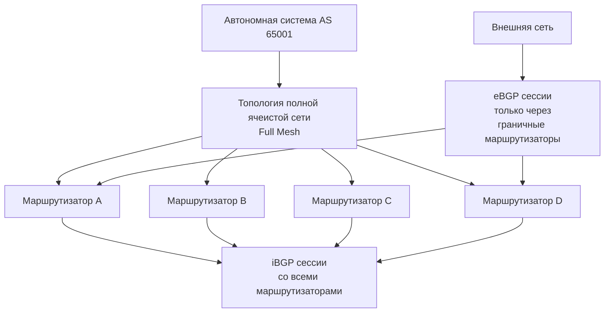

## 3. Процесс установления iBGP сессии

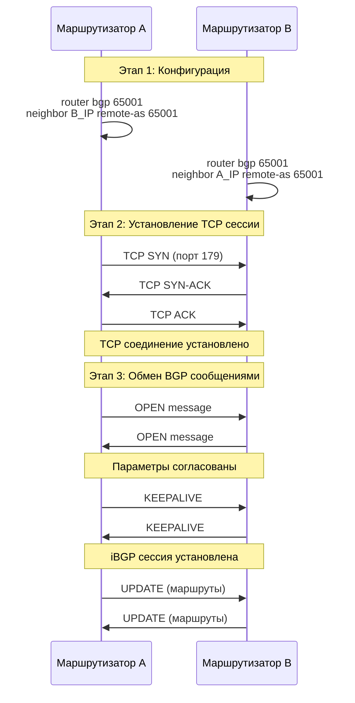

## 4. Правило синхронизации iBGP

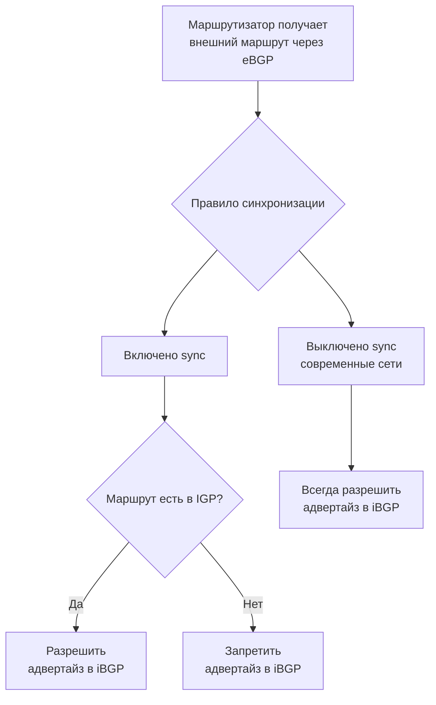

## 5. Процесс распространения маршрута через iBGP

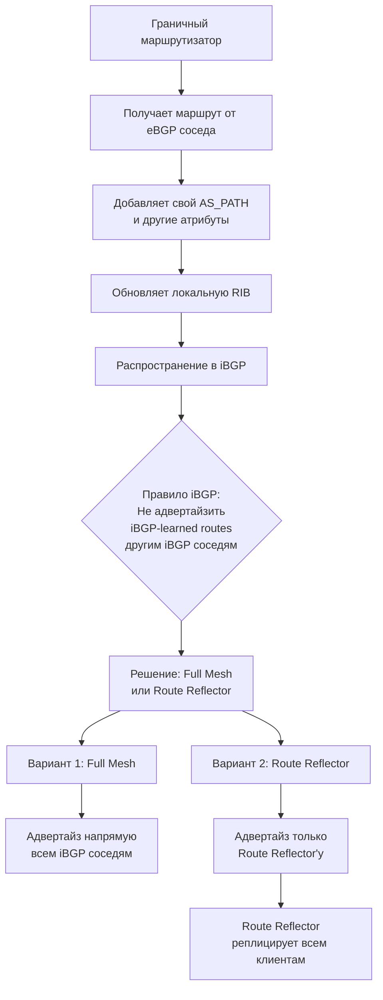

## 6. Сравнение iBGP и eBGP

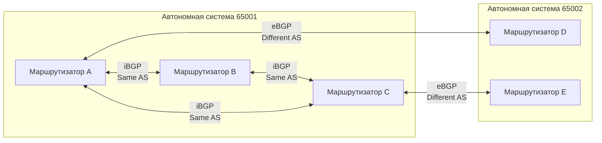

## 7. Атрибуты BGP в iBGP

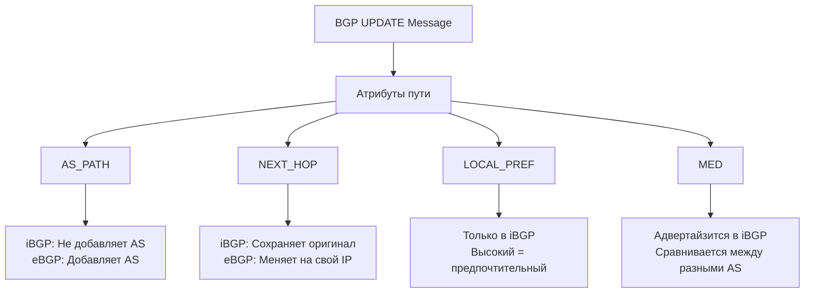

## 8. Процесс принятия решений в iBGP

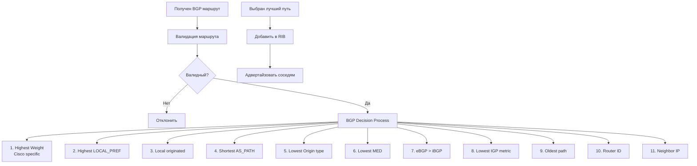

## 9. Пример работы Route Reflector

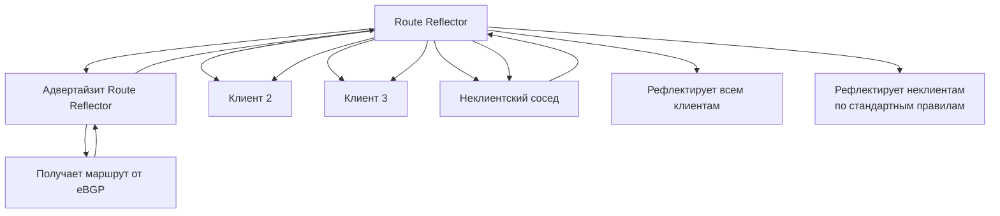

## 10. Полный процесс обработки iBGP маршрута

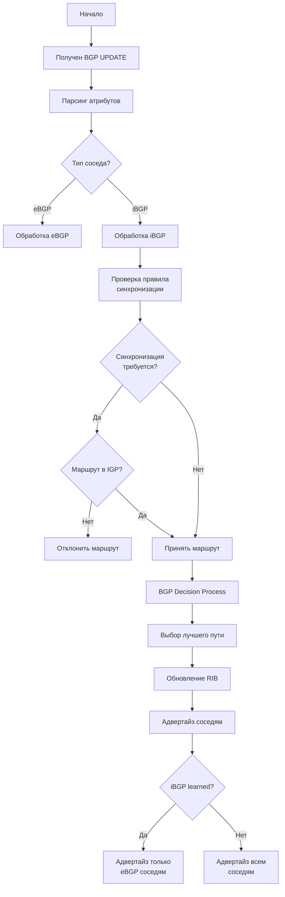

## 11. Практический пример конфигурации

```bash
! Маршрутизатор A в AS 65001
router bgp 65001
 bgp router-id 1.1.1.1
 bgp log-neighbor-changes
 ! iBGP соседи
 neighbor 192.168.1.2 remote-as 65001
 neighbor 192.168.1.3 remote-as 65001
 ! eBGP сосед
 neighbor 10.1.1.2 remote-as 65002
 ! Отключение синхронизации
 no synchronization
 ! Политика сети
 network 192.168.1.0 mask 255.255.255.0
```

## Ключевые особенности iBGP:

1. **Тот же AS номер** у всех участников
2. **Full Mesh требование** (без Route Reflector)
3. **Не изменяет AS_PATH** для внутренних маршрутов
4. **Сохраняет NEXT_HOP** от eBGP соседа
5. **Использует LOCAL_PREF** для управления трафиком внутри AS

iBGP обеспечивает согласованное распространение внешней маршрутной информации внутри автономной системы, работая поверх IGP (OSPF, EIGRP), который обеспечивает внутреннюю связность.


## 1. Основные понятия и расшифровки

**BGP** = **B**order **G**ateway **P**rotocol (Протокол пограничного шлюза)
**iBGP** = **I**nternal **B**order **G**ateway **P**rotocol (Внутренний BGP)
**eBGP** = **E**xternal **B**order **G**ateway **P**rotocol (Внешний BGP)

**AS** = **A**utonomous **S**ystem (Автономная система) - сеть под единым техническим управлением

## 2. Фундаментальные принципы iBGP

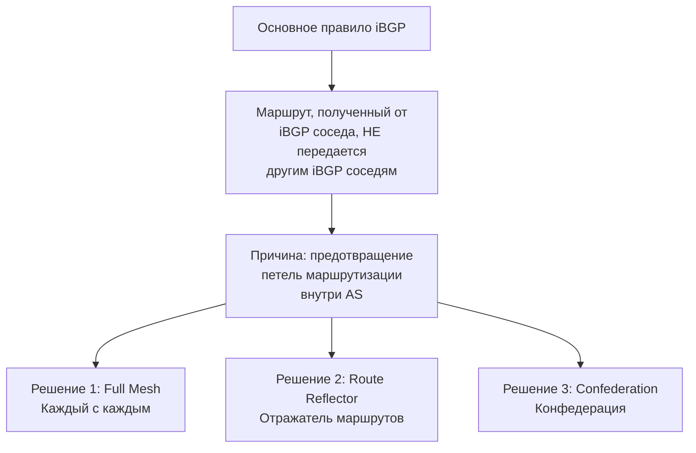

## 3. Детальный процесс установления iBGP сессии

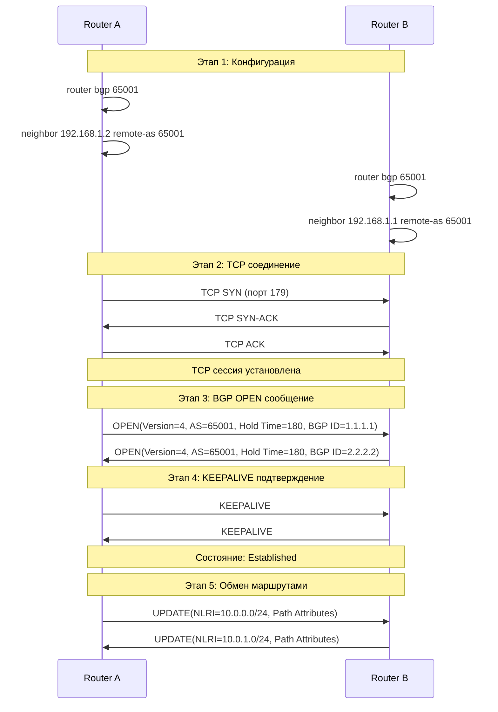

## 4. Ключевые аббревиатуры и их значения

### BGP сообщения:
- **OPEN** - установление соседства
- **UPDATE** - объявление/отзыв маршрутов
- **KEEPALIVE** - поддержание сессии
- **NOTIFICATION** - ошибки и разрыв сессии

### Атрибуты пути (Path Attributes):
- **AS_PATH** = **AS** **PATH** (Путь автономных систем)
- **NEXT_HOP** = **NEXT** **HOP** (Следующий прыжок)
- **LOCAL_PREF** = **LOCAL** **PREF**erence (Локальное предпочтение)
- **MED** = **M**ulti-**E**xit **D**iscriminator (Многовариантный дискриминатор выхода)
- **ORIGIN** - источник маршрута
- **COMMUNITY** - сообщества для группировки маршрутов

## 5. Полный процесс обработки BGP маршрута

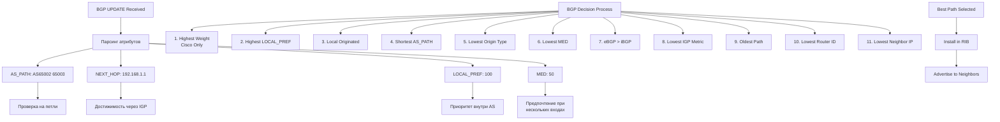

## 6. Разница между iBGP и eBGP

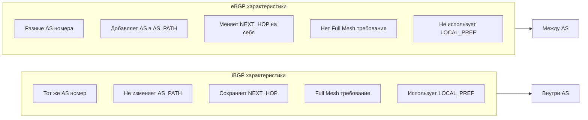

## 7. Решение проблемы Full Mesh: Route Reflector

**RR** = **R**oute **R**eflector (Отражатель маршрутов)

```mermaid
flowchart TD
    A[Проблема Full Mesh] --> B[N*(N-1)/2 сессий<br>Пример: 10 routers = 45 sessions]
    
    B --> C[Решение: Route Reflector]
    
    C --> D[Architecture]
    D --> E[RR Client]
    D --> F[RR Client]
    D --> G[RR Client]
    D --> H[Non-Client]
    
    E --> I[Только 1 сессия к RR]
    F --> I
    G --> I
    H --> I
    
    I --> J[RR отражает маршруты:<br>От клиентов → всем<br>От не-клиентов → только клиентам]
```

## 8. Атрибуты BGP с подробным объяснением

### AS_PATH:
```
AS_PATH: 65002 65003 65004
```
- **Описание:** Список AS, через которые прошел маршрут
- **iBGP:** Не добавляет свой AS
- **eBGP:** Добавляет свой AS в начало

### NEXT_HOP:
- **iBGP:** Сохраняет оригинальный NEXT_HOP от eBGP
- **Проблема:** NEXT_HOP должен быть достижим через IGP
- **Решение:** `next-hop-self` команда

### LOCAL_PREF:
- **Диапазон:** 0-4294967295
- **По умолчанию:** 100
- **Использование:** Выбор исходящего трафика из AS

### MED:
- **Диапазон:** 0-4294967295
- **Назначение:** Влияет на входящий трафик в AS
- **Правило:** Меньшее значение предпочтительнее

## 9. Процесс распространения маршрута в iBGP

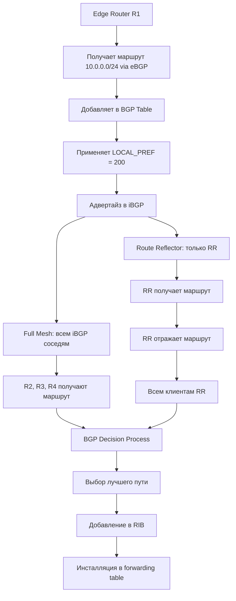

## 10. Важные концепции с расшифровкой

**RIB** = **R**outing **I**nformation **B**ase (База маршрутной информации)
- **Loc-RIB** - локальная BGP таблица
- **Adj-RIB-In** - полученные маршруты от соседа
- **Adj-RIB-Out** - маршруты для отправки соседу

**NLRI** = **N**etwork **L**ayer **R**eachability **I**nformation (Информация о достижимости сетевого уровня)
- Префикс + маска (10.0.0.0/24)

**IGP** = **I**nterior **G**ateway **P**rotocol (Внутренний шлюзовой протокол)
- OSPF, EIGRP, IS-IS - для внутренней связности

## 11. Практический пример: Конфигурация iBGP

```bash
! Маршрутизатор R1 в AS 65001
router bgp 65001
 ! BGP Router ID - уникальный идентификатор
 bgp router-id 1.1.1.1
 bgp log-neighbor-changes
 
 ! iBGP соседи - тот же AS номер
 neighbor 192.168.1.2 remote-as 65001
 neighbor 192.168.1.3 remote-as 65001
 
 ! eBGP сосед - другой AS номер
 neighbor 10.1.1.2 remote-as 65002
 
 ! Отключение правила синхронизации
 no synchronization
 
 ! Изменение NEXT_HOP на себя для iBGP
 neighbor 192.168.1.2 next-hop-self
 neighbor 192.168.1.3 next-hop-self
 
 ! Объявление сетей
 network 192.168.1.0 mask 255.255.255.0
```

## 12. Диагностика iBGP

```bash
# Показать BGP соседей
show ip bgp neighbors

# Показать BGP таблицу
show ip bgp

# Показать BGP summary
show ip bgp summary

# Отладка BGP событий
debug ip bgp events
debug ip bgp updates
```

## Ключевые выводы:

1. **iBGP работает внутри одной AS**
2. **Требует Full Mesh или Route Reflector**
3. **Не изменяет AS_PATH для внутренних маршрутов**
4. **Использует IGP для достижения NEXT_HOP**
5. **LOCAL_PREF управляет исходящим трафиком**
6. **MED влияет на входящий трафик**

iBGP обеспечивает согласованное распространение внешней маршрутной информации внутри автономной системы, работая в тесной интеграции с IGP протоколами.


## 1. Проблема, которую решает Route Reflector

### Full Mesh проблема:
```mermaid
flowchart TD
    A[Проблема Full Mesh iBGP] --> B[N маршрутизаторов = N*(N-1)/2 сессий]
    B --> C[Пример: 10 маршрутизаторов = 45 сессий]
    C --> D[100 маршрутизаторов = 4950 сессий!]
    D --> E[Сложность управления<br>Высокое потребление ресурсов]
```

## 2. Основная концепция Route Reflector

**Route Reflector (RR)** = **Отражатель маршрутов** - специальный BGP маршрутизатор, который отражает (реплицирует) маршруты между своими клиентами.

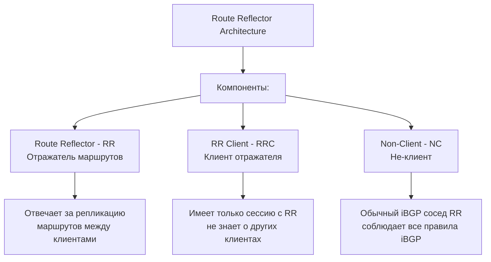

## 3. Правила отражения маршрутов

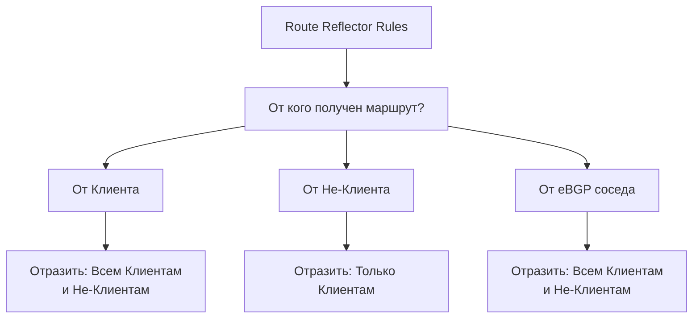

## 4. Детальная архитектура Route Reflector

```mermaid
flowchart TD
    A[Route Reflector RR] --> B[RR Client A]
    A --> C[RR Client B]
    A --> D[RR Client C]
    A --> E[Non-Client X]
    A --> F[eBGP Neighbor Y]
    
    style A fill:#e1f5fe
    style B fill:#c8e6c9
    style C fill:#c8e6c9
    style D fill:#c8e6c9
    style E fill:#ffecb3
    style F fill:#ffcdd2
    
    %% Маршрут от Client A
    B -->|Маршрут 10.1.0.0/24| A
    A -->|Отразить всем| C
    A -->|Отразить всем| D
    A -->|Отразить всем| E
    A -->|Отразить всем| F
    
    %% Маршрут от Non-Client X
    E -->|Маршрут 10.2.0.0/24| A
    A -->|Отразить только клиентам| B
    A -->|Отразить только клиентам| C
    A -->|Отразить только клиентам| D
    A -->|Не отражать| E
    A -->|Не отражать| F
    
    %% Маршрут от eBGP
    F -->|Маршрут 10.3.0.0/24| A
    A -->|Отразить всем| B
    A -->|Отразить всем| C
    A -->|Отразить всем| D
    A -->|Отразить всем| E
```

## 5. Атрибуты Route Reflector

### Специальные атрибуты для предотвращения петель:
- **ORIGINATOR_ID** - Router ID маршрутизатора, который первоначально advertised маршрут в AS
- **CLUSTER_LIST** - список Cluster ID, через которые прошел маршрут

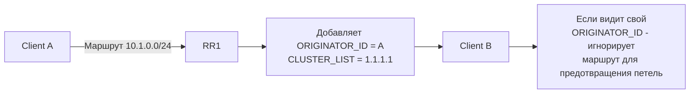

## 6. Процесс обработки маршрута в Route Reflector

```mermaid
flowchart TD
    A[RR получает BGP UPDATE] --> B[Анализ источника]
    
    B --> C{Тип соседа?}
    C --> D[RR Client]
    C --> E[Non-Client]
    C --> F[eBGP Neighbor]
    
    D --> G[Добавить ORIGINATOR_ID<br>и CLUSTER_LIST если нужно]
    E --> G
    F --> G
    
    G --> H[Применить правила отражения]
    
    H --> I[От Клиента:<br>Отразить ВСЕМ]
    H --> J[От Не-Клиента:<br>Отразить только КЛИЕНТАМ]
    H --> K[От eBGP:<br>Отразить ВСЕМ]
    
    I --> L[Отправить маршрут]
    J --> L
    K --> L
```

## 7. Иерархическая архитектура RR

### Multiple Route Reflectors:
```mermaid
flowchart TD
    A[Cluster 1] --> B[RR1]
    A --> C[Client A1]
    A --> D[Client A2]
    
    E[Cluster 2] --> F[RR2]
    E --> G[Client B1]
    E --> G[Client B2]
    
    H[Cluster 3] --> I[RR3]
    H --> J[Client C1]
    H --> K[Client C2]
    
    B <-->|iBGP Full Mesh| F
    F <-->|iBGP Full Mesh| I
    I <-->|iBGP Full Mesh| B
    
    style B fill:#e1f5fe
    style F fill:#e1f5fe
    style I fill:#e1f5fe
```

## 8. Конфигурация Route Reflector

### На Route Reflector:
```bash
! Конфигурация Route Reflector
router bgp 65001
 bgp router-id 1.1.1.1
 !
 ! Обычные iBGP соседи (Non-Clients)
 neighbor 192.168.1.100 remote-as 65001
 neighbor 192.168.1.100 route-reflector-client  # ❌ НЕ ЗДЕСЬ!
 !
 ! RR Clients
 neighbor 192.168.2.1 remote-as 65001
 neighbor 192.168.2.1 route-reflector-client    # ✅ КЛИЕНТ
 
 neighbor 192.168.2.2 remote-as 65001
 neighbor 192.168.2.2 route-reflector-client    # ✅ КЛИЕНТ
 
 neighbor 192.168.2.3 remote-as 65001
 neighbor 192.168.2.3 route-reflector-client    # ✅ КЛИЕНТ
 
 ! eBGP сосед
 neighbor 10.1.1.2 remote-as 65002
```

### На RR Client (обычная конфигурация):
```bash
! Конфигурация RR Client
router bgp 65001
 bgp router-id 2.2.2.2
 !
 ! Только сессия с Route Reflector
 neighbor 192.168.2.100 remote-as 65001
 !
 ! eBGP если нужно
 neighbor 10.2.1.2 remote-as 65003
```

## 9. Пример полного процесса работы

```mermaid
sequenceDiagram
    participant A as Client A
    participant RR as Route Reflector
    participant B as Client B
    participant C as Non-Client
    participant D as eBGP Neighbor
    
    Note over A,RR: Маршрут от Client A
    A->>RR: UPDATE: 10.1.0.0/24
    RR->>RR: Добавить ORIGINATOR_ID = A's RID
    RR->>B: UPDATE: 10.1.0.0/24 (ORIGINATOR_ID = A)
    RR->>C: UPDATE: 10.1.0.0/24 (ORIGINATOR_ID = A)
    RR->>D: UPDATE: 10.1.0.0/24 (ORIGINATOR_ID = A)
    
    Note over C,RR: Маршрут от Non-Client C
    C->>RR: UPDATE: 10.2.0.0/24
    RR->>RR: Добавить ORIGINATOR_ID = C's RID
    RR->>A: UPDATE: 10.2.0.0/24 (ORIGINATOR_ID = C)
    RR->>B: UPDATE: 10.2.0.0/24 (ORIGINATOR_ID = C)
    Note over RR,D: Non-Client маршрут НЕ отражается eBGP
    
    Note over D,RR: Маршрут от eBGP Neighbor
    D->>RR: UPDATE: 10.3.0.0/24 (AS_PATH: 65002)
    RR->>A: UPDATE: 10.3.0.0/24
    RR->>B: UPDATE: 10.3.0.0/24
    RR->>C: UPDATE: 10.3.0.0/24
```

## 10. Кластеры Route Reflector

**Cluster** = группа Route Reflector'ов с одинаковым **CLUSTER_ID**

```mermaid
flowchart TD
    A[Cluster 10] --> B[RR1]
    A --> C[RR2]
    A --> D[Clients]
    
    B --> E[Оба RR имеют<br>CLUSTER_ID = 10]
    C --> E
    
    F[Преимущества] --> G[Избыточность]
    F --> H[Балансировка нагрузки]
    F --> I[Предотвращение петель<br>через CLUSTER_LIST]
```

## 11. Диагностика и мониторинг

```bash
# Показать BGP соседей с их RR статусом
show ip bgp neighbors

# Показать BGP таблицу с ORIGINATOR_ID
show ip bgp

# Детальная информация о маршруте
show ip bgp 10.1.0.0/24

# Показать RR клиентов
show ip bgp route-reflector clients
```

## 12. Best Practices

### Дизайн рекомендации:
```mermaid
graph TB
    A[Best Practices] --> B[Использовать 2+ RR<br>для избыточности]
    A --> C[Размещать RR на<br>P-маршрутизаторах]
    A --> D[Группировать клиентов<br>по географическому принципу]
    A --> E[Использовать разные<br>CLUSTER_ID в разных дата-центрах]
    A --> F[Мониторить нагрузку<br>на RR]
```

## Ключевые преимущества Route Reflector:

1. **✅ Уменьшение количества сессий** - с O(N²) до O(N)
2. **✅ Упрощение управления** - централизованная конфигурация
3. **✅ Масштабируемость** - поддержка больших сетей
4. **✅ Совместимость** - прозрачен для клиентов
5. **✅ Избыточность** - через Multiple RR

Route Reflector решает фундаментальную проблему масштабируемости iBGP, позволяя строить крупные сети без необходимости полной ячеистой топологии.


## 🏢 Сценарий: Компания "ТехноМир" с 4 филиалами

```mermaid
flowchart TD
    A[Компания ТехноМир AS 65001] --> B[Route Reflector<br/>Главный офис Москва]
    
    B --> C[Филиал СПб<br/>Хочет в интернет]
    B --> D[Филиал ЕКБ<br/>Хочет в интернет]  
    B --> E[Филиал НСК<br/>Хочет в интернет]
    B --> F[Филиал КРД<br/>Хочет в интернет]
    
    G[Провайдер А AS 64500] --> B
    H[Провайдер Б AS 64501] --> B
```

## 🔄 Полный рабочий процесс

### Шаг 1: Настройка соединений
```bash
# Все филиалы настраивают связь ТОЛЬКО с Route Reflector
Филиал СПб   --> Route Reflector: "Привет, я твой клиент"
Филиал ЕКБ   --> Route Reflector: "Привет, я твой клиент"  
Филиал НСК   --> Route Reflector: "Привет, я твой клиент"
Филиал КРД   --> Route Reflector: "Привет, я твой клиент"

# Route Reflector отвечает
Route Reflector --> Все филиалы: "ОК, запомнил вас как клиентов"
```

```
hostname    RR-MOSCOW

key chain BGP-KEYS
  key 1
     key-string NETWORK_NAME
     accept-lifetime 00:00:00 Jan 1 2025 infinite
     send-lifetime 00:00:00 Jan 1 2025 infinite
     cryptographic-algorithm HMAC-SHA-256


IP: 10.255.255.254
interface Loopback0
  ip address 10.255.255.254 2555.255.255.255

interface GigabitEthernet0/0
  ip address 203.0.113.2 255.255.255.255.252

interface GigabitEthernet0/1
  ip address 198.51.100.2 255.255.255.255.252

router bgp 65001
  bgp router-id 10.255.255.254
  neighbor RR-CLIENTS tcp-ao BGP-KEYCHAIN
  neighbor RR-CLIENTS peer-group
  neighbor RR-CLIENTS remote-as 65001
  neighbor RR-CLIENTS description iBGP-RR-CLINETS
  neighbor RR-CLIENTS route-reflector-client
  neighbor RR_CLIENTS next-hop-self all

  neighbor PROVIDERS peer-group
  neighbor PROVIDERS ebgp-multihop 2
  neighbor PROVIDERS update-source Loopback0

address-family ipv4
  network 10.0.0.0 mask 255.0.0.0

```

### Шаг 2: Получение интернет-маршрутов
```mermaid
sequenceDiagram
    participant P1 as Провайдер А
    participant P2 as Провайдер Б
    participant RR as Route Reflector
    participant C as Все филиалы

    Note over P1,RR: Route Reflector получает маршруты от провайдеров

    P1->>RR: UPDATE: путь в интернет 0.0.0.0/0<br/>Через меня быстрее!
    P2->>RR: UPDATE: путь в интернет 0.0.0.0/0<br/>Через меня надежнее!

    Note over RR,RR: Route Reflector анализирует:
    Note over RR,RR: - Провайдер А: LOCAL_PREF = 200 (лучший)
    Note over RR,RR: - Провайдер Б: LOCAL_PREF = 100 (резервный)

    RR->>C: ОТРАЖАЕТ: Идите в интернет через Провайдер А!
    RR->>C: ОТРАЖАЕТ: Резервный путь через Провайдер Б
```

### Шаг 3: Филиал хочет в интернет
```mermaid
flowchart TD
    A[Пользователь в СПб<br/>заходит на google.com] --> B[Филиал СПб]
    
    B --> C{Куда отправить пакет?}
    C --> D[Смотрю в таблицу маршрутов]
    
    D --> E[Нашел от Route Reflector:<br/>0.0.0.0/0 через Провайдер А]
    E --> F[Отправляю пакет<br/>через Провайдер А]
    
    F --> G[Пакет доходит до Google]
    G --> H[Ответ возвращается<br/>через Провайдер А]
```

### Шаг 4: Общение между филиалами
```mermaid
sequenceDiagram
    participant SPB as Филиал СПб
    participant RR as Route Reflector
    participant EKB as Филиал ЕКБ
    participant NSK as Филиал НСК

    Note over SPB,NSK: Филиал СПб хочет отправить данные в ЕКБ

    SPB->>RR: UPDATE: Мои сети 10.1.0.0/16
    RR->>EKB: ОТРАЖАЕТ: Сети СПб 10.1.0.0/16
    RR->>NSK: ОТРАЖАЕТ: Сети СПб 10.1.0.0/16

    EKB->>RR: UPDATE: Мои сети 10.2.0.0/16  
    RR->>SPB: ОТРАЖАЕТ: Сети ЕКБ 10.2.0.0/16
    RR->>NSK: ОТРАЖАЕТ: Сети ЕКБ 10.2.0.0/16

    Note over SPB,EKB: Теперь СПб знает как<br/>достичь ЕКБ и наоборот
```

### Шаг 5: Провайдер А падает - автоматическое переключение
```mermaid
flowchart TD
    A[⚡ Провайдер А перестал работать] --> B[Route Reflector обнаруживает сбой]
    
    B --> C[Удаляет маршрут через Провайдер А]
    C --> D[Автоматически выбирает Провайдер Б]
    
    D --> E[ОТРАЖАЕТ ВСЕМ ФИЛИАЛАМ:<br/>Теперь идите в интернет через Провайдер Б!]
    
    E --> F[Филиал СПб получает UPDATE]
    E --> G[Филиал ЕКБ получает UPDATE]
    E --> H[Филиал НСК получает UPDATE]
    E --> I[Филиал КРД получает UPDATE]
    
    F --> J[Все автоматически<br/>переключаются на Провайдер Б]
    G --> J
    H --> J
    I --> J
    
    J --> K[Пользователи даже не заметили сбоя!]
```

## 💻 Реальные команды в процессе

### На Route Reflector:
```bash
# Route Reflector получает маршруты от провайдеров
BGP: 203.0.113.1 (Провайдер А) - получен маршрут 0.0.0.0/0
BGP: 198.51.100.1 (Провайдер Б) - получен маршрут 0.0.0.0/0

# Route Reflector выбирает лучший путь
BGP: Лучший путь до 0.0.0.0/0 - через 203.0.113.1

# Route Reflector отражает клиентам
BGP: ОТРАЖАЮ 0.0.0.0/0 клиенту 10.1.1.1 (СПб)
BGP: ОТРАЖАЮ 0.0.0.0/0 клиенту 10.1.2.1 (ЕКБ)
BGP: ОТРАЖАЮ 0.0.0.0/0 клиенту 10.1.3.1 (НСК)
BGP: ОТРАЖАЮ 0.0.0.0/0 клиенту 10.1.4.1 (КРД)
```

### На филиале СПб:
```bash
# Получает маршрут от Route Reflector
BGP: Получен маршрут 0.0.0.0/0 от 10.255.255.254 (RR)

# Добавляет в таблицу маршрутизации
ROUTING TABLE: 0.0.0.0/0 via 203.0.113.1

# Пользователь открывает сайт
USER: Запрос к 8.8.8.8 (Google DNS)
ROUTER: Отправляю через 203.0.113.1 (Провайдер А)
```

## 🕒 Временная шкала процесса

```mermaid
gantt
    title Временная шкала работы Route Reflector
    dateFormat HH:mm:ss
    section Инициализация
    Настройка BGP сессий :done, 00:00:00, 10s
    Обмен маршрутами :done, 00:00:10, 5s
    section Рабочий процесс
    Пользователь запрос :active, 00:00:15, 2s
    Маршрутизация :active, 00:00:16, 1s
    Передача данных :active, 00:00:17, 3s
    section Сбой и восстановление
    Провайдер А падает :crit, 00:01:00, 1s
    Обнаружение сбоя :crit, 00:01:01, 3s
    Переключение :crit, 00:01:04, 2s
    Восстановление :crit, 00:01:06, 2s
```

## 📊 Результаты работы

### До Route Reflector:
```
6 устройств = 15 BGP сессий
Путаница в маршрутах
Медленное обновление
Сложное управление
```

### После Route Reflector:
```
6 устройств = 5 BGP сессий
Четкие оптимальные маршруты  
Быстрое обновление за секунды
Простое управление через одну точку
```

## 🎯 Итог рабочего процесса:

**Route Reflector работает как диспетчер такси:**
1. **Знает** всех водителей (провайдеров)
2. **Знает** всех клиентов (филиалы)  
3. **Назначает** оптимальный маршрут для каждой поездки
4. **Перераспределяет** заказы при проблемах
5. **Все довольны** - клиенты быстро едут, водители не простаивают

