```mermaid
flowchart TD
    subgraph "🌐 Интернет / WAN"
        direction LR
        INTERNET[Доступ в Интернет]
        VPN[VPN туннели <br> для удаленных офисов]
        CLOUD[Облачные сервисы <br> Azure/AWS/GCP]
    end

    subgraph "🛡️ Периметр безопасности"
        FIREWALL[Брандмауэр NGFW<br>UTM/IPS/IDS]
        BALANCER[Балансировщик нагрузки<br>F5/nginx]
        WAF[Web Application Firewall]
        PROXY[Прокси-сервер]
        EMAIL[Почтовый сервер/шлюз]
        
        FIREWALL --> BALANCER
        BALANCER --> WAF
    end

    subgraph "🔀 Ядро сети (Core/Distribution)"
        direction LR
        CORE_SW1[Коммутатор ядра 1<br>L3]
        CORE_SW2[Коммутатор ядра 2<br>L3]
        ROUTER1[Маршрутизатор 1]
        ROUTER2[Маршрутизатор 2]
        
        CORE_SW1 <--> CORE_SW2
    end

    subgraph "📡 Коммутаторы доступа (Access Layer)"
        SW_DMZ[Коммутаторы DMZ]
        SW_SERVERS[Коммутаторы серверной]
        SW_USERS[Коммутаторы пользователей]
        SW_STORAGE[Коммутаторы СХД]
        
        SW_DMZ --> CORE_SW1 & CORE_SW2
        SW_SERVERS --> CORE_SW1 & CORE_SW2
        SW_USERS --> CORE_SW1 & CORE_SW2
        SW_STORAGE --> CORE_SW1 & CORE_SW2
    end

    subgraph "🏢 Зона DMZ (Demilitarized Zone)"
        WEB1[Веб-сервер 1<br>Битрикс/сайт]
        WEB2[Веб-сервер 2<br>Резервный]
        APP1[Веб-приложение 1<br>Корпоративный портал]
        APP2[Веб-приложение 2<br>CRM/ERP]
        PROXY --> WEB1 & WEB2 & APP1 & APP2
    end

    subgraph "🖥️ Основная серверная инфраструктура"
        direction TB
        
        subgraph "🧠 Active Directory / Инфраструктура"
            DC1[Контроллер домена 1<br>DC/DNS/DHCP]
            DC2[Контроллер домена 2<br>Резервный]
            ADDS[Службы каталогов<br>Групповые политики]
            ADFS[Службы федерации<br>SSO]
            DC1 <--> DC2
        end
        
        subgraph "📊 1С Предприятие"
            RAC1[1С Сервер 1<br>Кластер серверов]
            RAC2[1С Сервер 2]
            SQL_1C[(SQL Server<br>БД 1С)]
            RDS[Сервер терминалов<br>1С Тонкий клиент]
            RAC1 & RAC2 --> SQL_1C
        end
        
        subgraph "💾 Файловые сервисы"
            FS1[Файловый сервер 1<br>DFS]
            FS2[Файловый сервер 2<br>Репликация]
            NAS[NAS-сервер<br>Общие папки]
            FS1 <--> FS2
        end
        
        subgraph "🔄 Системы резервного копирования"
            BACKUP_SRV[Сервер бэкапов<br>Veeam/Commvault]
            TAPE[Ленточная библиотека]
            REPO[Репозиторий бэкапов]
            CLOUD_BKP[Облачный бэкап]
            BACKUP_SRV --> TAPE & REPO & CLOUD_BKP
        end
        
        subgraph "📈 Мониторинг и логирование"
            SIEM[SIEM система<br>ELK/Splunk/QRadar]
            MONITOR[Система мониторинга<br>Zabbix/Nagios]
            LOG_SRV[Сервер логов<br>syslog-ng]
            SIEM <--> MONITOR <--> LOG_SRV
        end
        
        subgraph "🗄️ Системы хранения данных (СХД)"
            SAN[SAN-коммутаторы<br>Fibre Channel]
            STORAGE1[СХД 1<br>Основной массив]
            STORAGE2[СХД 2<br>Резервный]
            STORAGE1 <--> STORAGE2
        end
    end

    subgraph "🏢 Пользовательская среда"
        USERS_PC[Компьютеры пользователей<br>Windows/macOS]
        LAPTOPS[Ноутбуки<br>Мобильные устройства]
        PHONES[IP-телефоны<br>VoIP]
        PRINTERS[Принтеры/МФУ<br>Сетевая печать]
        
        USERS_PC & LAPTOPS & PHONES & PRINTERS --> SW_USERS
    end

    subgraph "☁️ Вспомогательные сервисы"
        HYPERVISOR[Гипервизор<br>VMware/Hyper-V/KVM]
        CONFIG_MGMT[Управление конфигурациями<br>Ansible/Chef]
        CONTAINERS[Контейнеры<br>Docker/Kubernetes]
        DEVOPS[DevOps пайплайны<br>GitLab/Jenkins]
    end

    %% Основные связи
    INTERNET --> FIREWALL
    VPN --> FIREWALL
    CLOUD --> FIREWALL
    
    FIREWALL --> CORE_SW1 & CORE_SW2
    
    %% DMZ связи
    SW_DMZ --> WEB1 & WEB2 & APP1 & APP2
    BALANCER --> SW_DMZ
    
    %% Серверные связи
    SW_SERVERS --> DC1 & DC2 & RAC1 & RAC2 & SQL_1C & RDS
    SW_SERVERS --> FS1 & FS2 & NAS
    SW_SERVERS --> BACKUP_SRV & SIEM & MONITOR
    SW_SERVERS --> HYPERVISOR
    
    %% СХД связи
    SW_STORAGE --> SAN
    SAN --> STORAGE1 & STORAGE2
    
    %% Виртуализация и СХД
    HYPERVISOR --> SAN
    STORAGE1 --> HYPERVISOR
    STORAGE1 --> BACKUP_SRV
    
    %% Системные связи
    DC1 & DC2 --> USERS_PC & LAPTOPS & RDS
    SIEM --> FIREWALL & CORE_SW1 & CORE_SW2 & SW_SERVERS
    MONITOR --> все_системы
    
    %% Резервное копирование
    BACKUP_SRV --> DC1 & DC2 & RAC1 & FS1 & SQL_1C
    
    %% Стили для наглядности
    style INTERNET fill:#4fc3f7
    style FIREWALL fill:#ff9800
    style CORE_SW1 fill:#9c27b0
    style CORE_SW2 fill:#9c27b0
    style DC1 fill:#2196f3
    style RAC1 fill:#4caf50
    style WEB1 fill:#ff5722
    style SIEM fill:#f44336
    style STORAGE1 fill:#795548
    style BACKUP_SRV fill:#607d8b
    style HYPERVISOR fill:#009688
    
    classDef internet fill:#4fc3f7,stroke:#333,stroke-width:2px
    classDef security fill:#ff9800,stroke:#333,stroke-width:2px
    classDef network fill:#9c27b0,stroke:#333,stroke-width:2px
    classDef directory fill:#2196f3,stroke:#333,stroke-width:2px
    classDef business fill:#4caf50,stroke:#333,stroke-width:2px
    classDef web fill:#ff5722,stroke:#333,stroke-width:2px
    classDef monitoring fill:#f44336,stroke:#333,stroke-width:2px
    classDef storage fill:#795548,stroke:#333,stroke-width:2px
    classDef backup fill:#607d8b,stroke:#333,stroke-width:2px
    classDef virtualization fill:#009688,stroke:#333,stroke-width:2px
```

## **Ключевые компоненты схемы:**

### **1. Периметр безопасности:**
- **NGFW/Firewall** - межсетевой экран нового поколения
- **WAF** - защита веб-приложений
- **Балансировщик** - распределение нагрузки на веб-серверы
- **Прокси** - контроль интернет-доступа

### **2. Сетевая инфраструктура:**
- **Ядро сети** - L3 коммутаторы и маршрутизаторы
- **Коммутаторы доступа** - разделение по зонам
- **DMZ зона** - изолированная зона для публичных сервисов

### **3. Основные бизнес-сервисы:**
- **Active Directory** - управление учетными записями, политиками
- **1С Предприятие** - бизнес-приложения, бухгалтерия
- **Битрикс/веб-серверы** - корпоративный сайт, портал
- **Файловые серверы** - общие ресурсы, документы

### **4. Инфраструктурные системы:**
- **СХД** - системы хранения данных (SAN/NAS)
- **Бэкап** - системы резервного копирования
- **SIEM/мониторинг** - сбор логов и мониторинг
- **Гипервизор** - виртуализация серверов

### **5. Пользовательская среда:**
- Рабочие станции, ноутбуки
- Сетевая периферия (принтеры, телефоны)

Эта схема представляет типичную корпоративную ИТ-инфраструктуру среднего/крупного предприятия с балансом между безопасностью, производительностью и управляемостью.

# **Таблица: Описание компонентов корпоративной ИТ-инфраструктуры**

| № | Компонент | Тип устройства/сервиса | Основное назначение | Входные подключения (откуда принимает трафик) | Выходные подключения (куда передает трафик) | С чем соединяется напрямую | Особые характеристики |
|---|-----------|------------------------|-------------------|--------------------------------|--------------------------------|---------------------------|-------------------------|
| **1. ПЕРИМЕТР БЕЗОПАСНОСТИ** | | | | | | | |
| 1.1 | **NGFW/Firewall** | Аппаратный/виртуальный межсетевой экран | - Фильтрация входящего/исходящего трафика - IPS/IDS - VPN терминация - NAT | - Интернет-провайдер - Удаленные офисы (VPN) - Облачные сервисы | - Ядро сети - DMZ зона | - Маршрутизатор ISP - Коммутаторы ядра | Stateful inspection, Deep Packet Inspection, SSL Inspection |
| 1.2 | **WAF** | Веб-брандмауэр | - Защита веб-приложений от атак - Фильтрация HTTP/HTTPS трафика | - Балансировщик нагрузки - Пользовательский трафик к веб-серверам | - Веб-серверы в DMZ | - Балансировщик нагрузки - Веб-серверы | Защита от SQLi, XSS, CSRF, DDoS на уровне приложений |
| 1.3 | **Балансировщик нагрузки** | Аппаратный/программный LB | - Распределение нагрузки между веб-серверами - Health check серверов - SSL termination | - Пользовательский трафик из интернета - Внутренние запросы | - Веб-серверы в DMZ - Серверы приложений | - Firewall - Веб-серверы | Алгоритмы балансировки (round-robin, least connections), Sticky sessions |
| 1.4 | **Прокси-сервер** | Серверное ПО | - Контроль интернет-доступа - Кэширование - Аутентификация пользователей | - Пользовательские рабочие станции - Серверы | - Интернет через Firewall - Целевые веб-ресурсы | - Пользовательские компьютеры - Firewall | Политики доступа, фильтрация контента, отчетность |
| **2. СЕТЕВАЯ ИНФРАСТРУКТУРА** | | | | | | | |
| 2.1 | **Ядро сети (Core)** | L3 коммутаторы | - Высокоскоростная коммутация между сегментами - Маршрутизация между VLAN - Агрегирование каналов | - Все коммутаторы доступа - Firewall - Критические серверы | - Все коммутаторы доступа - СХД - Серверная ферма | - Firewall - Коммутаторы доступа - Серверные коммутаторы | Redundant power, VSS/Stacking, 10/40/100 Gbps порты |
| 2.2 | **Коммутаторы доступа** | L2/L3 коммутаторы | - Подключение конечных устройств - VLAN segmentation - PoE для телефонов/камер | - Пользовательские устройства - IP-телефоны - Принтеры | - Ядро сети - Другие коммутаторы | - ПК пользователей - Телефоны VoIP - Принтеры | Power over Ethernet, Port Security, 802.1X |
| 2.3 | **DMZ зона** | Выделенные коммутаторы | - Изоляция публично доступных сервисов - Контролируемый доступ извне | - Балансировщик нагрузки - Firewall (ограниченный доступ) | - Веб-серверы - Серверы приложений в DMZ | - Веб-серверы - Внешние API серверы | Отдельные VLAN, строгие ACL, изоляция от внутренней сети |
| **3. ОСНОВНЫЕ БИЗНЕС-СЕРВИСЫ** | | | | | | | |
| 3.1 | **Active Directory** | Windows Server | - Централизованная аутентификация - Управление учетными записями - Групповые политики | - Все компьютеры домена - Приложения (аутентификация) - Принтеры/ресурсы | - Ответы на аутентификацию - Применение политик | - Все рабочие станции - Серверы Windows - Приложения | Domain Controllers, DNS сервис, Replication между DC |
| 3.2 | **1С Предприятие** | Сервер приложений + SQL | - Выполнение бизнес-логики 1С - Обработка транзакций - Работа с базами данных | - Тонкие клиенты 1С - Веб-клиенты - Интеграционные запросы | - SQL сервер (база данных) - Файловые серверы (конфигурации) | - SQL Server - Клиентские рабочие места - Файловые серверы | Кластеризация серверов 1С, RDP/терминальный сервер |
| 3.3 | **Битрикс/Веб-серверы** | Веб-сервер (IIS/Apache/Nginx) | - Хостинг корпоративного сайта - Веб-приложения - Портал сотрудников | - Балансировщик нагрузки - Пользовательские запросы | - Базы данных - Файловые хранилища - Внешние API | - Балансировщик - SQL Server - Файловые серверы | PHP/ASP.NET, кэширование, CDN интеграция |
| 3.4 | **Файловые серверы** | Windows/Linux сервер | - Хранение общих документов - Резервирование файлов - Контроль доступа к файлам | - Рабочие станции пользователей - Серверы приложений - Серверы бэкапа | - Ответы на файловые запросы - Репликация на другие FS | - Пользовательские ПК - Серверы приложений - Backup сервер | DFS Replication, квотирование, Shadow Copy |
| **4. ИНФРАСТРУКТУРНЫЕ СИСТЕМЫ** | | | | | | | |
| 4.1 | **СХД (SAN/NAS)** | Система хранения данных | - Централизованное хранение данных - Высокая доступность - Резервирование | - Серверы через FC/iSCSI - Гипервизоры - Серверы бэкапа | - Данные виртуальным машинам - Данные физическим серверам | - Серверы через FC-коммутаторы - Гипервизоры | RAID массивы, SSD кэш, репликация между СХД |
| 4.2 | **Бэкап система** | Сервер + ПО резервного копирования | - Резервное копирование данных - Восстановление при сбоях - Архивирование | - Все серверы и рабочие станции - СХД - Базы данных | - Хранилища бэкапов (ленты, диски) - Облачные хранилища | - Все серверы - СХД - Ленточные библиотеки | Инкрементальные/полные копии, Deduplication, шифрование |
| 4.3 | **SIEM система** | Сервер сбора и анализа логов | - Централизованный сбор логов - Анализ безопасности - Корреляция событий | - Все сетевые устройства - Все серверы - Приложения | - Отчеты и алерты - Dashboard мониторинга | - Все устройства через syslog/агентов - Сетевые анализаторы | Real-time monitoring, threat intelligence, compliance reporting |
| 4.4 | **Гипервизор** | VMware ESXi/Hyper-V/KVM | - Виртуализация серверов - Изоляция ВМ - Управление ресурсами | - Управляющие консоли (vCenter) - Администраторы - API вызовы | - Виртуальные машины - СХД (через SAN) | - СХД - Серверы управления - Сеть (vSwitch) | vMotion, HA, DRS, ресурс пулы |
| **5. ПОЛЬЗОВАТЕЛЬСКАЯ СРЕДА** | | | | | | | |
| 5.1 | **Рабочие станции** | ПК/Ноутбуки | - Рабочие места сотрудников - Запуск приложений - Доступ к ресурсам | - Пользовательский ввод - Обновления с серверов | - Запросы к серверам - Интернет трафик | - Коммутаторы доступа - Принтеры - IP-телефоны | Доменное присоединение, управление через групповые политики |
| 5.2 | **IP-телефоны** | VoIP устройства | - Телефонная связь - Видеозвонки - Конференц-связь | - Аналоговые линии или SIP trunk - Пользовательские вызовы | - SIP сервер - Другие телефоны | - Коммутаторы с PoE - SIP сервер | PoE питание, VLAN для голосового трафика |
| 5.3 | **Принтеры/МФУ** | Сетевая периферия | - Печать документов - Сканирование в сеть - Копирование | - Задания на печать - Административные команды | - Отпечатанные документы - Отсканированные файлы | - Коммутаторы доступа - Сервер печати - Пользовательские ПК | Сетевая печать, управление очередями, мониторинг расходников |

---

## **ДОПОЛНИТЕЛЬНАЯ ТАБЛИЦА: ВЗАИМОСВЯЗИ И ПРОТОКОЛЫ**

| Взаимодействие между компонентами | Используемые протоколы | Порт(ы) | Назначение взаимодействия |
|----------------------------------|----------------------|---------|--------------------------|
| **Пользователи → Active Directory** | LDAP, Kerberos | 389, 636, 88 | Аутентификация, авторизация, поиск в каталоге |
| **Рабочие станции → Файловые серверы** | SMB/CIFS, NFS | 445, 139, 2049 | Доступ к общим папкам, документам |
| **1С Сервер → SQL Server** | TDS (Tabular Data Stream) | 1433 | Запросы к базе данных, транзакции |
| **Веб-серверы → Базы данных** | MySQL, PostgreSQL, SQL | 3306, 5432, 1433 | Получение контента, обработка форм |
| **Гипервизор → СХД** | iSCSI, Fibre Channel, NFS | 3260, 3260 (FC), 2049 | Доступ к хранилищам ВМ, шаблонам |
| **Все устройства → SIEM** | Syslog, SNMP, WMI | 514, 162, 135/445 | Передача логов, мониторинг событий |
| **Бэкап сервер → Все серверы** | VSS, агенты бэкапа, NFS | Разные | Резервное копирование данных |
| **Firewall → Все устройства** | Любые (инспекция) | Все | Фильтрация и контроль трафика |
| **Балансировщик → Веб-серверы** | HTTP, HTTPS, TCP health checks | 80, 443, custom | Распределение нагрузки, проверка доступности |
| **Коммутаторы ядра ↔ Коммутаторы доступа** | STP, LACP, OSPF | - | Управление топологией, агрегация каналов, маршрутизация |

---

## **КЛЮЧЕВЫЕ ПРИНЦИПЫ АРХИТЕКТУРЫ:**

1. **Иерархичность** - четкое разделение на уровни (периметр, ядро, доступ)
2. **Сегментация** - разделение на зоны безопасности (DMZ, внутренняя сеть, управление)
3. **Отказоустойчивость** - дублирование критических компонентов
4. **Масштабируемость** - возможность добавления мощностей без перепроектирования
5. **Централизованное управление** - AD для пользователей, SIEM для мониторинга
6. **Защита в глубину** - многоуровневая безопасность (Firewall, WAF, антивирус)

---

## **ПОТОКИ ДАННЫХ В СИСТЕМЕ:**

1. **Внешний трафик:** Интернет → Firewall → Балансировщик → WAF → Веб-серверы
2. **Внутренний трафик:** Пользователи → Коммутаторы → Ядро → Серверы
3. **Управляющий трафик:** Устройства → SIEM/Мониторинг → Администраторы
4. **Резервное копирование:** Серверы → Бэкап система → Хранилища
5. **Хранение данных:** Серверы → СХД → Гипервизор (для ВМ)