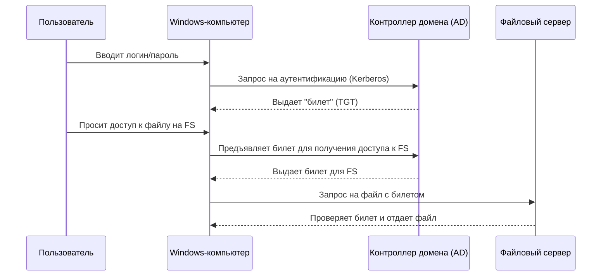
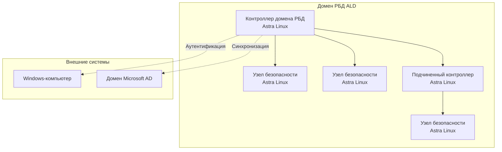
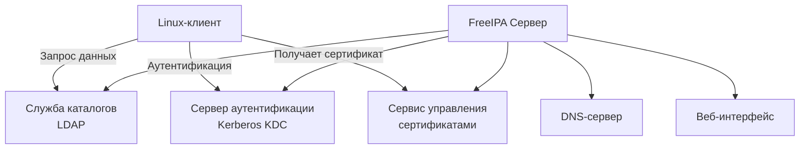

### Что такое служба доменов (каталога)?

Представьте, что у вас в компании 100 компьютеров. Вам нужно на каждом создать одни и те же учетные записи пользователей, настроить права доступа к папкам, установить программы. Делать это вручную на каждой машине — кошмар!

**Служба доменов (Domain Service)** — это как "единый центр управления" для всей сети. Вместо того чтобы заходить на каждый компьютер отдельно, вы создаете пользователя один раз в центре, и этот пользователь может войти со своим логином и паролем на *любой* компьютер, входящий в этот "домен".

**Ключевые понятия:**
*   **Домен (Domain)** — группа компьютеров, управляемых из единого центра.
*   **Контроллер домена (Domain Controller, DC)** — главный компьютер (сервер), на котором работает эта служба. Он хранит базу данных всех пользователей, компьютеров и правил.
*   **Аутентификация** — процесс проверки логина и пароля (кто вы?).
*   **Авторизация** — процесс проверки прав (что вам можно делать?).
*   **Политика безопасности** — набор правил (например, "запретить простые пароли" или "заблокировать экран через 5 минут бездействия").

---

### 1. Microsoft Active Directory (AD)

Это "золотой стандарт" и самая распространенная в мире система. Если вы где-то работали в офисе с Windows-компьютерами, вы почти наверняка сталкивались с AD.

*   **Производитель:** Microsoft.
*   **Основная ОС:** Windows Server.
*   **Целевая аудитория:** Корпоративные сети любого размера, особенно с преобладанием ОС Windows.

**Как работает:**
Все данные (пользователи, компьютеры) хранятся в базе данных на основе **LDAP** (облегчённый протокол доступа к каталогам). Для аутентификации используется несколько протоколов, главный из которых — **Kerberos**. Это очень безопасный протокол, который работает по принципу "билетов" (tickets), как в метро: вы один раз предъявляете пропуск (логин/пароль), а дальше получаете билеты для доступа к другим сервисам.

**Диаграмма взаимодействия:**

**Плюсы:**
*   **Высокая интеграция с Windows:** Работает "из коробки", максимально просто настраивается.
*   **Огромная экосистема:** Тысячи программ и устройств (принтеры, сканеры) умеют с ней работать.
*   **Мощные групповые политики (GPO):** Гибкое управление настройками всех компьютеров.
*   **Поддержка:** Официальная поддержка от Microsoft.

**Минусы:**
*   **Платные лицензии:** Нужно покупать Windows Server и клиентские лицензии (CAL).
*   **Требовательность к ресурсам:** Сервер должен быть достаточно мощным.
*   **Привязка к ОС Windows:** Хотя и есть интеграция с Linux, она не всегда идеальна.

---

### 2. Служба каталогов Astra Linux (ALD)

Это "родная" служба каталогов для операционной системы Astra Linux, созданной для нужд российских госструктур и силовых ведомств. Её главный фокус — **безопасность и соответствие российским регулятория**.

*   **Производитель:** "РусБИТех-Астра".
*   **Основная ОС:** Astra Linux SE.
*   **Целевая аудитория:** Госорганы, ФОИВ, ОИВ, ВС РФ, организации с повышенными требованиями к безопасности.

**Как работает:**
ALD также использует протоколы **LDAP** и **Kerberos**, как и AD. Однако, в её основе лежит **Open Source** решение **FreeIPA** (мы рассмотрим его ниже), которое было серьезно доработано и усилено.

**Главные особенности ALD:**
1.  **Мандатное управление доступом (МУД):** Это система принудительного контроля доступа, встроенная прямо в ядро ОС. У каждого файла и пользователя есть "метка безопасности" (уровень секретности и грифа). Пользователь не может прочитать файл с более высоким грифом, даже если у него есть права доступа к папке. Это главное отличие от AD.
2.  **Соответствие Требованиям по безопасности информации (ТБИ):** Из коробки настроена в соответствии с приказами ФСТЭК России.
3.  **Домен РБД:** РБД (Распределенная База Данных) — это аналог домена AD. Компьютеры Astra Linux присоединяются к домену РБД.

**Диаграмма структуры ALD:**

**Плюсы:**
*   **Максимальная безопасность:** Встроенное МУД, сертификация ФСТЭК и Минобороны.
*   **Централизованное управление МУД:** Настройка меток безопасности для всех пользователей из центра.
*   **Поддержка отечественного ПО:** Полная интеграция со средствами криптозащиты (КриптоПро, ViPNet).
*   **Возможность интеграции с AD:** Может работать в связке с существующей инфраструктурой Microsoft.

**Минусы:**
*   **Сложность:** Требует глубоких знаний для настройки и сопровождения.
*   **Нишевость:** В основном используется в госсекторе.
*   **Ограниченная экосистема:** Меньше сторонних программ, которые тестировались с ALD.

---

### 3. Samba Domain Controller (SDC)

Samba — это набор программ, который позволяет Linux-компьютерам "притворяться" Windows-машинами и взаимодействовать с ними. **Samba Domain Controller** — это реализация контроллера домена Microsoft Active Directory, но работающая на Linux.

*   **Производитель:** Open Source проект.
*   **Основная ОС:** Любой дистрибутив Linux.
*   **Целевая аудитория:** Небольшие компании, которые хотят использовать бесплатный аналог AD или интегрировать Linux-серверы в существующую Windows-сеть.

**Как работает:**
Samba "эмулирует" протоколы Microsoft (SMB/CIFS для общих папок и принтеров, а также собственный протокол аутентификации) и может выступать в роли контроллера домена. Современные версии Samba (4.x) могут работать как **полноценный контроллер домена AD**, используя те же протоколы (LDAP, Kerberos).

**Плюсы:**
*   **Бесплатность:** Не требуются лицензии Windows Server.
*   **Гибкость:** Работает на любом "железе" под управлением Linux.
*   **Хорошая интеграция:** Позволяет Linux-серверам полноценно входить в домен Windows и управлять им.

**Минусы:**
*   **Сложность настройки:** Конфигурируется через текстовые файлы, требует хорошего понимания работы AD.
*   **Отставание в функциях:** Не всегда поддерживает самые новые функции AD с момента их выхода.
*   **Поддержка:** Нет официальной поддержки, только сообщество.

---

### 4. FreeIPA

FreeIPA — это "ответ" Linux-сообщества на Microsoft AD. Это не эмулятор, а **нативная, интегрированная система управления идентификацией для Linux/Unix-сред**.

*   **Производитель:** Open Source проект (Red Hat является основным спонсором).
*   **Основная ОС:** RHEL, CentOS, Fedora и другие дистрибутивы на их основе.
*   **Целевая аудитория:** Инфраструктуры, построенные преимущественно на Linux.

**Как работает:**
FreeIPA объединяет в себе несколько компонентов:
*   **LDAP-сервер (389 Directory Server):** Для хранения данных.
*   **Сервер аутентификации (Kerberos KDC):** Для проверки подлинности.
*   **Сервер управления политиками (Dogtag):** Для управления сертификатами.
*   **DNS-сервер (Bind):** Для управления именами хостов.
*   **Веб-интерфейс:** Для удобного управления.

По сути, FreeIPA — это готовый "конструктор" для построения домена Linux.

**Диаграмма компонентов FreeIPA:**

**Плюсы:**
*   **"Из коробки" для Linux:** Идеально подходит для сред, где нет Windows-машин.
*   **Интегрированное управление сертификатами:** Упрощает раздание SSL-сертификатов.
*   **Удобный веб-интерфейс:** Проще в управлении, чем Samba.
*   **Поддержка от Red Hat:** Входит в состав RHEL.

**Минусы:**
*   **Ориентация на Linux:** Сложно, а иногда и невозможно, присоединить к домену FreeIPA компьютеры с Windows.
*   **Сложность:** Много зависимых компонентов.

---

### Сравнительная таблица

| Характеристика | Microsoft AD | Astra Linux (ALD) | Samba DC | FreeIPA |
| :--- | :--- | :--- | :--- | :--- |
| **Основная ОС** | Windows Server | Astra Linux | Любой Linux | RHEL, CentOS, Fedora |
| **Лицензирование** | Платное | Входит в дистриб. ОС | Бесплатное (Open Source) | Бесплатное (Open Source) |
| **Главная цель** | Управление Windows-сетями | Безопасные гос. сети | Совместимость с AD на Linux | Управление Linux-сетями |
| **Ключевая фича** | Групповые политики (GPO) | Мандатное управление доступом (МУД) | Совместимость с протоколами MS | Управление сертификатами |
| **Сложность** | Средняя | Высокая | Высокая | Средняя/Высокая |
| **Идеально для** | Корпоративных сетей с Windows | Госсектор, ВПК | Замена AD или интеграция в AD | Чистые Linux/Unix-сети |

### Итог 

*   **Если у вас все компьютеры на Windows** — стандартом является **Microsoft AD**.
*   **Если вы работаете в госорганах России и нужна максимальная безопасность** — ваш выбор **ALD в Astra Linux**.
*   **Если у вас смешанная сеть (Windows и Linux) и вы хотите сэкономить на лицензиях** — можно рассмотреть **Samba DC**, но будьте готовы к сложной настройке.
*   **Если у вас все компьютеры на Linux** — идеальным решением будет **FreeIPA**.

Надеюсь, это объяснение помогло разобраться в этом сложном, но очень важном вопросе