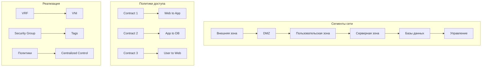

# Построение сетевой фабрики для предприятия: Полное руководство

## 1. Архитектура сетевой фабрики

### Общая концепция


## 2. Компоненты сетевой фабрики

### Базовые строительные блоки


## 3. Underlay сеть: проектирование и реализация

### Физическая топология Spine-Leaf


### Протоколы Underlay сети


## 4. Конфигурация Underlay с eBGP

### Базовая конфигурация eBGP

```bash
# Spine Switch Configuration
interface Ethernet1/1-48
  no switchport
  ip address unnumbered loopback0
  no shutdown

router bgp 65000
  router-id 1.1.1.1
  bgp log-neighbor-changes
  neighbor UNDERLAY peer-group
  neighbor UNDERLAY remote-as external
  neighbor UNDERLAY capability extended-nexthop
  neighbor Ethernet1/1 peer-group UNDERLAY
  neighbor Ethernet1/2 peer-group UNDERLAY
  
  address-family ipv4 unicast
    network 1.1.1.1/32
    neighbor UNDERLAY activate

# Leaf Switch Configuration
interface Ethernet1/1-2
  no switchport
  ip address unnumbered loopback0
  no shutdown

router bgp 65001
  router-id 2.2.2.2
  bgp log-neighbor-changes
  neighbor SPINE peer-group
  neighbor SPINE remote-as 65000
  neighbor SPINE capability extended-nexthop
  neighbor Ethernet1/1 peer-group SPINE
  neighbor Ethernet1/2 peer-group SPINE
  
  address-family ipv4 unicast
    network 2.2.2.2/32
    neighbor SPINE activate
```

### Схема IP адресации Underlay


## 5. Overlay сеть: VXLAN/EVPN

### Архитектура Overlay сети


### Конфигурация EVPN/VXLAN

```bash
# EVPN Configuration on Leaf
evpn
  router-id loopback0
  default-gateway advertise

interface nve1
  source-interface loopback0
  host-reachability protocol bgp
  member vni 10010
    mcast-group 239.1.1.1
  member vni 10020
    mcast-group 239.1.1.2

router bgp 65001
  address-family l2vpn evpn
    neighbor EVPN activate
    advertise-pip evpn
    retain route-target all
  
  vrf PRODUCTION
    rd 65001:100
    address-family ipv4 unicast
      advertise l2vpn evpn
```

## 6. Сегментация и политики безопасности

### Микросетевая сегментация



## 7. Сервисная вставка (Service Insertion)

### Архитектура сервисов


## 8. Мониторинг и телеметрия

### Система мониторинга


## 9. Поэтапный план внедрения

### План миграции


## 10. Конфигурационные примеры

### Полная конфигурация Leaf коммутатора

```bash
! Basic Configuration
hostname LEAF-01
ntp server 10.0.100.1
logging server 10.0.100.2

! Underlay Configuration
interface loopback0
  ip address 10.0.2.1/32

interface Ethernet1/1-2
  no switchport
  ip address unnumbered loopback0
  no shutdown

router bgp 65001
  router-id 10.0.2.1
  neighbor SPINE peer-group
  neighbor SPINE remote-as 65000
  neighbor Ethernet1/1 peer-group SPINE
  neighbor Ethernet1/2 peer-group SPINE
  
  address-family ipv4 unicast
    network 10.0.2.1/32
    neighbor SPINE activate

! Overlay Configuration
evpn
  router-id loopback0

interface nve1
  source-interface loopback0
  host-reachability protocol bgp

! VRF and VLAN Configuration
vrf instance PRODUCTION
rd 65001:100

interface Vlan10
  vrf PRODUCTION
  ip address 10.10.10.1/24
  ip helper-address 10.10.100.10

interface Vlan20
  vrf PRODUCTION  
  ip address 10.10.20.1/24
```

## 11. Проверка и валидация

### Команды проверки

```bash
# Проверка BGP сессий
show bgp ipv4 unicast summary
show bgp l2vpn evpn summary

# Проверка VXLAN
show nve peers
show nve vni

# Проверка маршрутов
show bgp l2vpn evpn
show ip route vrf PRODUCTION

# Мониторинг трафика
show interface counters
show system resources
```

Эта архитектура обеспечивает:
- **Масштабируемость**: Добавление новых leaf без прерывания работы
- **Отказоустойчивость**: Multiple paths и fast convergence
- **Безопасность**: Микросетевая сегментация и политики
- **Автоматизацию**: Единая точка управления
- **Наблюдаемость**: Полный мониторинг и телеметрия

# Достижение сходимости состояний на всех уровнях сетевой фабрики

## 1. Концепция сходимости состояний


## 2. Сходимость на уровне Underlay сети

### Протоколы и времена сходимости


### Конфигурация быстрой сходимости BGP

```bash
# BGP Fast Convergence Configuration
router bgp 65001
  bgp router-id 1.1.1.1
  bgp log-neighbor-changes
  bgp graceful-restart
  bgp bestpath as-path multipath-relax
  
  # Fast failure detection
  neighbor SPINE_GROUP fall-over bfd
  neighbor SPINE_GROUP advertisement-interval 0
  neighbor SPINE_GROUP capability extended-nexthop
  
  # Fast reconvergence
  bgp scan-time 5
  bgp fast-external-fallover
  
  address-family ipv4 unicast
    bgp additional-paths send receive
    bgp bestpath compare-routerid
```

### Настройка BFD (Bidirectional Forwarding Detection)

```bash
# BFD Configuration on Spine-Leaf links
interface Ethernet1/1
  bfd interval 50 min_rx 50 multiplier 3
  no bfd echo

bfd-map BFD_50MS
  interval min-tx 50 min-rx 50 multiplier 3

router bgp 65001
  neighbor 10.0.1.1 bfd remote BFD_50MS
  neighbor 10.0.1.2 bfd remote BFD_50MS
```

## 3. Сходимость на уровне Overlay (EVPN/VXLAN)

### Архитектура распространения состояний


### Оптимизация EVPN сходимости

```bash
! EVPN Fast Convergence Settings
evpn
  convergence slow 10
  convergence freeze 30000
  duplicate-address-detection time 3 count 5
  
  ! Optimize MAC movement
  mac mobility hold-time 30
  mac mobility sequence-number

router bgp 65001
  address-family l2vpn evpn
    ! Fast advertisement
    neighbor EVPN_GROUP advertisement-interval 0
    
    ! Additional paths for fast reconvergence
    bgp additional-paths send receive
    bgp additional-paths selection route-map ADD_PATH_SELECT
    
    ! Route damping for stability
    bgp dampening route-map EVPN_DAMPENING
```

## 4. Сходимость на уровне контроллера

### Архитектура распределенного состояния


### Алгоритмы консенсуса для состояний

```python
class StateConvergence:
    def __init__(self):
        self.state_store = {}
        self.sequence_numbers = {}
        self.quorum_size = (n // 2) + 1
    
    def update_state(self, key, value, timestamp):
        # Raft-like consensus
        if self.leader_election():
            log_entry = self.append_log(key, value, timestamp)
            if self.replicate_log(log_entry):
                self.commit_state(log_entry)
                return True
        return False
    
    def read_state(self, key):
        # Linearizable read
        if self.quorum_read(key):
            return self.state_store.get(key)
        return None
```

## 5. Сходимость на уровне данных (Data Plane)

### Fast Reroute и защитные механизмы


### Настройка IP Fast Reroute

```bash
! IP FRR Configuration
router isis UNDERLAY
  fast-reroute per-prefix
  fast-reroute per-prefix tie-break downstream-protection-index 10
  fast-reroute per-prefix tie-break linecard-disjoint index 20
  
  interface Ethernet1/1
    fast-reroute per-prefix
    fast-reroute per-prefix remote-lfa tunnel mpls-ldp

! Or for OSPF
router ospf 1
  fast-reroute per-prefix
  fast-reroute per-prefix tie-break node-protecting index 100
```

## 6. Сходимость на уровне приложений

### Service Mesh и балансировка


### Конфигурация health checks и circuit breaker

```yaml
# Envoy Proxy Configuration
circuit_breakers:
  thresholds:
    - priority: DEFAULT
      max_connections: 1000
      max_requests: 1000
      
outlier_detection:
  consecutive_5xx: 5
  interval: 10s
  base_ejection_time: 30s
  max_ejection_percent: 50

health_checks:
  timeout: 2s
  interval: 5s
  unhealthy_threshold: 3
  healthy_threshold: 2
```

## 7. Мониторинг и метрики сходимости

### Ключевые метрики для измерения


### Prometheus метрики для мониторинга

```yaml
# Convergence Metrics Collection
convergence_metrics:
  bgp_convergence_time: 
    query: 'bgp_session_state_change_time'
    description: 'BGP neighbor state change timestamp'
  
  evpn_route_propagation: 
    query: 'evpn_route_advertisement_latency_seconds'
    description: 'EVPN route propagation delay'
  
  mac_learning_time:
    query: 'mac_address_learning_duration_seconds'
    description: 'Time for MAC address learning'
  
  application_failover:
    query: 'application_failover_duration_seconds'
    description: 'Application-level failover time'
```

## 8. Оптимизация таймеров и параметров

### Рекомендуемые значения таймеров

```bash
# Optimized BGP Timers
router bgp 65001
  timers bgp 3 9
  timers prefix-peer-timeout 10
  bgp scan-time 5

# Optimized IGP Timers  
router ospf 1
  timers throttle spf 50 50 500
  timers throttle lsa 10 100 500
  timers lsa arrival 100

# BFD for Sub-second Detection
bfd slow-timers 1000
bfd echo-latency 10
```

## 9. Тестирование сходимости

### Методика тестирования

```python
class ConvergenceTester:
    def __init__(self):
        self.test_cases = [
            "link_failure",
            "node_failure", 
            "route_withdrawal",
            "mac_movement",
            "service_failover"
        ]
    
    def measure_convergence(self, test_type):
        start_time = time.time()
        
        # Trigger event
        self.trigger_event(test_type)
        
        # Monitor until convergence
        while not self.is_converged():
            time.sleep(0.001)  # 1ms resolution
        
        convergence_time = time.time() - start_time
        return convergence_time
    
    def is_converged(self):
        # Check all layers for convergence
        return (self.underlay_converged() and 
                self.overlay_converged() and
                self.application_converged())
```

## 10. Best Practices для достижения сходимости

### Золотые правила


### Рекомендуемые значения для разных уровней:

1. **Underlay**: < 1 секунда (с BFD)
2. **Overlay**: < 2 секунды  
3. **Application**: < 3 секунды
4. **End-to-End**: < 5 секунд

Достижение быстрой сходимости требует комплексного подхода на всех уровнях сетевого стека и тщательной настройки всех компонентов системы.