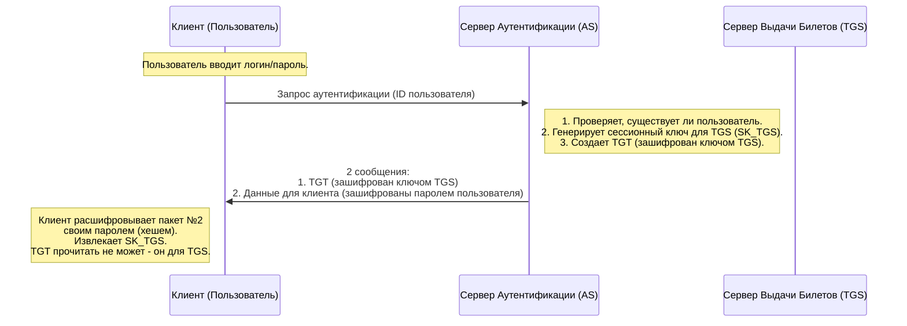
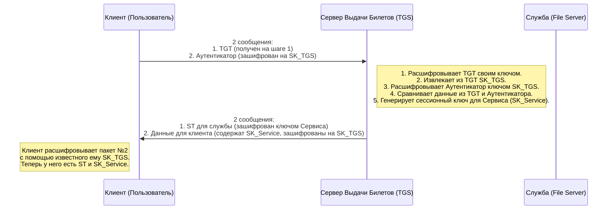
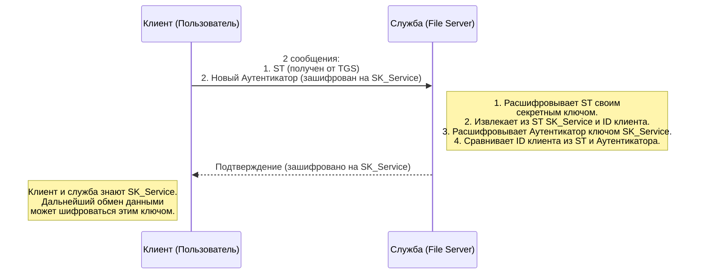
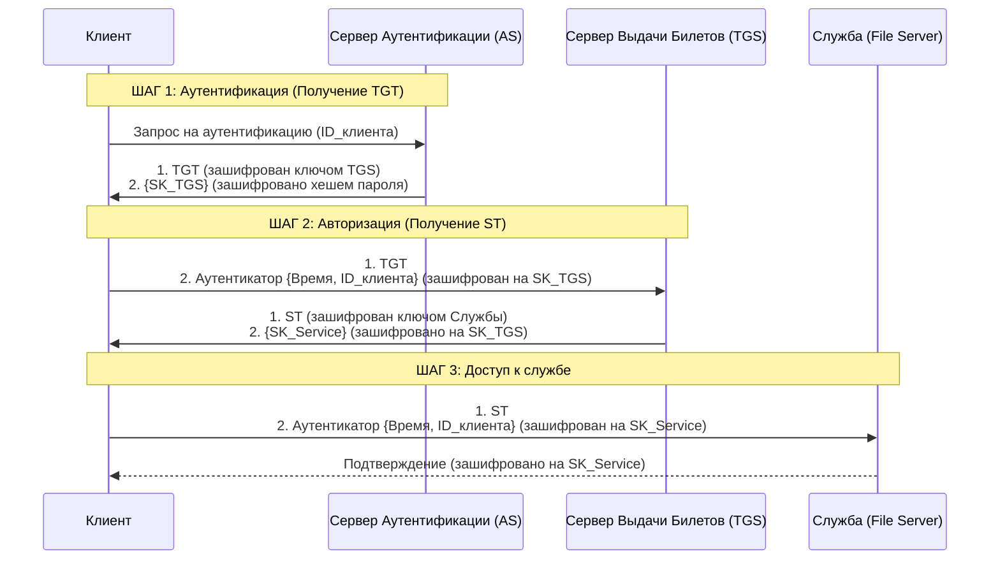

### Что такое Kerberos и зачем он нужен?

Представьте, что вам нужно попасть на закрытый концерт с несколькими зонами:

1.  **Главный вход** (где проверяют, есть ли вы в списке гостей).
2.  **VIP-ложа** (куда пускают только избранных).
3.  **Бэкстейдж** (куда пускают только артистов и crew).

Без Kerberos вам пришлось бы каждый раз показывать паспорт и доказывать, кто вы есть. Это небезопасно (вы светите паспортом везде) и неудобно.

**Kerberos** — это протокол, который решает эту проблему. Он работает по принципу **"билетной системы"**:
*   Вы один раз доказываете свою личность на входе.
*   Взамен вам выдают специальный **билет**, который вы предъявляете на всех последующих точках.
*   Этот билет надежен, его почти невозможно подделать, и он имеет ограниченный срок действия.

В компьютерном мире:
*   **Вы —** Пользователь.
*   **Концертная площадка —** Сеть (домен).
*   **Разные зоны —** Разные сетевые службы (файловый сервер, почтовый сервер, принтер).
*   **Билеты —** Зашифрованные блоки данных (tickets).

---

### Ключевые участники системы Kerberos

Прежде чем смотреть на схему, давайте определимся с главными героями:

1.  **Клиент (Client)** — это вы за вашим компьютером. Вы хотите получить доступ к службе (например, к общей папке на сервере).
2.  **Служба (Service)** — это ресурс, к которому вы хотите получить доступ (например, `fileserver.company.com`).
3.  **Центр распределения ключей (Key Distribution Center, KDC)** — это "главная касса" нашего концерта. Внутри KDC есть два отдельных сервиса:
    *   **Сервер аутентификации (Authentication Server, AS)** — Проверяет вашу личность при первом обращении.
    *   **Сервер выдачи билетов (Ticket-Granting Server, TGS)** — Выдает вам билеты для доступа к конкретным службам.

> **Важно:** В реальной жизни, например, в Windows Active Directory или Astra Linux ALD, KDC работает на контроллере домена.

---

### Как работает протокол Kerberos: 3 основных шага

Весь процесс можно разбить на три фундаментальных шага. Давайте пройдемся по ним с помощью диаграммы.

#### Шаг 1: Аутентификация (Получение TGT - "Билета на все билеты")

На этом шаге вы доказываете KDC, что вы — это вы, и получаете специальный **Билет-Разрешение-на-Получение-Билетов (Ticket-Granting Ticket, TGT)**. TGT — это ваш пропуск в "кассу билетов" (TGS) для получения всех последующих билетов.

**Что здесь происходит?**
*   Клиент отправляет AS свой логин (в открытом виде).
*   AS не отправляет пароль по сети! Вместо этого он берет пароль пользователя (вернее, его хеш) из своей базы, генерирует случайный **Сессионный ключ для TGS (SK_TGS)** и создает **TGT**, который содержит внутри ID клиента и этот самый SK_TGS. TGT зашифрован на **секретном ключе TGS** (который знают только AS и TGS).
*   AS отправляет клиенту два "конверта":
    1.  **TGT** (запечатанный конверт для TGS, клиент его вскрыть не может).
    2.  **Данные для клиента**, включая `SK_TGS`, зашифрованные хешем пароля пользователя.
*   Клиент **расшифровывает второй конверт** своим паролем. Если он смог это сделать — значит, пароль был введен верный, и он доказал свою личность. Теперь у клиента есть `SK_TGS` и TGT.

---

#### Шаг 2: Авторизация (Получение ST - "Билета на службу")

Теперь у пользователя есть TGT. Допустим, он хочет получить доступ к файловому серверу. Для этого ему нужно получить **Билет на Службу (Service Ticket, ST)**.

**Что здесь происходит?**
*   Клиент отправляет TGS два "конверта":
    1.  **TGT** (который он получил на шаге 1 и не может прочитать).
    2.  **Аутентикатор (Authenticator)** — это метка времени, зашифрованная на `SK_TGS` (который клиент узнал на шаге 1).
*   TGS получает запрос. Он:
    1.  Берет свой секретный ключ, **расшифровывает TGT** и извлекает оттуда `SK_TGS` и ID клиента.
    2.  Использует `SK_TGS` для **расшифровки Аутентикатора**.
    3.  Сравнивает ID клиента из TGT и из Аутентикатора, а также проверяет свежесть метки времени (чтобы никто не перехватил и не повторил этот запрос).
*   Если все совпало, TGS генерирует **Билет на Службу (ST)** для доступа к файловому серверу. ST содержит ID клиента и новый **Сессионный ключ для Сервиса (SK_Service)**. ST зашифрован на **секретном ключе самой Службы** (File Server).
*   TGS отправляет клиенту два "конверта":
    1.  **ST** (запечатанный конверт для Службы).
    2.  **Данные для клиента**, включая `SK_Service`, зашифрованные на `SK_TGS`.
*   Клиент расшифровывает второй конверт и теперь у него есть ST (который он прочитать не может) и `SK_Service`.

---

#### Шаг 3: Доступ к службе

Финальный аккорд! Клиент, наконец, обращается к нужной ему службе (файловому серверу).

**Что здесь происходит?**
*   Клиент отправляет Службе два "конверта":
    1.  **ST** (который он получил от TGS).
    2.  **Новый Аутентикатор**, зашифрованный на `SK_Service`.
*   Служба (файловый сервер):
    1.  Берет свой **секретный ключ** (который известен только ей и KDC) и **расшифровывает ST**. Оттуда она извлекает ID клиента и `SK_Service`.
    2.  Использует `SK_Service`, чтобы расшифровать Аутентикатор и проверить ID клиента и метку времени.
*   Если все в порядке, служба доверяет клиенту. Чтобы доказать клиенту, что она — это не поддельный сервер, она может отправить ему ответ, также зашифрованный `SK_Service`.
*   Теперь и клиент, и служба знают общий ключ `SK_Service` и могут использовать его для безопасного обмена данными (например, для шифрования трафика).

---

### Полная схема работы Kerberos

Чтобы увидеть всю картину целиком, вот полная диаграмма всех трех шагов:

### Главные преимущества Kerberos

1.  **Пароль не передается по сети.** После первого шага пароль больше не используется. Работают только билеты и сессионные ключи.
2.  **Взаимная аутентификация.** Клиент убеждается, что сервер "настоящий" (когда сервер присылает подтверждение, зашифрованное `SK_Service`).
3.  **Билеты имеют ограниченное время жизни.** Обычно несколько часов. Это предотвращает повторное использование перехваченных билетов.
4.  **Единый вход (Single Sign-On, SSO).** Пользователь вводит пароль один раз при входе в систему, и дальше все операции аутентификации происходят "под капотом" с помощью TGT.

Именно поэтому Kerberos является краеугольным камнем безопасности в таких системах, как Microsoft Active Directory и Astra Linux ALD.