## **📊 ТЕХНИЧЕСКИЕ ОГРАНИЧЕНИЯ**

### **1. Количество категорий**

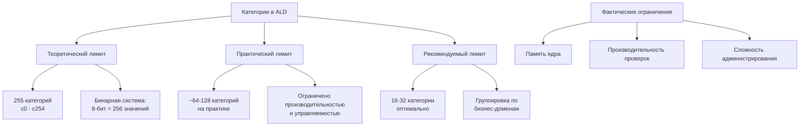

**Технические детали:**
- **Битовая маска:** 256 бит (32 байта) на метку
- **Нумерация:** c0, c1, c2, ..., c254
- **c255** зарезервирован для специальных целей

### **2. Количество иерархий (уровней конфиденциальности)**

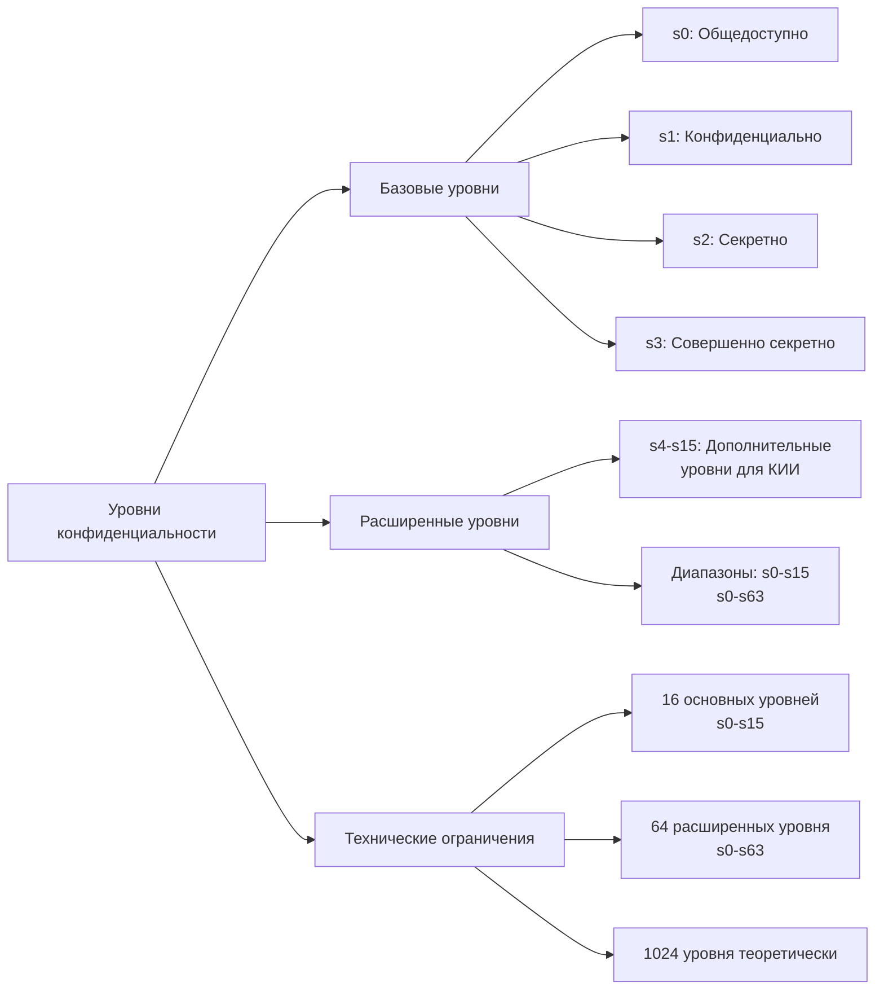

## **🎯 ПРАКТИЧЕСКИЕ ПРИМЕРЫ**

### **Пример 1: Средняя организация (16 категорий)**

```bash
# Бизнес-категории
c0 - Финансы
c1 - Персональные данные
c2 - Кадровые данные
c3 - Разработка
c4 - Маркетинг
c5 - Продажи
c6 - Юридические данные
c7 - Инфраструктура

# Технические категории
c8 - Базы данных
c9 - Веб-сервисы
c10 - Сети
c11 - Резервные копии
c12 - Логи
c13 - Конфигурации
c14 - Криптография
c15 - Аудит
```

### **Пример 2: Крупная корпорация (32 категории)**

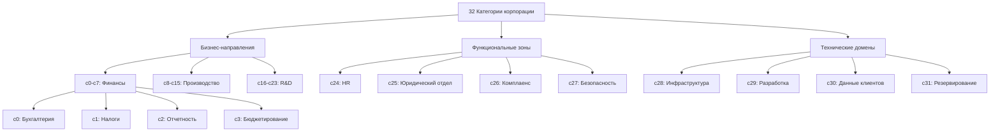

## **⚙️ КОМАНДЫ ДЛЯ РАБОТЫ С КАТЕГОРИЯМИ**

### **Просмотр доступных категорий:**

```bash
# Просмотр всех категорий в системе
sudo seinfo -c

# Просмотр с фильтрацией
sudo seinfo -c | grep -E "c[0-9]+" | head -20

# Проверка лимитов
sudo semanage user -l | awk '{print $4}' | grep "c" | sort -u

# Анализ использования категорий
sudo sesearch --allow | grep "c0" | wc -l
```

### **Создание и управление категориями:**

```bash
# Создание политики с новыми категориями
cat > custom_categories.te << 'EOF'
policy_module(custom_categories, 1.0)

# Определение дополнительных категорий
# (система автоматически назначает cN)
type custom_finance_t;
type custom_hr_t;
type custom_dev_t;
EOF

# Компиляция и установка политики
checkmodule -M -m -o custom_categories.mod custom_categories.te
semodule_package -o custom_categories.pp -m custom_categories.mod
sudo semodule -i custom_categories.pp
```

## **📈 ПРОИЗВОДИТЕЛЬНОСТЬ И МАСШТАБИРУЕМОСТЬ**

### **Влияние количества категорий на производительность:**

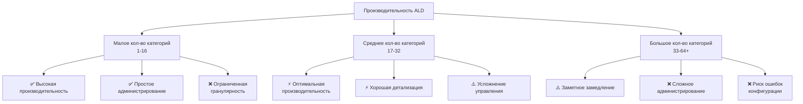

## **🏢 РЕКОМЕНДАЦИИ ДЛЯ РАЗНЫХ ОРГАНИЗАЦИЙ**

### **Малое предприятие (до 100 сотрудников):**
```bash
# 8 категорий достаточно
c0 - Финансы
c1 - Персональные данные  
c2 - Кадры
c3 - Документы
c4 - Инфраструктура
c5 - Резервирование
c6 - Логи
c7 - Аудит
```

### **Средняя организация (100-1000 сотрудников):**
```bash
# 16 категорий
c0-c3 - Финансы (бухгалтерия, налоги, отчеты, бюджет)
c4-c7 - Операции (продажи, маркетинг, производство, логистика)
c8-c11 - Персонал (HR, зарплаты, рекрутинг, оценки)
c12-c15 - IT (инфраструктура, разработка, безопасность, данные)
```

### **Крупная корпорация (1000+ сотрудников):**
```bash
# 32 категории с группировкой
# Финансовый домен (c0-c7)
# Производственный домен (c8-c15) 
# Исследования и разработки (c16-c23)
# Инфраструктура и безопасность (c24-c31)
```

## **🔧 ПРАКТИЧЕСКОЕ ОГРАНИЧЕНИЕ ПРОИЗВОДИТЕЛЬНОСТИ**

### **Тест производительности:**

```bash
#!/bin/bash
# Тест скорости проверки доступа с разным количеством категорий

echo "Тест производительности ALD с разным количеством категорий"

for categories in 8 16 32 64; do
    echo -n "Категорий: $categories - "
    
    # Создание тестовой метки
    LABEL="s2:c0"
    for ((i=1; i<categories; i++)); do
        LABEL+=",c$i"
    done
    
    # Тест скорости
    time for i in {1..1000}; do
        echo "test" > /tmp/testfile
        chcon -l $LABEL /tmp/testfile 2>/dev/null
    done 2>/dev/null
    
    echo "---"
done
```

## **🎓 ВЫВОДЫ**

### **Фактические ограничения:**

| Параметр | Технический лимит | Практический лимит | Рекомендация |
|----------|-------------------|-------------------|-------------|
| **Категории** | 255 (c0-c254) | 64-128 | 16-32 |
| **Уровни** | 1024 (s0-s1023) | 64 (s0-s63) | 4-8 (s0-s3) |
| **Комбинаций** | ~65,000 | ~4,000 | ~256 |

### **Ключевые принципы:**

1. **Принцип достаточности:** Создавайте столько категорий, сколько действительно нужно
2. **Группировка:** Объединяйте схожие данные в общие категории  
3. **Масштабируемость:** Начинайте с минимального набора, расширяйте по необходимости
4. **Производительность:** Каждая дополнительная категория увеличивает нагрузку
5. **Управляемость:** Сложные системы требуют больше усилий на администрирование

**Итог:** Для 95% организаций достаточно **4-8 уровней** и **16-32 категорий**. Это обеспечивает оптимальный баланс между безопасностью, производительностью и удобством управления.

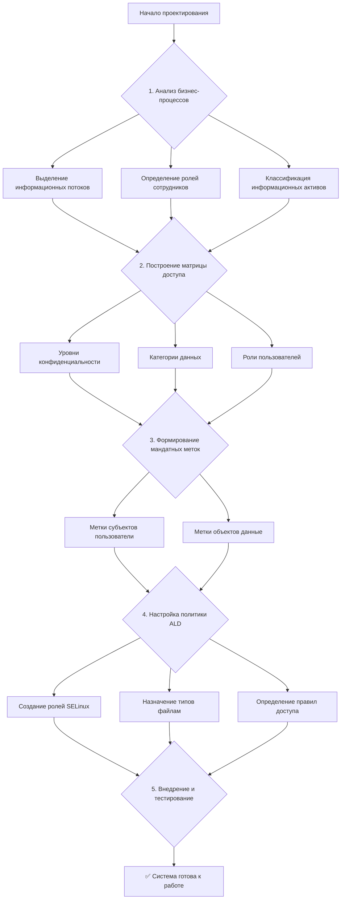

---

## **1. ИСХОДНАЯ МАТРИЦА ДОСТУПА**

### **Бизнес-контекст: Банк "ФинансГарант"**

| Роль | Общедоступные данные | Финансовые отчеты | База клиентов | HR данные | Исходный код |
|------|---------------------|-------------------|---------------|-----------|-------------|
| **Клиент** | Чтение | - | Свои данные | - | - |
| **Сотрудник** | Чтение | - | - | - | - |
| **Бухгалтер** | Чтение | Чтение/Запись | Чтение | - | - |
| **Менеджер** | Чтение | Чтение | Чтение/Запись | Чтение | - |
| **Разработчик** | Чтение | - | - | - | Чтение/Запись |
| **HR-специалист** | Чтение | - | Чтение | Чтение/Запись | - |
| **Администратор** | Чтение/Запись | Чтение/Запись | Чтение/Запись | Чтение/Запись | Чтение/Запись |

---

## **2. РАСШИФРОВКА И ПРЕОБРАЗОВАНИЕ В МАНДАТНУЮ МАТРИЦУ**

### **2.1. Определение уровней конфиденциальности**

```
s0 - Общедоступно (Public)
s1 - Конфиденциально (Confidential)  
s2 - Секретно (Secret)
s3 - Совершенно секретно (Top Secret)
```

### **2.2. Определение категорий данных**

```
c0 - Финансы (Finance)
c1 - Персональные данные (Personal Data)
c2 - Кадровые данные (HR)
c3 - Разработка (Development)
c4 - Операционные данные (Operations)
```

### **2.3. Мандатная матрица доступа**

| Роль | Уровень доступа | Категории | Объекты доступа |
|------|----------------|-----------|-----------------|
| **Клиент** | s0-s1 | c1 | `/data/public/`, `/data/clients/{own_data}` |
| **Сотрудник** | s0-s1 | c4 | `/data/public/`, `/data/internal/` |
| **Бухгалтер** | s0-s2 | c0,c1,c4 | `/data/finance/`, `/data/clients/` |
| **Менеджер** | s0-s2 | c0,c1,c2,c4 | `/data/finance/readonly/`, `/data/clients/`, `/data/hr/readonly/` |
| **Разработчик** | s0-s2 | c3,c4 | `/data/development/`, `/data/internal/` |
| **HR-специалист** | s0-s2 | c1,c2,c4 | `/data/hr/`, `/data/clients/readonly/` |
| **Администратор** | s0-s3 | c0.c3 | Полный доступ (ограниченный мандатно) |

---

## **3. КАК ЗАДАЮТСЯ МАНДАТНЫЕ МЕТКИ**

### **3.1. Формат мандатной метки**

```
user:role:type:level[:categories]
```

**Примеры:**
- `user_u:staff_r:public_data_t:s0`
- `system_u:finance_r:finance_data_t:s2:c0`
- `user_u:hr_r:hr_data_t:s2:c1,c2`

### **3.2. Диаграмма назначения меток**

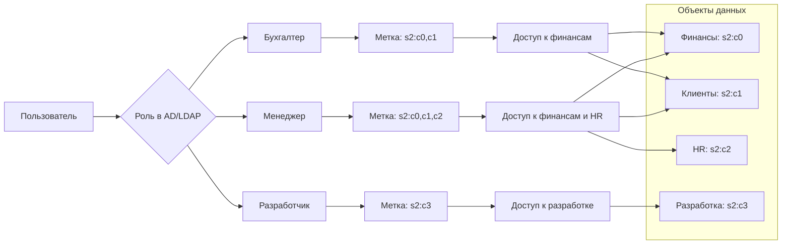

---

## **4. ПРАКТИЧЕСКАЯ РЕАЛИЗАЦИЯ В ALD**

### **4.1. Создание ролей и пользователей**

```bash
# Создание пользователей SELinux для ролей
sudo semanage user -a -R "staff_r" -L s0 -r s0-s1:c1 user_client_r
sudo semanage user -a -R "staff_r" -L s0 -r s0-s2:c0,c1,c4 user_finance_r
sudo semanage user -a -R "staff_r" -L s0 -r s0-s2:c0,c1,c2,c4 user_manager_r
sudo semanage user -a -R "staff_r" -L s0 -r s0-s2:c3,c4 user_developer_r
sudo semanage user -a -R "staff_r" -L s0 -r s0-s2:c1,c2,c4 user_hr_r
sudo semanage user -a -R "sysadm_r" -L s0 -r s0-s3:c0.c3 user_admin_r

# Привязка к пользователям ОС
sudo semanage login -a -s user_client_r -r "s0-s1:c1" bank_client
sudo semanage login -a -s user_finance_r -r "s0-s2:c0,c1,c4" accountant
sudo semanage login -a -s user_manager_r -r "s0-s2:c0,c1,c2,c4" manager
sudo semanage login -a -s user_developer_r -r "s0-s2:c3,c4" developer
sudo semanage login -a -s user_hr_r -r "s0-s2:c1,c2,c4" hr_specialist
```

### **4.2. Создание типов файлов**

```bash
# Определение типов файлов для разных категорий данных
sudo semanage fcontext -a -t public_data_t "/data/public(/.*)?"
sudo semanage fcontext -a -t finance_data_t "/data/finance(/.*)?"
sudo semanage fcontext -a -t client_data_t "/data/clients(/.*)?"
sudo semanage fcontext -a -t hr_data_t "/data/hr(/.*)?"
sudo semanage fcontext -a -t dev_data_t "/data/development(/.*)?"
sudo semanage fcontext -a -t internal_data_t "/data/internal(/.*)?"

# Применение контекстов
sudo restorecon -R /data/
```

### **4.3. Назначение мандатных меток файлам**

```bash
# Общедоступные данные - уровень s0
sudo chcon -R -l s0 /data/public/

# Финансовые данные - уровень s2, категория c0
sudo chcon -R -l s2:c0 /data/finance/

# Данные клиентов - уровень s2, категория c1
sudo chcon -R -l s2:c1 /data/clients/

# HR данные - уровень s2, категории c1,c2
sudo chcon -R -l s2:c1,c2 /data/hr/

# Данные разработки - уровень s2, категория c3
sudo chcon -R -l s2:c3 /data/development/

# Внутренние данные - уровень s1, категория c4
sudo chcon -R -l s1:c4 /data/internal/
```

---

## **5. ДИАГРАММА ПРОВЕРКИ ДОСТУПА**

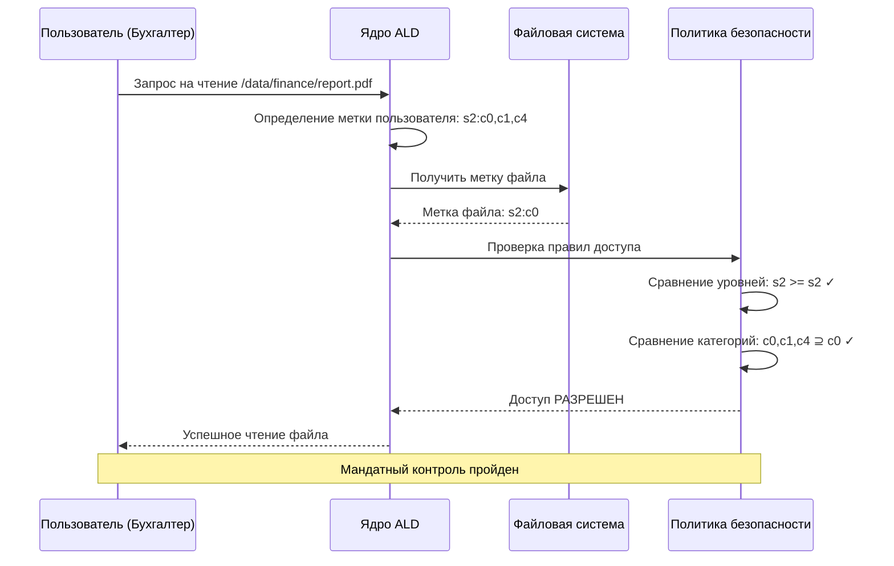

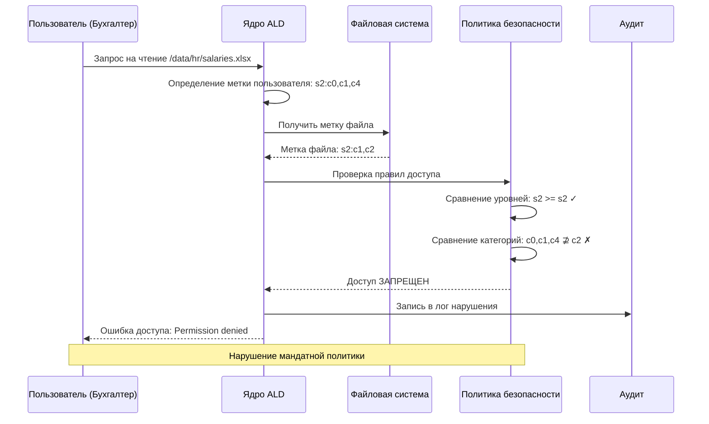

---

## **6. ТАБЛИЦА СООТВЕТСТВИЯ МЕТОК**

### **Метки пользователей (субъекты):**

| Роль | Метка SELinux | Уровень | Категории | Расшифровка |
|------|---------------|---------|-----------|-------------|
| Клиент | `user_client_r` | s0-s1 | c1 | Доступ к общедоступным данным и своим данным |
| Бухгалтер | `user_finance_r` | s0-s2 | c0,c1,c4 | Финансы, клиенты, внутренние данные |
| Менеджер | `user_manager_r` | s0-s2 | c0,c1,c2,c4 | Финансы, клиенты, HR, внутренние данные |
| Разработчик | `user_developer_r` | s0-s2 | c3,c4 | Разработка, внутренние данные |
| HR | `user_hr_r` | s0-s2 | c1,c2,c4 | Клиенты, HR, внутренние данные |
| Админ | `user_admin_r` | s0-s3 | c0.c3 | Все уровни и категории |

### **Метки данных (объекты):**

| Тип данных | Путь | Метка типа | Уровень | Категории |
|------------|------|------------|---------|-----------|
| Общедоступные | `/data/public/` | `public_data_t` | s0 | - |
| Финансы | `/data/finance/` | `finance_data_t` | s2 | c0 |
| Клиенты | `/data/clients/` | `client_data_t` | s2 | c1 |
| HR | `/data/hr/` | `hr_data_t` | s2 | c1,c2 |
| Разработка | `/data/development/` | `dev_data_t` | s2 | c3 |
| Внутренние | `/data/internal/` | `internal_data_t` | s1 | c4 |

---

## **7. ИНСТРУКЦИЯ ДЛЯ СОТРУДНИКА ИБ**

### **Шаги проектирования:**

1. **Анализ бизнес-процессов** → Выделение ролей и данных
2. **Классификация данных** → Определение уровней и категорий  
3. **Построение матрицы** → Сопоставление ролей и данных
4. **Создание меток** → Формализация правил в метки ALD
5. **Тестирование** → Проверка корректности работы политики

### **Критерии успеха:**

- ✅ Все бизнес-процессы работают без нарушений
- ✅ Нет избыточных прав доступа
- ✅ Нарушения логируются в audit.log
- ✅ Администраторы не имеют избыточного доступа к данным
- ✅ Соответствие требованиям 152-ФЗ и ФСТЭК

Эта методика позволяет системно подойти к проектированию мандатного доступа и гарантирует соответствие требованиям информационной безопасности.

```mermaid
flowchart TD
    A[🌳 Дерево мандатных меток ALD] --> B[Уровни конфиденциальности]
    A --> C[Категории данных]
    A --> D[Типы объектов]
    A --> E[Роли субъектов]

    B --> B0[s0: Общедоступно]
    B --> B1[s1: Конфиденциально]
    B --> B2[s2: Секретно]
    B --> B3[s3: Совершенно секретно]
    
    B1 --> B1a[/etc/passwd<br>Конфигурация ОС/]
    B1 --> B1b[/var/log/<br>Логи системы/]
    B2 --> B2a[/data/finance/<br>Финансовые отчеты/]
    B2 --> B2b[/data/clients/<br>База клиентов/]
    B3 --> B3a[/data/strategy/<br>Стратегические планы/]
    B3 --> B3b[/keys/<br>Криптографические ключи/]

    C --> C0[c0: Финансы]
    C --> C1[c1: Персональные данные]
    C --> C2[c2: Кадровые данные]
    C --> C3[c3: Разработка]
    C --> C4[c4: Операционные данные]
    C --> C5[c5: Юридические данные]
    
    C0 --> C0a[Бухгалтерские отчеты]
    C0 --> C0b[Платежные ведомости]
    C1 --> C1a[Паспортные данные]
    C1 --> C1b[Контактная информация]
    C2 --> C2a[Трудовые договоры]
    C2 --> C2b[Оценочные листы]
    C3 --> C3a[Исходный код]
    C3 --> C3b[Архитектура системы]

    D --> D1[Файлы]
    D --> D2[Процессы]
    D --> D3[Сокеты]
    D --> D4[Порты]
    
    D1 --> D1a[public_data_t]
    D1 --> D1b[finance_data_t]
    D1 --> D1c[client_data_t]
    D1 --> D1d[hr_data_t]
    D1 --> D1e[dev_data_t]
    
    D2 --> D2a[user_process_t]
    D2 --> D2b[system_process_t]
    D2 --> D2c[db_process_t]
    D2 --> D2d[web_process_t]
    
    D3 --> D3a[client_socket_t]
    D3 --> D3b[server_socket_t]
    
    D4 --> D4a[ssh_port_t]
    D4 --> D4b[http_port_t]
    D4 --> D4c[db_port_t]

    E --> E1[Пользовательские роли]
    E --> E2[Системные роли]
    E --> E3[Специальные роли]
    
    E1 --> E1a[user_client_r]
    E1 --> E1b[user_finance_r]
    E1 --> E1c[user_manager_r]
    E1 --> E1d[user_developer_r]
    E1 --> E1e[user_hr_r]
    
    E2 --> E2a[system_r]
    E2 --> E2b[system_admin_r]
    
    E3 --> E3a[db_admin_r]
    E3 --> E3b[network_admin_r]
    E3 --> E3c[security_audit_r]

    %% Примеры полных меток
    subgraph F [Примеры полных мандатных меток]
        F1[user_u:user_finance_r:finance_data_t:s2:c0]
        F2[system_u:system_r:httpd_t:s0]
        F3[user_u:user_hr_r:hr_data_t:s2:c1,c2]
        F4[admin_u:system_admin_r:admin_data_t:s3:c0.c5]
    end

    B --> F
    C --> F
    D --> F
    E --> F

    %% Правила доминирования
    subgraph G [Правила доминирования меток]
        G1[s3 > s2 > s1 > s0]
        G2[Уровень субъекта ≥ Уровень объекта]
        G3[Категории субъекта ⊇ Категории объекта]
        G4[Мандатный доступ = Уровень + Категории]
    end

    B --> G
    C --> G
    
    %% Ключ расшифровки
    subgraph H [🔑 Ключ расшифровки меток]
        H1[user_u - пользователь системы]
        H2[system_u - системный пользователь]
        H3[admin_u - администратор]
        H4[role_r - роль субъекта]
        H5[type_t - тип объекта]
        H6[sN - уровень конфиденциальности]
        H7[cN - категории доступа]
    end

    E --> H
    D --> H
```

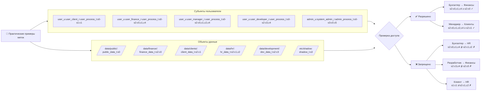

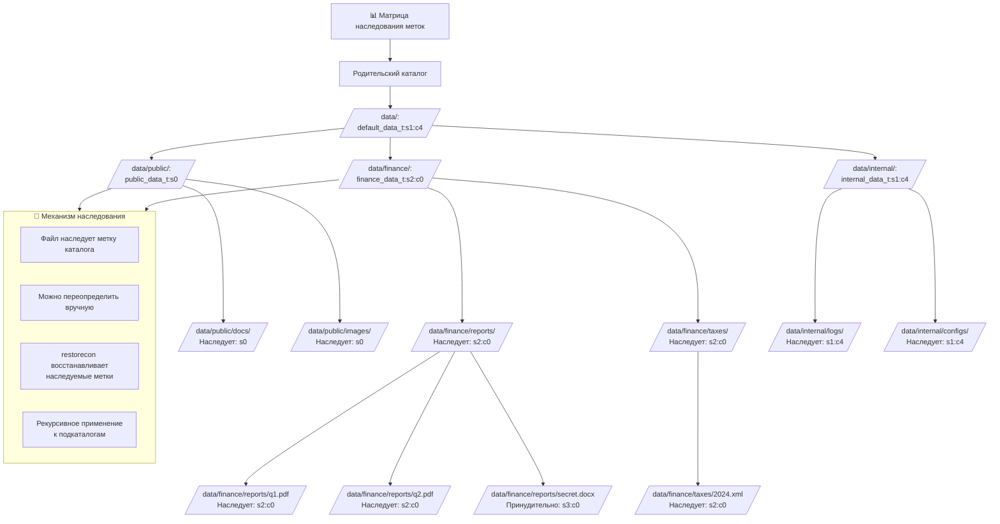

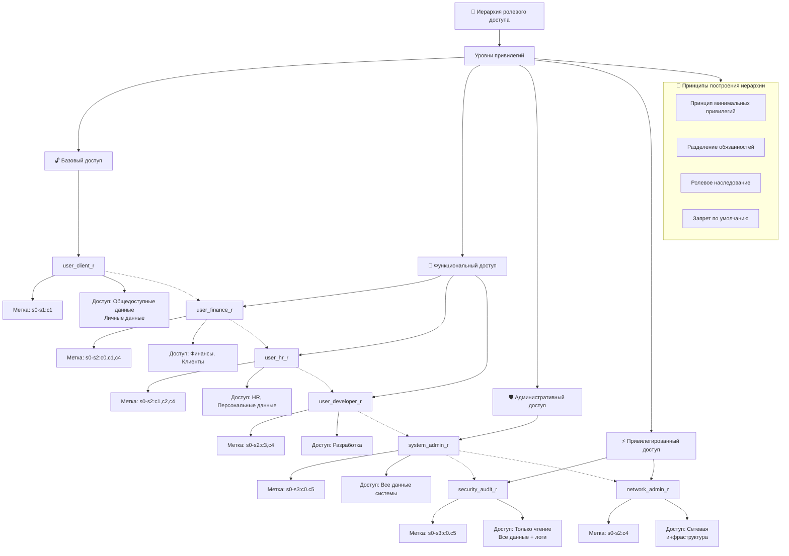

## **📋 ПОЛНАЯ ТАБЛИЦА РАСШИФРОВКИ МЕТОК**

### **Структура мандатной метки:**
```
user:role:type:level:categories
```

### **Компоненты метки:**

| Компонент | Значения | Расшифровка |
|-----------|----------|-------------|
| **user** | `user_u` | Обычный пользователь |
| | `system_u` | Системный процесс |
| | `admin_u` | Администратор |
| **role** | `*_r` | Роль субъекта |
| **type** | `*_t` | Тип объекта |
| **level** | `s0`-`s3` | Уровень конфиденциальности |
| **categories** | `c0`-`cN` | Категории данных |

### **Уровни доступа:**

| Уровень | Числовое значение | Описание |
|---------|-------------------|----------|
| `s0` | 0 | Общедоступно |
| `s1` | 1 | Конфиденциально |
| `s2` | 2 | Секретно |
| `s3` | 3 | Совершенно секретно |

### **Правила доминирования:**
- **Уровни:** `s3` > `s2` > `s1` > `s0`
- **Категории:** Набор категорий субъекта должен включать все категории объекта
- **Формула доступа:** `Уровень_субъекта ≥ Уровень_объекта` И `Категории_субъекта ⊇ Категории_объекта`

Это дерево меток дает полное представление о том, как организована система мандатного контроля в ALD и как взаимодействуют между собой различные компоненты системы безопасности.