## 1. Что такое OSPF?

**OSPF** = **O**pen **S**hortest **P**ath **F**irst
(Открытый кратчайший путь первый)

**Простыми словами:** OSPF - это "дорожная карта" для маршрутизаторов, которая показывает самый быстрый путь между сетями.

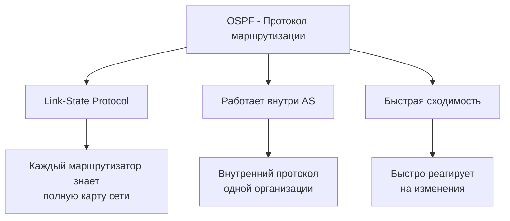

## 2. Основные понятия OSPF

### Ключевые термины:
- **Router ID** - уникальный "паспорт" маршрутизатора
- **Area** - зона (район) сети
- **Link** - соединение между маршрутизаторами
- **Cost** - "стоимость" пути (чем меньше - тем лучше)
- **LSA** - объявление о состоянии линка

## 3. Процесс установления соседства (Neighbor Discovery)

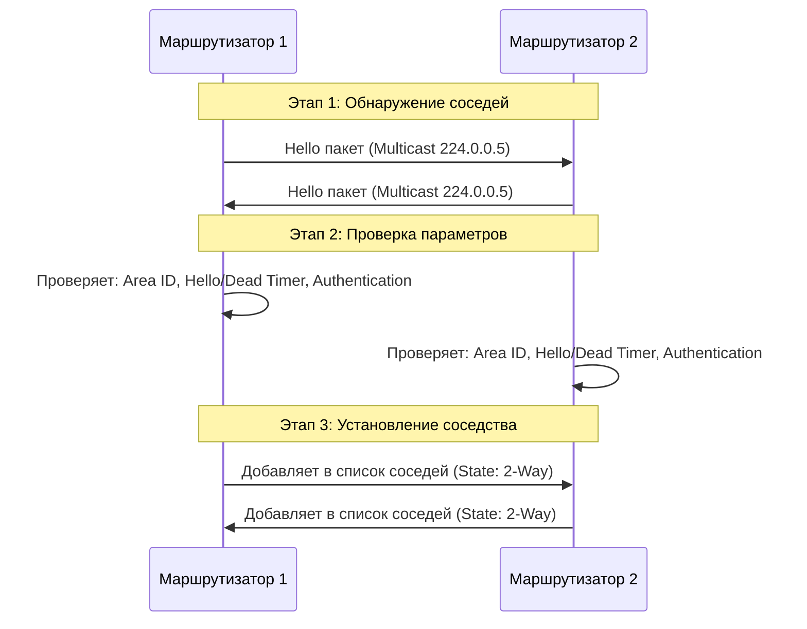

## 4. Процесс обмена маршрутной информацией

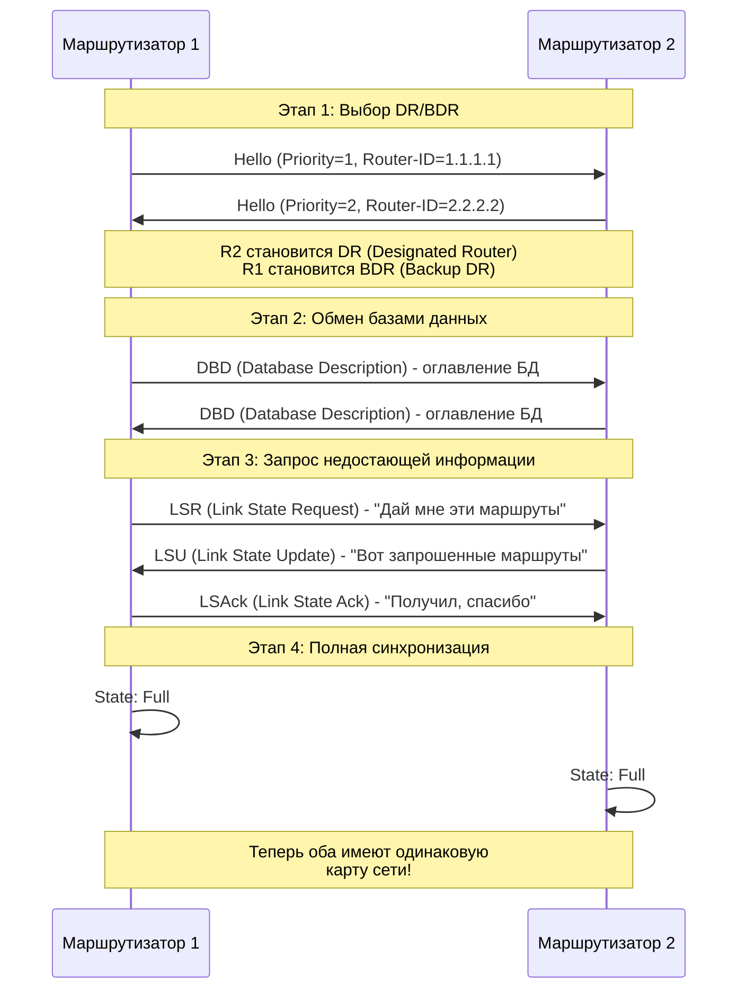

## 5. Состояния OSPF (OSPF States)

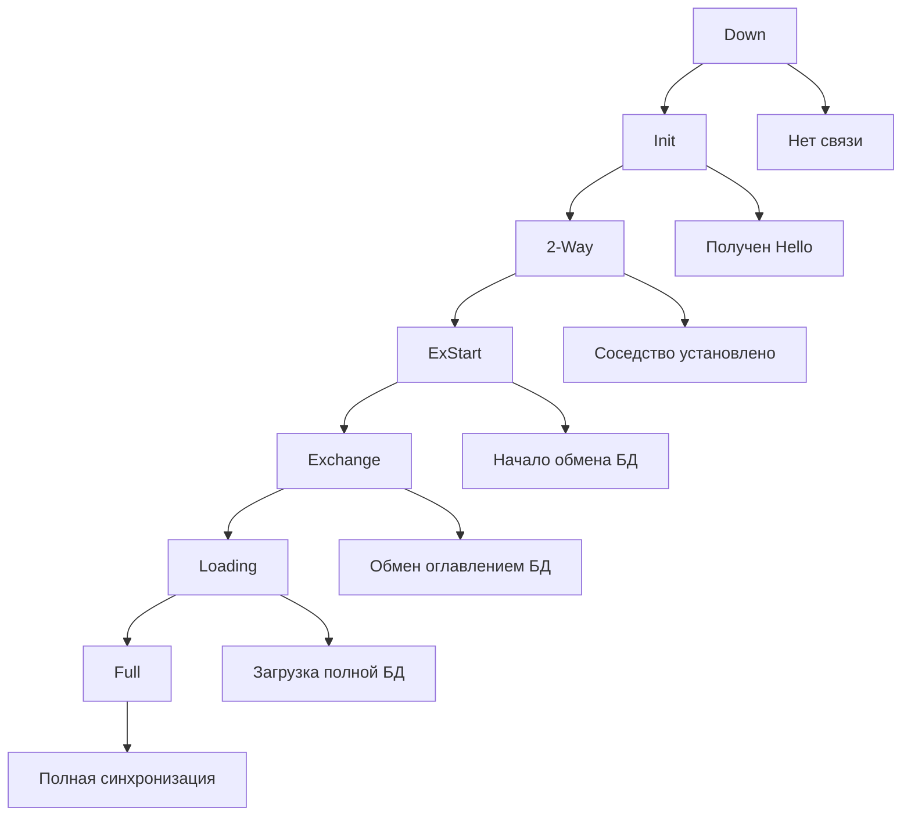

## 6. Areas (Зоны) в OSPF

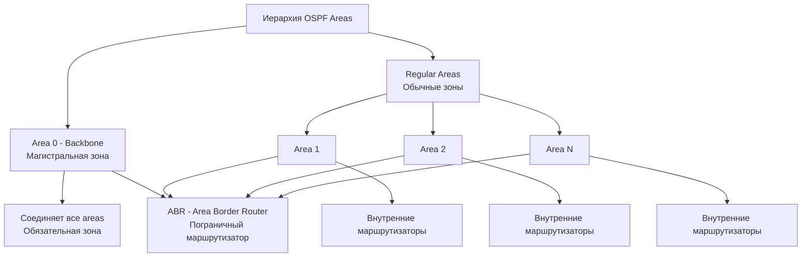

## 7. Типы маршрутизаторов OSPF

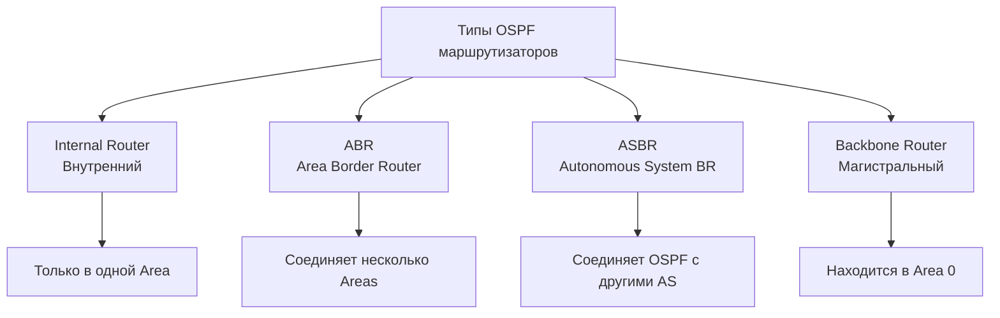

## 8. Расчет маршрутов (SPF Algorithm)

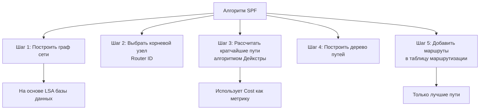

## 9. LSA (Link State Advertisement) Типы

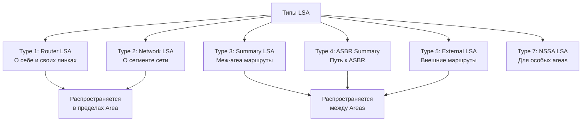

## 10. Полный рабочий процесс OSPF

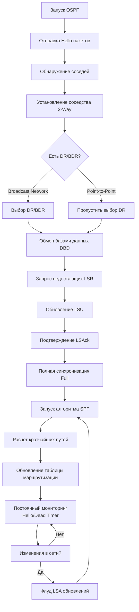

## 11. Пример сети OSPF

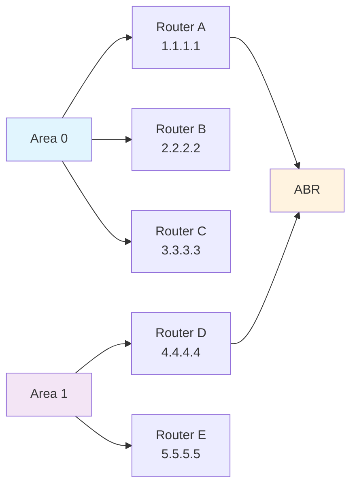

## 12. Практический пример конфигурации


## 13. Команды мониторинга OSPF

```bash
# Показать соседей OSPF
show ip ospf neighbor

# Показать базу данных OSPF
show ip ospf database

# Показать интерфейсы OSPF
show ip ospf interface

# Показать маршруты OSPF
show ip route ospf

# Детальная информация OSPF
show ip ospf
```

## 14. Преимущества OSPF

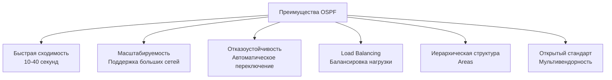

**OSPF похож на GPS навигатор для маршрутизаторов** - он всегда знает самый быстрый путь до любой точки сети! 🗺️