## 1. Что такое OSPF?

**OSPF** = **O**pen **S**hortest **P**ath **F**irst
(Открытый кратчайший путь первый)

**Простыми словами:** OSPF - это "дорожная карта" для маршрутизаторов, которая показывает самый быстрый путь между сетями.

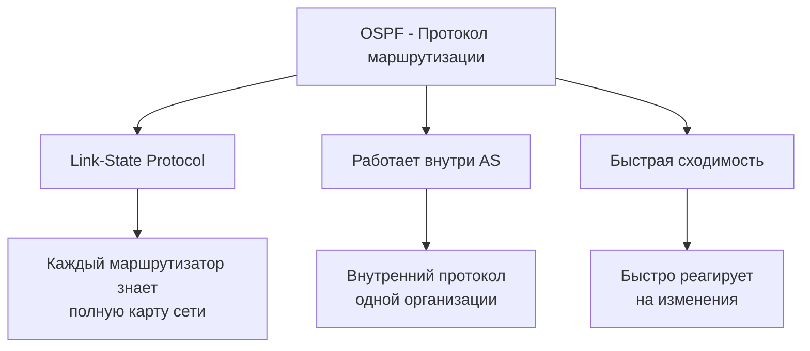
```mermaid
flowchart TD
    A[OSPF - Протокол маршрутизации] --> B[Link-State Protocol]
    A --> C[Работает внутри AS]
    A --> D[Быстрая сходимость]
    
    B --> E[Каждый маршрутизатор знает<br>полную карту сети]
    C --> F[Внутренний протокол<br>одной организации]
    D --> G[Быстро реагирует<br>на изменения]
```

## 2. Основные понятия OSPF

### Ключевые термины:
- **Router ID** - уникальный "паспорт" маршрутизатора
- **Area** - зона (район) сети
- **Link** - соединение между маршрутизаторами
- **Cost** - "стоимость" пути (чем меньше - тем лучше)
- **LSA** - объявление о состоянии линка

## 3. Процесс установления соседства (Neighbor Discovery)

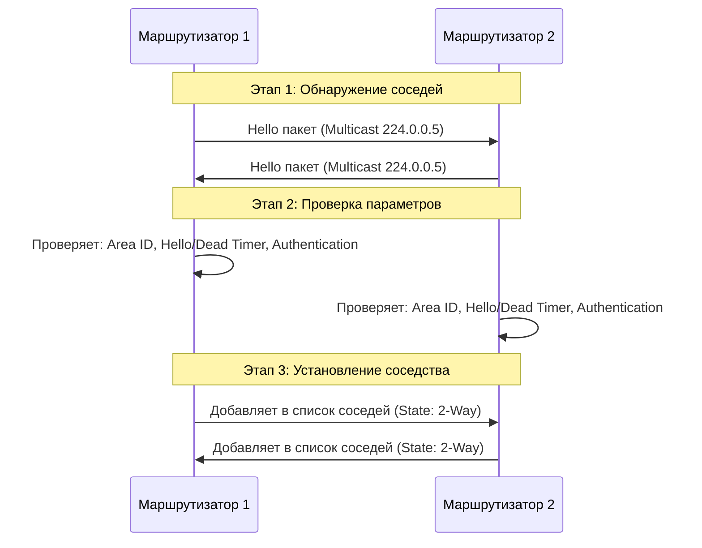
```mermaid
sequenceDiagram
    participant R1 as Маршрутизатор 1
    participant R2 as Маршрутизатор 2

    Note over R1,R2: Этап 1: Обнаружение соседей
    R1->>R2: Hello пакет (Multicast 224.0.0.5)
    R2->>R1: Hello пакет (Multicast 224.0.0.5)
    
    Note over R1,R2: Этап 2: Проверка параметров
    R1->>R1: Проверяет: Area ID, Hello/Dead Timer, Authentication
    R2->>R2: Проверяет: Area ID, Hello/Dead Timer, Authentication
    
    Note over R1,R2: Этап 3: Установление соседства
    R1->>R2: Добавляет в список соседей (State: 2-Way)
    R2->>R1: Добавляет в список соседей (State: 2-Way)
```

## 4. Процесс обмена маршрутной информацией

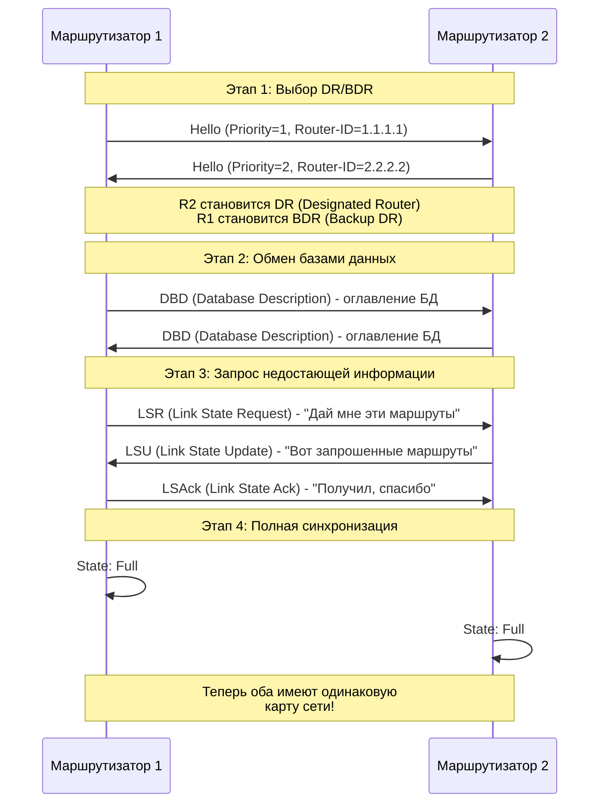
```mermaid
sequenceDiagram
    participant R1 as Маршрутизатор 1
    participant R2 as Маршрутизатор 2

    Note over R1,R2: Этап 1: Выбор DR/BDR
    R1->>R2: Hello (Priority=1, Router-ID=1.1.1.1)
    R2->>R1: Hello (Priority=2, Router-ID=2.2.2.2)
    Note over R1,R2: R2 становится DR (Designated Router)<br>R1 становится BDR (Backup DR)

    Note over R1,R2: Этап 2: Обмен базами данных
    R1->>R2: DBD (Database Description) - оглавление БД
    R2->>R1: DBD (Database Description) - оглавление БД
    
    Note over R1,R2: Этап 3: Запрос недостающей информации
    R1->>R2: LSR (Link State Request) - "Дай мне эти маршруты"
    R2->>R1: LSU (Link State Update) - "Вот запрошенные маршруты"
    R1->>R2: LSAck (Link State Ack) - "Получил, спасибо"
    
    Note over R1,R2: Этап 4: Полная синхронизация
    R1->>R1: State: Full
    R2->>R2: State: Full
    Note over R1,R2: Теперь оба имеют одинаковую<br>карту сети!
```

## 5. Состояния OSPF (OSPF States)

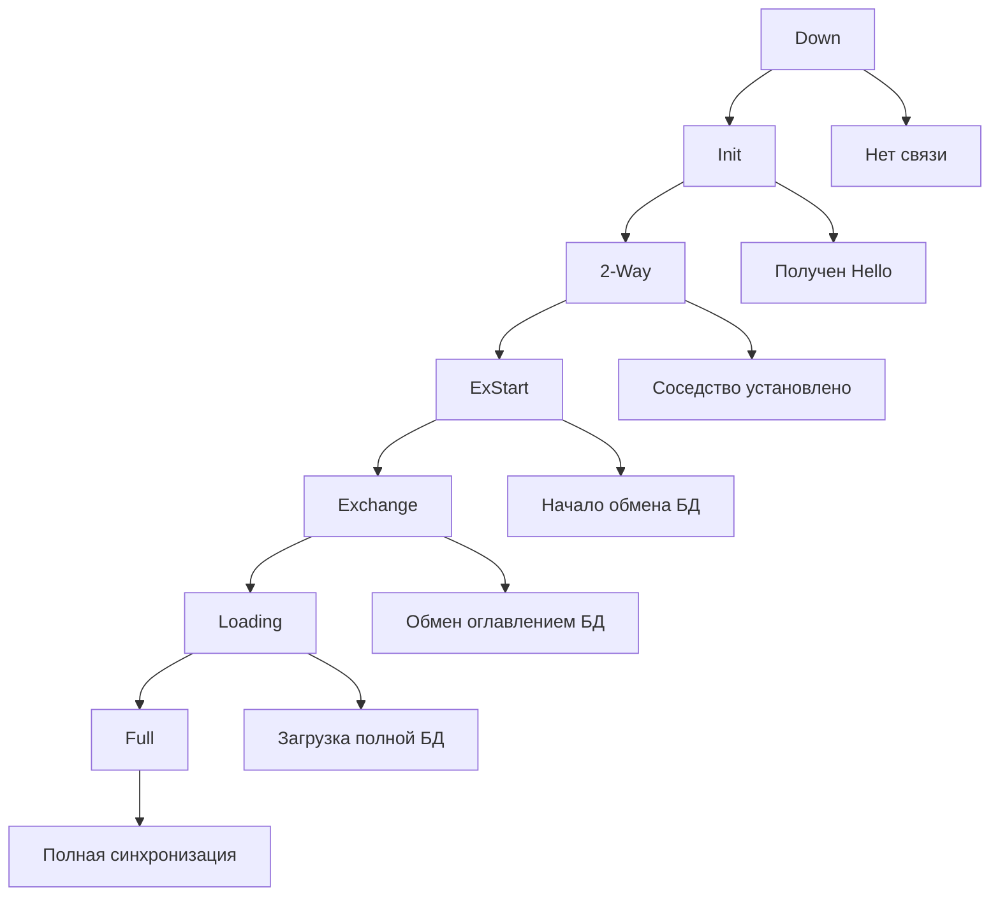
```mermaid
flowchart TD
    A[Down] --> B[Init]
    B --> C[2-Way]
    C --> D[ExStart]
    D --> E[Exchange]
    E --> F[Loading]
    F --> G[Full]
    
    A --> H[Нет связи]
    B --> I[Получен Hello]
    C --> J[Соседство установлено]
    D --> K[Начало обмена БД]
    E --> L[Обмен оглавлением БД]
    F --> M[Загрузка полной БД]
    G --> N[Полная синхронизация]
```

## 6. Areas (Зоны) в OSPF

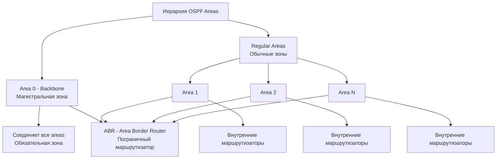
```mermaid
flowchart TD
    A[Иерархия OSPF Areas] --> B[Area 0 - Backbone<br>Магистральная зона]
    A --> C[Regular Areas<br>Обычные зоны]
    
    B --> D[Соединяет все areas<br>Обязательная зона]
    
    C --> E[Area 1]
    C --> F[Area 2]
    C --> G[Area N]
    
    E --> H[Внутренние маршрутизаторы]
    F --> I[Внутренние маршрутизаторы]
    G --> J[Внутренние маршрутизаторы]
    
    B --> K[ABR - Area Border Router<br>Пограничный маршрутизатор]
    E --> K
    F --> K
    G --> K
```

## 7. Типы маршрутизаторов OSPF

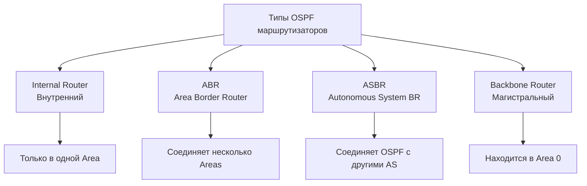
```mermaid
flowchart TD
    A[Типы OSPF маршрутизаторов] --> B[Internal Router<br>Внутренний]
    A --> C[ABR<br>Area Border Router]
    A --> D[ASBR<br>Autonomous System BR]
    A --> E[Backbone Router<br>Магистральный]
    
    B --> F[Только в одной Area]
    C --> G[Соединяет несколько Areas]
    D --> H[Соединяет OSPF с другими AS]
    E --> I[Находится в Area 0]
```

## 8. Расчет маршрутов (SPF Algorithm)

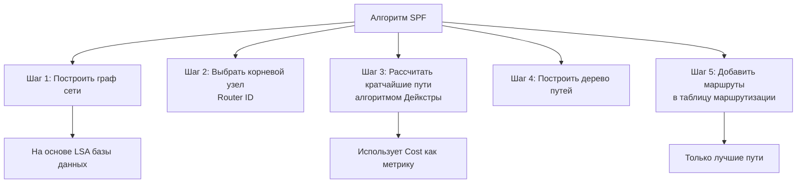
```mermaid
flowchart TD
    A[Алгоритм SPF] --> B[Шаг 1: Построить граф сети]
    A --> C[Шаг 2: Выбрать корневой узел<br>Router ID]
    A --> D[Шаг 3: Рассчитать кратчайшие пути<br>алгоритмом Дейкстры]
    A --> E[Шаг 4: Построить дерево путей]
    A --> F[Шаг 5: Добавить маршруты<br>в таблицу маршрутизации]
    
    B --> G[На основе LSA базы данных]
    D --> H[Использует Cost как метрику]
    F --> I[Только лучшие пути]
```

## 9. LSA (Link State Advertisement) Типы

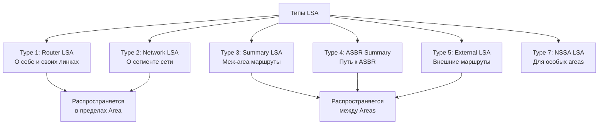
```mermaid
graph TB
    A[Типы LSA] --> B[Type 1: Router LSA<br>О себе и своих линках]
    A --> C[Type 2: Network LSA<br>О сегменте сети]
    A --> D[Type 3: Summary LSA<br>Меж-area маршруты]
    A --> E[Type 4: ASBR Summary<br>Путь к ASBR]
    A --> F[Type 5: External LSA<br>Внешние маршруты]
    A --> G[Type 7: NSSA LSA<br>Для особых areas]
    
    B --> H[Распространяется<br>в пределах Area]
    C --> H
    D --> I[Распространяется<br>между Areas]
    E --> I
    F --> I
```

## 10. Полный рабочий процесс OSPF

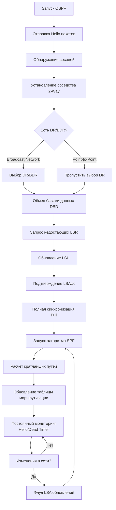
```mermaid
flowchart TD
    A[Запуск OSPF] --> B[Отправка Hello пакетов]
    B --> C[Обнаружение соседей]
    C --> D[Установление соседства 2-Way]
    
    D --> E{Есть DR/BDR?}
    E -->|Broadcast Network| F[Выбор DR/BDR]
    E -->|Point-to-Point| G[Пропустить выбор DR]
    
    F --> H[Обмен базами данных DBD]
    G --> H
    
    H --> I[Запрос недостающих LSR]
    I --> J[Обновление LSU]
    J --> K[Подтверждение LSAck]
    
    K --> L[Полная синхронизация Full]
    L --> M[Запуск алгоритма SPF]
    M --> N[Расчет кратчайших путей]
    N --> O[Обновление таблицы маршрутизации]
    
    O --> P[Постоянный мониторинг<br>Hello/Dead Timer]
    P --> Q[Изменения в сети?]
    Q -->|Да| R[Флуд LSA обновлений]
    Q -->|Нет| P
    
    R --> M
```

## 11. Пример сети OSPF

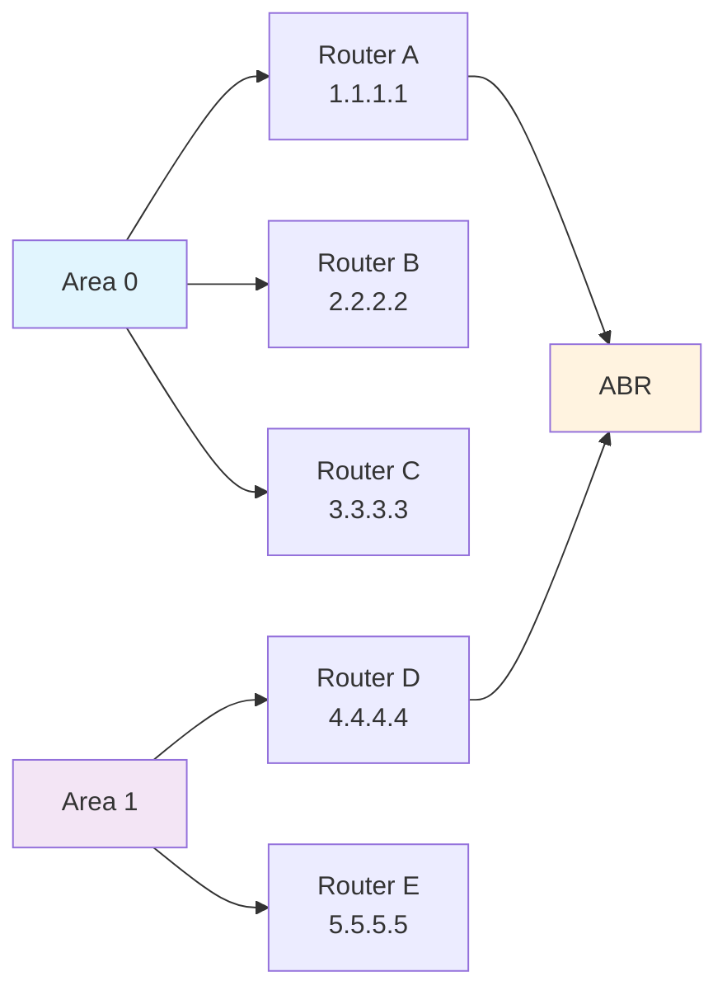
```mermaid
flowchart LR
    A[Area 0] --> B[Router A<br/>1.1.1.1]
    A --> C[Router B<br/>2.2.2.2]
    A --> D[Router C<br/>3.3.3.3]
    
    E[Area 1] --> F[Router D<br/>4.4.4.4]
    E --> G[Router E<br/>5.5.5.5]
    
    B --> H[ABR]
    F --> H
    
    style A fill:#e1f5fe
    style E fill:#f3e5f5
    style H fill:#fff3e0
```

## 12. Практический пример конфигурации


## 13. Команды мониторинга OSPF

```bash
# Показать соседей OSPF
show ip ospf neighbor

# Показать базу данных OSPF
show ip ospf database

# Показать интерфейсы OSPF
show ip ospf interface

# Показать маршруты OSPF
show ip route ospf

# Детальная информация OSPF
show ip ospf
```

## 14. Преимущества OSPF

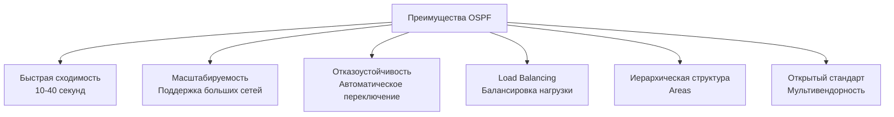
```mermaid
graph TB
    A[Преимущества OSPF] --> B[Быстрая сходимость<br>10-40 секунд]
    A --> C[Масштабируемость<br>Поддержка больших сетей]
    A --> D[Отказоустойчивость<br>Автоматическое переключение]
    A --> E[Load Balancing<br>Балансировка нагрузки]
    A --> F[Иерархическая структура<br>Areas]
    A --> G[Открытый стандарт<br>Мультивендорность]
```

**OSPF похож на GPS навигатор для маршрутизаторов** - он всегда знает самый быстрый путь до любой точки сети! 🗺️

# Полный рабочий процесс OSPF: Детальное пошаговое объяснение

## 🎯 Обзор полного процесса OSPF

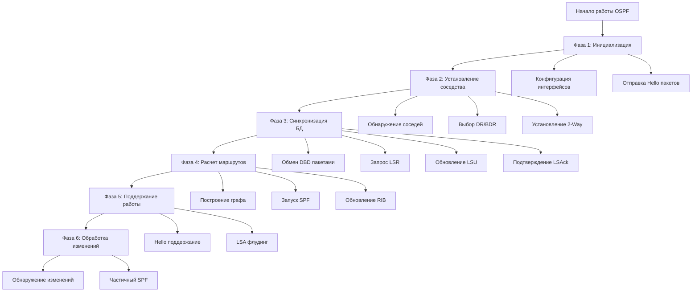
```mermaid
flowchart TD
    A[Начало работы OSPF] --> B[Фаза 1: Инициализация]
    B --> C[Фаза 2: Установление соседства]
    C --> D[Фаза 3: Синхронизация БД]
    D --> E[Фаза 4: Расчет маршрутов]
    E --> F[Фаза 5: Поддержание работы]
    F --> G[Фаза 6: Обработка изменений]
    
    B --> B1[Конфигурация интерфейсов]
    B --> B2[Отправка Hello пакетов]
    
    C --> C1[Обнаружение соседей]
    C --> C2[Выбор DR/BDR]
    C --> C3[Установление 2-Way]
    
    D --> D1[Обмен DBD пакетами]
    D --> D2[Запрос LSR]
    D --> D3[Обновление LSU]
    D --> D4[Подтверждение LSAck]
    
    E --> E1[Построение графа]
    E --> E2[Запуск SPF]
    E --> E3[Обновление RIB]
    
    F --> F1[Hello поддержание]
    F --> F2[LSA флудинг]
    
    G --> G1[Обнаружение изменений]
    G --> G2[Частичный SPF]
```

## 🔄 Детальный пошаговый процесс

### Фаза 1: Инициализация и конфигурация

**Шаг 1.1: Базовая конфигурация**
```bash
! Активация OSPF на интерфейсах
router ospf 1
 router-id 1.1.1.1
 network 10.0.0.0 0.255.255.255 area 0
!
interface GigabitEthernet0/0
 ip ospf priority 100
 ip ospf cost 10
```

**Шаг 1.2: Отправка Hello пакетов**
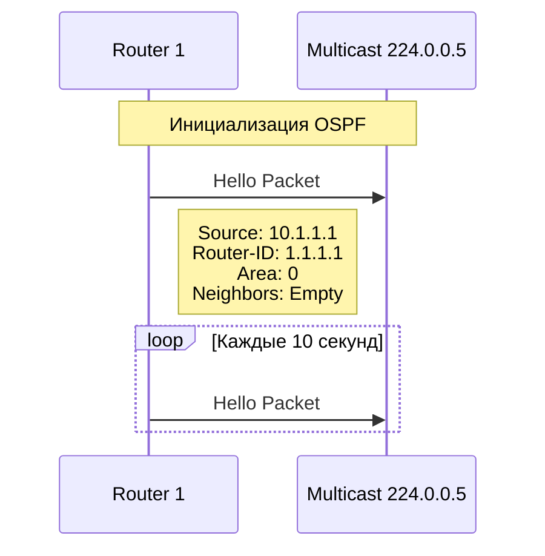
```mermaid
sequenceDiagram
    participant R1 as Router 1
    participant Network as Multicast 224.0.0.5

    Note over R1,Network: Инициализация OSPF
    R1->>Network: Hello Packet
    Note right of R1: Source: 10.1.1.1<br>Router-ID: 1.1.1.1<br>Area: 0<br>Neighbors: Empty
    loop Каждые 10 секунд
        R1->>Network: Hello Packet
    end
```

### Фаза 2: Установление соседства

**Шаг 2.1: Обнаружение соседей**
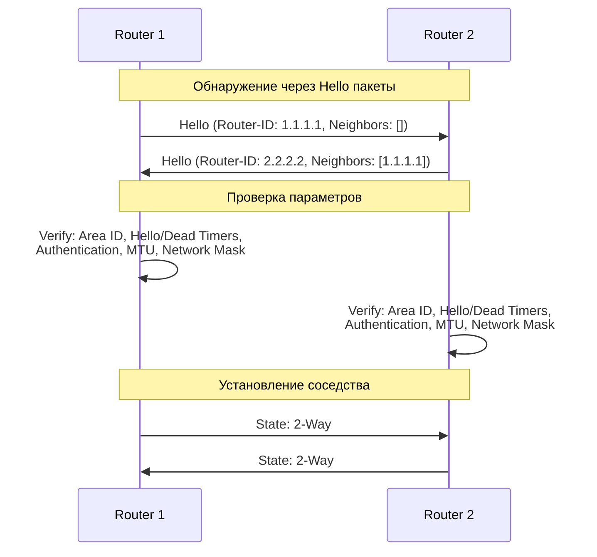
```mermaid
sequenceDiagram
    participant R1 as Router 1
    participant R2 as Router 2

    Note over R1,R2: Обнаружение через Hello пакеты
    R1->>R2: Hello (Router-ID: 1.1.1.1, Neighbors: [])
    R2->>R1: Hello (Router-ID: 2.2.2.2, Neighbors: [1.1.1.1])
    
    Note over R1,R2: Проверка параметров
    R1->>R1: Verify: Area ID, Hello/Dead Timers,<br>Authentication, MTU, Network Mask
    R2->>R2: Verify: Area ID, Hello/Dead Timers,<br>Authentication, MTU, Network Mask
    
    Note over R1,R2: Установление соседства
    R1->>R2: State: 2-Way
    R2->>R1: State: 2-Way
```

**Шаг 2.2: Выбор DR/BDR (для multi-access сетей)**
```bash
# Алгоритм выбора:
# 1. Highest OSPF Priority (0 = не участвует)
# 2. Highest Router ID
# 3. Если равны - оба становятся DROTHER

# Результат выбора:
DR: Router with Priority 255, RID 2.2.2.2
BDR: Router with Priority 100, RID 1.1.1.1
DROTHER: Остальные маршрутизаторы
```

### Фаза 3: Синхронизация базы данных

**Шаг 3.1: Обмен Database Description (DBD)**
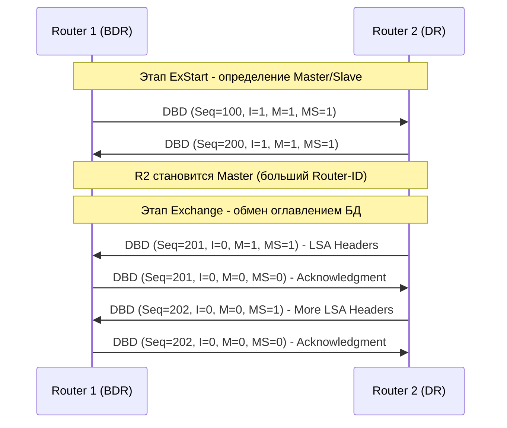
```mermaid
sequenceDiagram
    participant R1 as Router 1 (BDR)
    participant R2 as Router 2 (DR)

    Note over R1,R2: Этап ExStart - определение Master/Slave
    R1->>R2: DBD (Seq=100, I=1, M=1, MS=1)
    R2->>R1: DBD (Seq=200, I=1, M=1, MS=1)
    Note over R1,R2: R2 становится Master (больший Router-ID)
    
    Note over R1,R2: Этап Exchange - обмен оглавлением БД
    R2->>R1: DBD (Seq=201, I=0, M=1, MS=1) - LSA Headers
    R1->>R2: DBD (Seq=201, I=0, M=0, MS=0) - Acknowledgment
    R2->>R1: DBD (Seq=202, I=0, M=0, MS=1) - More LSA Headers
    R1->>R2: DBD (Seq=202, I=0, M=0, MS=0) - Acknowledgment
```

**Шаг 3.2: Запрос и обмен полной информацией LSA**
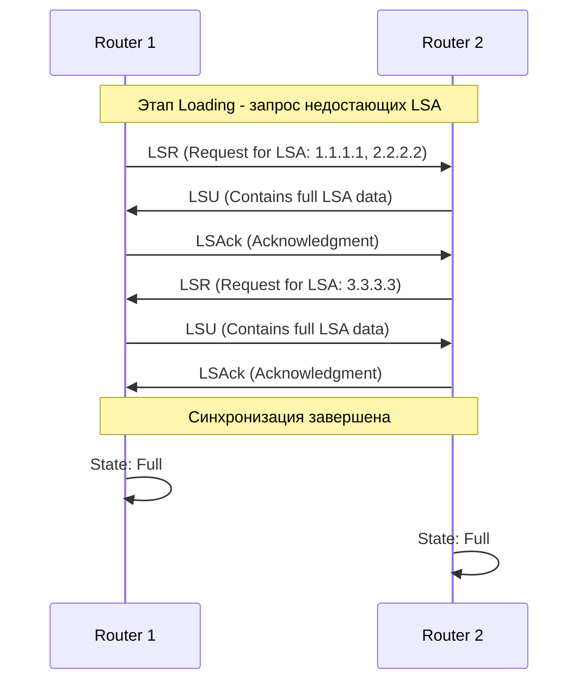
```mermaid
sequenceDiagram
    participant R1 as Router 1
    participant R2 as Router 2

    Note over R1,R2: Этап Loading - запрос недостающих LSA
    R1->>R2: LSR (Request for LSA: 1.1.1.1, 2.2.2.2)
    R2->>R1: LSU (Contains full LSA data)
    R1->>R2: LSAck (Acknowledgment)
    
    R2->>R1: LSR (Request for LSA: 3.3.3.3)
    R1->>R2: LSU (Contains full LSA data)
    R2->>R1: LSAck (Acknowledgment)
    
    Note over R1,R2: Синхронизация завершена
    R1->>R1: State: Full
    R2->>R2: State: Full
```

### Фаза 4: Расчет маршрутов SPF

**Шаг 4.1: Построение графа сети**
```python
# Псевдокод алгоритма SPF (Dijkstra)
def spf_algorithm(lsdb, root_router):
    # Инициализация
    tree = {root_router: 0}
    candidates = {}
    
    # Добавление соседей корневого маршрутизатора
    for neighbor, cost in lsdb.get_neighbors(root_router):
        candidates[neighbor] = cost
    
    while candidates:
        # Выбор кандидата с минимальной стоимостью
        current = min(candidates, key=candidates.get)
        current_cost = candidates.pop(current)
        
        # Добавление в дерево кратчайших путей
        tree[current] = current_cost
        
        # Обработка соседей выбранного маршрутизатора
        for neighbor, link_cost in lsdb.get_neighbors(current):
            if neighbor not in tree:
                total_cost = current_cost + link_cost
                if neighbor not in candidates or total_cost < candidates[neighbor]:
                    candidates[neighbor] = total_cost
    
    return tree
```

**Шаг 4.2: Обновление таблицы маршрутизации**
```bash
# Результат SPF расчета:
Destination    Next Hop       Cost    Interface
10.1.0.0/24    10.1.1.2       10      Gi0/0
10.2.0.0/24    10.1.1.2       20      Gi0/0  
10.3.0.0/24    10.1.1.3       15      Gi0/1

# Добавление в RIB (Routing Information Base)
Router# show ip route ospf
O    10.1.0.0/24 [110/10] via 10.1.1.2, GigabitEthernet0/0
O    10.2.0.0/24 [110/20] via 10.1.1.2, GigabitEthernet0/0
O    10.3.0.0/24 [110/15] via 10.1.1.3, GigabitEthernet0/1
```

### Фаза 5: Поддержание работы и мониторинг

**Шаг 5.1: Постоянный обмен Hello пакетами**
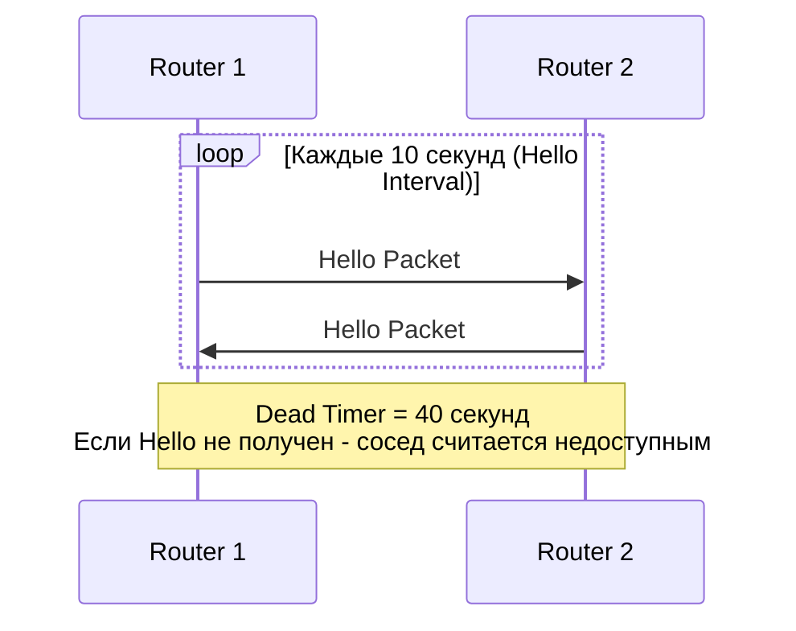
```mermaid
sequenceDiagram
    participant R1 as Router 1
    participant R2 as Router 2

    loop Каждые 10 секунд (Hello Interval)
        R1->>R2: Hello Packet
        R2->>R1: Hello Packet
    end
    
    Note over R1,R2: Dead Timer = 40 секунд<br>Если Hello не получен - сосед считается недоступным
```

**Шаг 5.2: LSA флудинг при изменениях**
```bash
# Процесс распространения LSA:
1. Router обнаруживает изменение линка
2. Генерирует новое LSA с увеличенным sequence number
3. Рассылает LSU пакет всем соседям
4. Соседи подтверждают получение LSAck
5. Соседи пересылают LSU дальше (флудинг)
6. Все маршрутизаторы запускают partial SPF
```

### Фаза 6: Обработка сетевых изменений

**Шаг 6.1: Обнаружение сбоя линка**
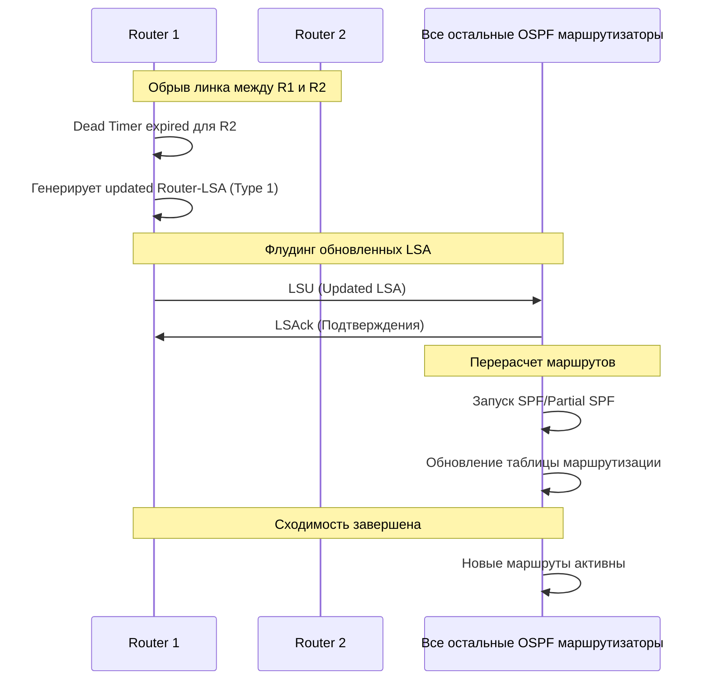
```mermaid
sequenceDiagram
    participant R1 as Router 1
    participant R2 as Router 2
    participant Other as Все остальные OSPF маршрутизаторы

    Note over R1,R2: Обрыв линка между R1 и R2
    R1->>R1: Dead Timer expired для R2
    R1->>R1: Генерирует updated Router-LSA (Type 1)
    
    Note over R1,Other: Флудинг обновленных LSA
    R1->>Other: LSU (Updated LSA)
    Other->>R1: LSAck (Подтверждения)
    
    Note over Other,Other: Перерасчет маршрутов
    Other->>Other: Запуск SPF/Partial SPF
    Other->>Other: Обновление таблицы маршрутизации
    
    Note over R1,Other: Сходимость завершена
    Other->>Other: Новые маршруты активны
```

**Шаг 6.2: Быстрая сходимость с оптимизациями**
```bash
# OSPF Timers для быстрой сходимости:
interface GigabitEthernet0/0
 ip ospf dead-interval minimal hello-multiplier 4
! Dead Interval: 1 секунда
! Hello Interval: 250 мс

# SPF Throttling:
router ospf 1
 timers throttle spf 10 100 5000
! Первый SPF: через 10 мс после изменения
! Второй SPF: через 100 мс
! Максимальное ожидание: 5000 мс
```

## 📊 Полный цикл состояний OSPF

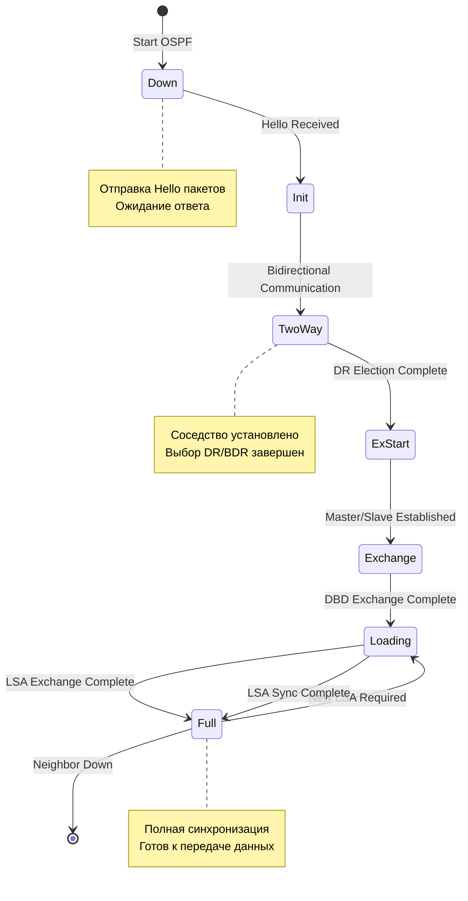
```mermaid
stateDiagram-v2
    [*] --> Down: Start OSPF
    Down --> Init: Hello Received
    Init --> TwoWay: Bidirectional Communication
    TwoWay --> ExStart: DR Election Complete
    ExStart --> Exchange: Master/Slave Established
    Exchange --> Loading: DBD Exchange Complete
    Loading --> Full: LSA Exchange Complete
    Full --> [*]: Neighbor Down
    Full --> Loading: New LSA Required
    Loading --> Full: LSA Sync Complete
    
    note right of Down
        Отправка Hello пакетов
        Ожидание ответа
    end note
    
    note right of TwoWay
        Соседство установлено
        Выбор DR/BDR завершен
    end note
    
    note right of Full
        Полная синхронизация
        Готов к передаче данных
    end note
```

## 🔍 Диагностика и мониторинг рабочего процесса

### Ключевые команды для наблюдения за процессом:
```bash
# Мониторинг состояний соседей
show ip ospf neighbor
# Вывод: Neighbor ID, Priority, State, Dead Time, Address, Interface

# Анализ базы данных OSPF
show ip ospf database
# Показывает все LSA в LSDB

# Мониторинг SPF вычислений
show ip ospf statistics
# Показывает количество SPF расчетов и время выполнения

# Отладка в реальном времени
debug ip ospf adj
debug ip ospf events
debug ip ospf packet
```

### Критические таймеры OSPF:
- **Hello Interval**: 10 секунд (30 для NBMA)
- **Dead Interval**: 40 секунд (120 для NBMA)  
- **LSA Refresh Time**: 30 минут
- **Max Age**: 60 минут

## ✅ Итог полного рабочего процесса

**OSPF обеспечивает:**
- ✅ **Автоматическое обнаружение** соседей
- ✅ **Полную синхронизацию** базы данных
- ✅ **Быструю сходимость** при изменениях (1-5 секунд)
- ✅ **Оптимальные маршруты** через алгоритм SPF
- ✅ **Масштабируемость** через иерархию areas
- ✅ **Отказоустойчивость** через быстрое переключение
