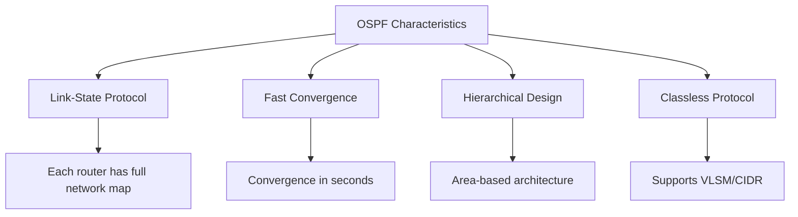
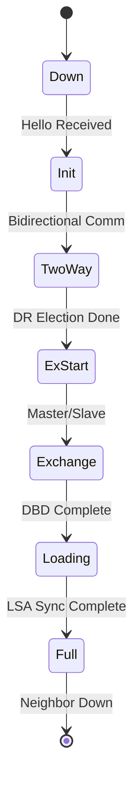
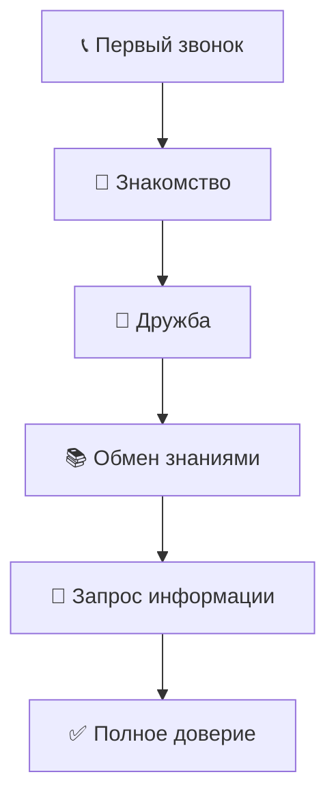
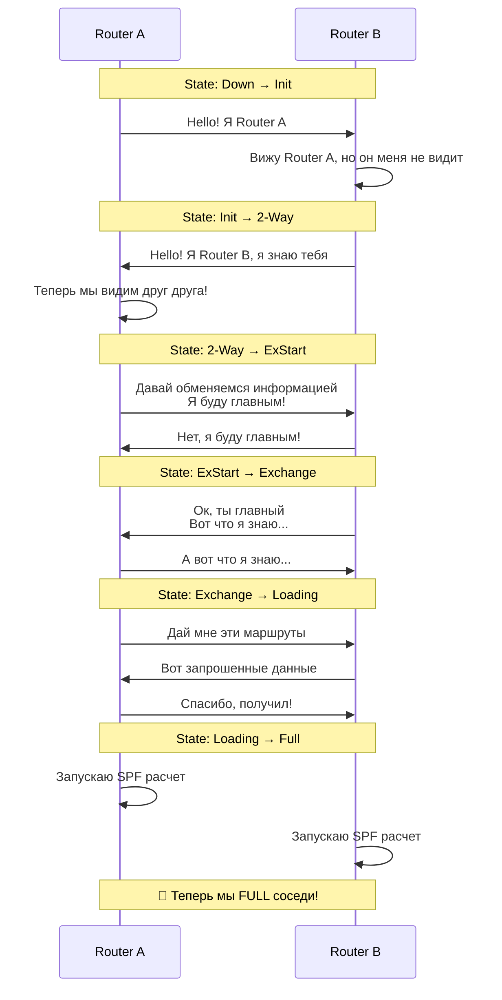
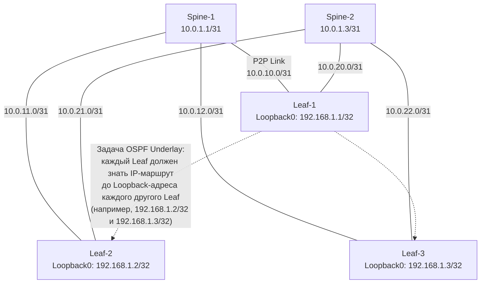
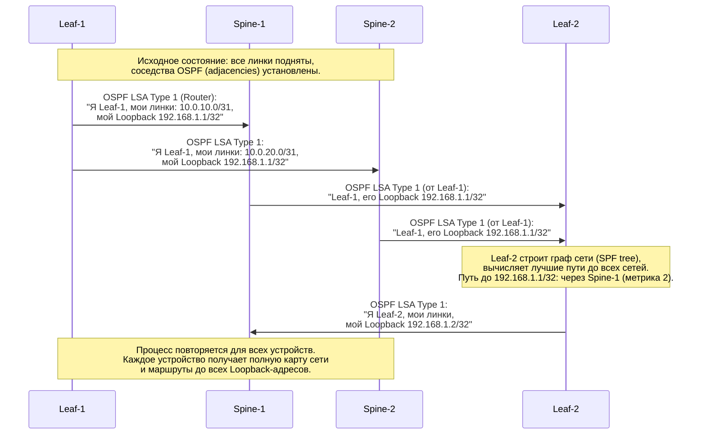
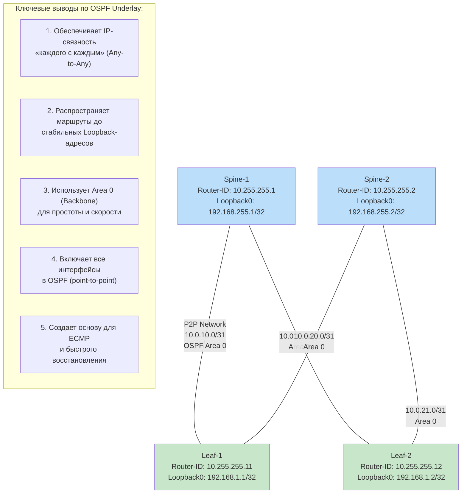

# 📚 OSPF (Open Shortest Path First) - Полная теория для самостоятельного изучения

## 🎯 Основные концепции OSPF

### Что такое OSPF?
**OSPF** - это протокол динамической маршрутизации класса **Link-State**, который:
- Работает на сетевом уровне (Layer 3)
- Использует алгоритм **Dijkstra SPF** для вычисления маршрутов
- Является **открытым стандартом** (RFC 2328)
- Имеет административное расстояние **110**



## 🏗️ Архитектура OSPF

### Иерархическая структура Areas
```
Autonomous System
    │
    └── Backbone Area 0
        ├── Area 1
        ├── Area 2
        ├── Stub Area
        └── NSSA
```

### Типы маршрутизаторов OSPF
- **Internal Router** - все интерфейсы в одной area
- **ABR (Area Border Router)** - соединяет несколько areas
- **ASBR (AS Boundary Router)** - подключает OSPF к другим протоколам
- **Backbone Router** - имеет интерфейсы в Area 0

## 🔄 Процесс установления соседства

### Состояния OSPF Finite State Machine


### OSPF Packet Types
1. **Hello** - обнаружение соседей и поддержание отношений
2. **DBD (Database Description)** - описание содержимого LSDB
3. **LSR (Link State Request)** - запрос конкретных LSA
4. **LSU (Link State Update)** - передача LSA
5. **LSAck (Link State Acknowledgment)** - подтверждение получения

## 📊 База данных OSPF (LSDB)

### Типы LSA (Link State Advertisements)
| Тип | Название | Описание | Область распространения |
|-----|----------|----------|-------------------------|
| **1** | Router-LSA | Описывает интерфейсы router'а | В пределах Area |
| **2** | Network-LSA | Генерируется DR для broadcast сетей | В пределах Area |
| **3** | Summary-LSA | Меж-area маршруты от ABR | Между Areas |
| **4** | ASBR-Summary | Путь к ASBR | Между Areas |
| **5** | AS-External | Внешние маршруты от ASBR | По всему OSPF домену |
| **7** | NSSA | Внешние маршруты в NSSA | NSSA → Area 0 |

## ⚙️ Алгоритм SPF (Dijkstra)

### Пошаговый процесс:
```python
def dijkstra_spf(graph, start_node):
    # 1. Инициализация
    distances = {node: float('inf') for node in graph}
    distances[start_node] = 0
    visited = set()
    
    while len(visited) < len(graph):
        # 2. Выбор узла с минимальной стоимостью
        current = min((distances[node], node) for node in graph if node not in visited)[1]
        visited.add(current)
        
        # 3. Обновление стоимостей соседей
        for neighbor, cost in graph[current].items():
            if neighbor not in visited:
                new_distance = distances[current] + cost
                if new_distance < distances[neighbor]:
                    distances[neighbor] = new_distance
    
    return distances
```

### Расчет метрики Cost:
```
Cost = Reference Bandwidth / Interface Bandwidth
По умолчанию: Reference Bandwidth = 100 Mbps

Примеры:
- 1 Gbps: Cost = 100 / 1000 = 1
- 100 Mbps: Cost = 100 / 100 = 1
- 10 Mbps: Cost = 100 / 10 = 10
```

## 🏆 DR/BDR Выбор

### Алгоритм выбора:
1. **Highest OSPF Priority** (0-255, по умолчанию 1)
2. **Highest Router ID**
3. При равных значениях - оба становятся DROTHER

### Роли в multi-access сетях:
- **DR (Designated Router)** - координирует обмен LSA
- **BDR (Backup DR)** - готов заменить DR
- **DROTHER** - обычные маршрутизаторы

## ⏱️ OSPF Timers

### Стандартные интервалы:
| Тип сети | Hello Interval | Dead Interval | DR/BDR |
|----------|----------------|---------------|---------|
| **Broadcast** | 10 сек | 40 сек | ✅ |
| **Point-to-Point** | 10 сек | 40 сек | ❌ |
| **NBMA** | 30 сек | 120 сек | ✅ |
| **Point-to-Multipoint** | 30 сек | 120 сек | ❌ |

## 🔧 Конфигурация OSPF

### Базовая конфигурация Cisco IOS:
```bash
! Активация OSPF процесса
router ospf 1
 router-id 1.1.1.1
 auto-cost reference-bandwidth 1000
 network 10.0.0.0 0.255.255.255 area 0
 network 192.168.1.0 0.0.0.255 area 1
 passive-interface default
 no passive-interface GigabitEthernet0/0
!

! Настройка интерфейсов
interface GigabitEthernet0/0
 ip ospf cost 10
 ip ospf priority 100
 ip ospf authentication message-digest
 ip ospf message-digest-key 1 md5 PASSWORD
!

! Area специфичные настройки
area 1 stub
area 2 nssa
area 0 range 10.0.0.0 255.0.0.0
```

## 🛡️ Безопасность OSPF

### Типы аутентификации:
1. **Null Authentication** - аутентификация отключена
2. **Simple Password** - plain-text пароль
3. **MD5 Authentication** - криптографическая аутентификация

### Конфигурация аутентификации:
```bash
interface GigabitEthernet0/0
 ip ospf authentication
 ip ospf authentication-key PLAIN_TEXT_PASS
!
! или MD5 аутентификация
interface GigabitEthernet0/1
 ip ospf authentication message-digest
 ip ospf message-digest-key 1 md5 SECURE_HASH
!
```

## 📈 Оптимизация OSPF

### Быстрая сходимость:
```bash
! Агрессивные таймеры
interface GigabitEthernet0/0
 ip ospf hello-interval 1
 ip ospf dead-interval 4

! SPF throttling
router ospf 1
 timers throttle spf 10 100 5000
 timers throttle lsa all 10 100 5000
!

! BFD интеграция
interface GigabitEthernet0/0
 bfd interval 50 min_rx 50 multiplier 3
router ospf 1
 bfd all-interfaces
```

### Route Summarization:
```bash
! Summarization на ABR
area 1 range 10.1.0.0 255.255.0.0

! Summarization на ASBR
summary-address 172.16.0.0 255.255.0.0
```

## 🔍 Мониторинг и диагностика

### Ключевые команды:
```bash
# Состояние соседей
show ip ospf neighbor
show ip ospf neighbor detail

# База данных OSPF
show ip ospf database
show ip ospf database router
show ip ospf database network

# Статистика и интерфейсы
show ip ospf interface
show ip ospf border-routers
show ip ospf virtual-links

# Маршруты OSPF
show ip route ospf
show ip ospf rib

# Производительность
show ip ospf statistics
show ip ospf request-list
show ip ospf retransmission-list
```

# 🎯 OSPF Finite State Machine - Простое объяснение

## 🤔 Что такое Finite State Machine?

**Finite State Machine (FSM)** - это "машина состояний", которая показывает, как OSPF маршрутизаторы проходят разные этапы при установлении соседства. 

**Простыми словами:** Это как история отношений между двумя маршрутизаторами - от первого знакомства до полного доверия!



## 🔄 Состояния OSPF FSM

### 1. **Down** ❌
**"Мы еще не знакомы"**
- Маршрутизаторы еще не общались
- OSPF не активирован на интерфейсе
- Ждут первого Hello пакета

### 2. **Init** 📞  
**"Я тебя увидел, но ты меня еще нет"**
- Один маршрутизатор получил Hello от другого
- Но ответный Hello еще не получен
- В Hello пакете нет твоего Router ID в списке соседей

### 3. **2-Way** 🤝
**"Мы познакомились и стали соседями"**
- Оба маршрутизатора видят друг друга в Hello пакетах
- Двусторонняя связь установлена
- **Важно:** На этом этапе решается, кто будет DR/BDR

### 4. **ExStart** 🏁
**"Решаем, кто первый начнет разговор"**
- Маршрутизаторы договариваются, кто будет "главным" в обмене информацией
- Определяется Master/Slave отношения
- Используются DBD пакеты с флагами

### 5. **Exchange** 📊
**"Показываем оглавления наших книг"**  
- Маршрутизаторы обмениваются DBD пакетами
- Показывают, какие LSA у них есть
- Сравнивают, какая информация отсутствует

### 6. **Loading** 📥
**"Просим недостающие страницы книг"**
- Маршрутизаторы запрашивают недостающие LSA через LSR
- Получают полные данные через LSU
- Подтверждают получение через LSAck

### 7. **Full** ✅
**"У нас одинаковые карты сети!"**
- Базы данных полностью синхронизированы
- Маршрутизаторы становятся "соседями"
- Запускается алгоритм SPF для расчета маршрутов

## 🎯 Визуализация всего процесса



## ⏱️ Что происходит в каждом состоянии?

### **Down → Init → 2-Way**
```bash
# В логах вы увидите:
%OSPF-5-ADJCHANGE: Neighbor 10.1.1.2 on GigabitEthernet0/0 
from LOADING to FULL, Loading Done
```

### **2-Way → ExStart → Exchange**
```bash
# Маршрутизаторы обмениваются DBD:
DBD Packet: I=1, M=1, MS=1, Seq=100
# I=Initial, M=More, MS=Master/Slave
```

### **Exchange → Loading → Full**
```bash
# Запросы и обновления:
LSR: "Дай мне LSA 1.1.1.1"
LSU: "Вот полные данные LSA 1.1.1.1"  
LSAck: "Получил, спасибо!"
```

## 🚨 Возможные проблемы

### **Застревание в состоянии:**
- **Init/ExStart** - Проблемы с MTU, аутентификацией
- **Exchange** - Несовпадение параметров OSPF
- **Loading** - Потеря LSA пакетов

### **Быстрая диагностика:**
```bash
# Проверить состояния соседей
show ip ospf neighbor

# Пример вывода:
Neighbor ID    Pri   State     Dead Time   Address     Interface
2.2.2.2        1     FULL/DR   00:00:38    10.1.1.2    Gi0/0
3.3.3.3        1     INIT/DROTHER 00:00:37 10.1.1.3    Gi0/0
```

## 💡 Ключевые моменты для запоминания

### **Обязательные состояния:**
1. **Down** → Начало
2. **2-Way** → Стали соседями  
3. **Full** → Полная синхронизация

### **Временные состояния:**
- Init, ExStart, Exchange, Loading - быстрые переходные состояния

### **Самое важное состояние:**
- **Full** - только в этом состоянии маршрутизаторы начинают передавать данные через OSPF

## ✅ Итог простыми словами

**OSPF FSM - это как знакомство и становление дружбы:**

1. **❌ Down** - "Мы незнакомцы"
2. **📞 Init** - "Я тебя увидел"  
3. **🤝 2-Way** - "Поздоровались и познакомились"
4. **🏁 ExStart** - "Решаем, кто первый говорит"
5. **📊 Exchange** - "Рассказываем, что знаем"
6. **📥 Loading** - "Спрашиваем непонятное"
7. **✅ Full** - "Теперь мы лучшие друзья с общими знаниями!"

**Когда оба маршрутизатора достигают состояния Full - сеть работает идеально!** 🎉


### **Диаграмма 1: Концептуальная модель Underlay vs Overlay**
Эта диаграмма задает контекст, объясняя, зачем вообще нужен Underlay.

```mermaid
graph TB
    subgraph "Уровень Overlay (Логический, Виртуальный)"
        O1[Виртуальная сеть A<br>VXLAN 1001]
        O2[Виртуальная сеть B<br>VXLAN 1002]
        O1 & O2 -- Туннели VXLAN --> O3[Виртуальный маршрутизатор]
    end

    subgraph "Уровень Underlay (Физический, Транспортный)"
        direction LR
        L3_1[L3-коммутатор /<br>Маршрутизатор Spine-1] <-->|IP-маршрутизация<br>(OSPF Area 0)| L3_2[Spine-2]
        L3_1 <-->|OSPF| L3_3[Leaf-1]
        L3_1 <-->|OSPF| L4[Leaf-2]
        L3_2 <-->|OSPF| L3_3
        L3_2 <-->|OSPF| L4
    end

    O3 -.->|"Работает поверх<br>стабильной IP-связности"| L3_1 & L3_2 & L3_3 & L4
```

**Объяснение:** Overlay (VXLAN, VPN) — это "пассажиры", которым нужна надежная "дорога" — стабильная IP-сеть. Underlay на базе OSPF — это и есть та самая "дорога".

---

### **Диаграмма 2: Роль OSPF в Underlay — обеспечение IP-связности "каждого с каждым"**
Показывает главную техническую цель Underlay в архитектуре Spine-Leaf.



**Объяснение:** Все линки — это сети /31 (точечные). OSPF анонсирует эти линки и, что критически важно, **Loopback-интерфейсы** устройств. Loopback-адрес становится стабильным идентификатором устройства для Overlay (например, для установки туннелей VXLAN).

---

### **Диаграмма 3: Распространение маршрутов Loopback в OSPF Area 0**
Детализирует процесс обмена маршрутами внутри OSPF.



**Объяснение:** OSPF рассылает информацию о топологии (LSA). Spine-устройства ретранслируют эти LSA, обеспечивая полную видимость сети. В итоге каждый Leaf знает путь до Loopback любого другого Leaf.

---

### **Диаграмма 4: Отказоустойчивость и ECMP в Underlay сети**
Показывает, как OSPF обеспечивает избыточность и балансировку нагрузки.

```mermaid
flowchart TD
    S1[Spine-1]
    S2[Spine-2]

    L1[Leaf-1<br>Loopback0: 192.168.1.1]
    L2[Leaf-2<br>Loopback0: 192.168.1.2]

    S1 === L1
    S1 === L2
    S2 === L1
    S2 === L2

    subgraph "Таблица маршрутизации на Leaf-1"
        T1[Сеть: 192.168.1.2/32<br>Next-Hop 1: Spine-1 (10.0.10.0)<br>Next-Hop 2: Spine-2 (10.0.20.0)]
    end

    style T1 fill:#e1f5e1,stroke:#333

    L1 -- "Трафик от Leaf-1 к Leaf-2<br>балансируется по двум путям (ECMP)" --> S1 & S2
    S1 & S2 --> L2

    style S2 stroke:#ff4444,stroke-width:2px
    Note over S2: Сценарий отказа: линк/Spine-2 недоступен
    Note over L1: OSPF пересчитывает граф,<br>убирает путь через Spine-2.<br>Трафик продолжает идти<br>через оставшийся путь (Spine-1).
```

**Объяснение:** Благодаря полносвязной топологии (каждый Leaf подключен к каждому Spine) OSPF вычисляет **равноценные пути (ECMP)**. Это дает балансировку нагрузки и мгновенное использование резервного пути при сбое без потери пакетов (при быстрой сходимости OSPF).

---

### **Диаграмма 5: Итоговая схема работающего Underlay с OSPF**
Сводная схема, показывающая конечное состояние сети.



**Объяснение:** Итоговая схема демонстрирует чистую, предсказуемую и высокодоступную транспортную сеть. Ее единственная задача — доставлять IP-пакеты между Loopback-адресами устройств с максимальной эффективностью и надежностью, что и требуется для работы современных Overlay-технологий (VXLAN, EVPN, MPLS).