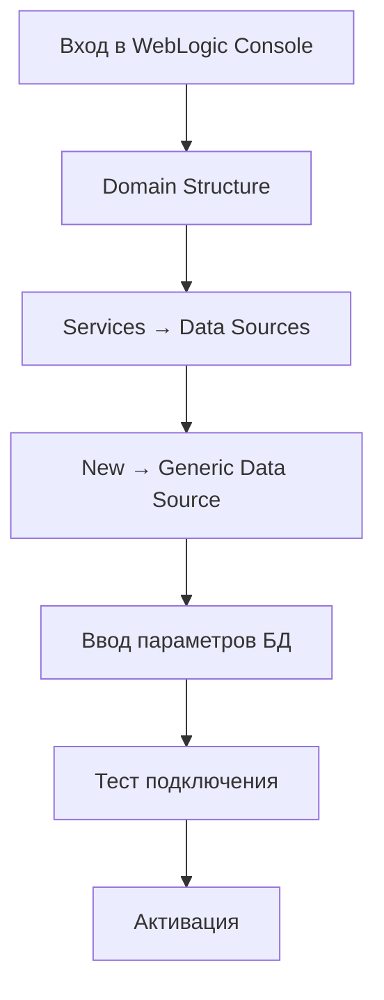

## Добавление БД из толстого клиента P6 Professional в WebLogic Server

### Способ 1: Через P6 Professional Admin Superuser

**Шаги:**

1. **Откройте P6 Professional:**
   ```cmd
   # Ярлык: Primavera P6 Professional
   ```

2. **Подключитесь к любой доступной БД** с правами администратора

3. **Перейдите в режим администрирования:**
   - `Admin` → `Admin Superuser` → `Database` → `Configure`

4. **Добавьте новую БД:**
   - Нажмите `Add`
   - Заполните параметры:

   ```properties
   Database Type: Oracle
   Database Name: P6EPPM_NEW
   Host Name: server.company.com (или IP)
   Port: 1521
   Database Service/SID: P6EPPM
   Schema Owner: PMDB
   Schema Password: ********
   ```

5. **Проверьте подключение:**
   - Нажмите `Test Connection`
   - Если успешно - `Save`

### Способ 2: Через файл конфигурации

**1. Найдите файл настроек P6:**
```cmd
# Путь по умолчанию:
C:\ProgramData\Oracle\Primavera P6\P6 Professional\database.cfg
```

**2. Добавьте запись о новой БД:**
```properties
[P6EPPM_NEW]
Type=Oracle
Connect=server.company.com:1521:P6EPPM
User=PMDB
Password=encrypted_password
Description=New EPPM Database
```

**3. Перезапустите P6 Professional**

### Способ 3: Экспорт настроек из существующей БД

1. **В P6 Professional:**
   - `Admin` → `Admin Superuser` → `Database` → `Configure`
   - Выберите существующую БД
   - Нажмите `Export`
   - Сохраните как `database_export.cfg`

2. **Отредактируйте файл:**
   ```properties
   [P6EPPM_NEW]
   Type=Oracle
   Connect=новый_сервер:1521:новый_сервис
   User=PMDB
   Password=новый_пароль
   ```

3. **Импортируйте настройки:**
   - В том же окне `Configure Databases`
   - Нажмите `Import`
   - Выберите измененный файл

### Способ 4: Через реестр Windows (продвинутый)

**1. Откройте реестр:**
```cmd
regedit
```

**2. Найдите ключ P6:**
```
HKEY_CURRENT_USER\Software\Oracle\Primavera P6\P6 Professional\Database Connections
```

**3. Создайте новую запись:**
```reg
[HKEY_CURRENT_USER\Software\Oracle\Primavera P6\P6 Professional\Database Connections\P6EPPM_NEW]
"Type"="Oracle"
"Connect"="server.company.com:1521:P6EPPM"
"User"="PMDB"
"Password"="encrypted"
"Description"="New EPPM Database"
```

### Способ 5: Массовое добавление через скрипт

**Создайте BAT файл:**
```batch
@echo off
set P6_PATH="C:\Program Files\Oracle\Primavera P6\P6 Professional"
set REG_FILE="add_p6_db.reg"

echo Windows Registry Editor Version 5.00 > %REG_FILE%
echo [HKEY_CURRENT_USER\Software\Oracle\Primavera P6\P6 Professional\Database Connections\P6EPPM_NEW] >> %REG_FILE%
echo "Type"="Oracle" >> %REG_FILE%
echo "Connect"="server.company.com:1521:P6EPPM" >> %REG_FILE%
echo "User"="PMDB" >> %REG_FILE%
echo "Password"="encrypted" >> %REG_FILE%
echo "Description"="New EPPM Database" >> %REG_FILE%

regedit /s %REG_FILE%
del %REG_FILE%

echo Database P6EPPM_NEW added successfully!
pause
```

## Данные которые нужны для добавления:

**Откуда брать:**
- **Хост и порт**: У администратора БД Oracle
- **Service Name**: В tnsnames.ora на сервере БД или у администратора
- **Schema Owner**: Обычно `PMDB` для P6 EPPM
- **Пароль**: У администратора БД P6

**Пример заполнения:**
```properties
Database Type: Oracle
Database Name: P6EPPM_PROD
Host Name: 192.168.1.100
Port: 1521
Database Service: P6EPPM
Schema Owner: PMDB
Schema Password: ********
```

## Проверка подключения:

1. **В P6 Professional:**
   - `File` → `Open Database`
   - Выберите новую БД из списка
   - Попробуйте подключиться

2. **Если ошибка:**
   - Проверьте сетевую доступность сервера БД
   - Убедитесь что порт 1521 открыт
   - Проверьте правильность Service Name
   - Убедитесь что пользователь PMDB существует и активен

## Важные моменты:

- ✅ **Толстый клиент подключается напрямую к БД**, минуя WebLogic
- ✅ **Добавление в толстом клиенте не добавляет БД в веб-клиент**
- ✅ **Для веб-клиента нужно отдельное добавление через web-админку**
- ✅ **Пароль в конфигах хранится в зашифрованном виде**

После добавления БД в толстый клиент вы сможете подключаться к ней напрямую из P6 Professional, но для доступа через веб-клиент потребуется дополнительная настройка на WebLogic Server.

## Настройка доступа к БД через WebLogic Server после добавления в толстый клиент

### Способ 1: Через Web Administration Console (самый простой)

**1. Доступ к веб-консоли WebLogic:**
```
URL: http://weblogic-server:7001/console
Логин: weblogic (или другой админ)
Пароль: ********
```

**2. Настройка Data Source:**



**Шаги в консоли:**
- В левом меню: `Domain Structure` → `Services` → `Data Sources`
- Нажмите `New` → `Generic Data Source`
- Заполните параметры:

```properties
Name: jdbc/P6EPPM_NEW
JNDI Name: jdbc/P6EPPM_NEW
Database Type: Oracle
Database Driver: *Oracle's Driver (Thin) for Instance connections
```

**Настройки подключения:**
```properties
Host Name: server.company.com
Port: 1521
Database Name: P6EPPM (Service Name)
User Name: PMDB
Password: ********
```

**3. Тестирование:**
- Нажмите `Test Configuration`
- Если `Connection test succeeded` - продолжайте
- Завершите создание Data Source

### Способ 2: Через P6 Web Administration

**1. Войдите в P6 Web:**
```
http://weblogic-server:7001/p6
Логин: admin (Admin Superuser)
Пароль: ********
```

**2. Добавление БД:**
- `Admin` → `Database Management`
- Нажмите `Add Database`

**3. Параметры БД:**
```properties
Database Name: P6EPPM_NEW
Database Type: Oracle
Host Name: server.company.com
Port: 1521
Service Name: P6EPPM
Schema Owner: PMDB
Schema Password: ********
Description: New EPPM Database from thick client
```

**4. Проверка:**
- Нажмите `Test Connection`
- Сохраните

### Способ 3: Через конфигурационные файлы

**1. Найти директорию приложения P6:**
```cmd
# Обычный путь:
C:\Oracle\Middleware\user_projects\domains\p6_domain\config\
```

**2. Изменить database-config.properties:**
```properties
# Добавить новую БД
p6.database.P6EPPM_NEW.type=oracle
p6.database.P6EPPM_NEW.url=jdbc:oracle:thin:@server.company.com:1521:P6EPPM
p6.database.P6EPPM_NEW.username=PMDB
p6.database.P6EPPM_NEW.password=encrypted_password
p6.database.P6EPPM_NEW.driver=oracle.jdbc.OracleDriver
p6.database.P6EPPM_NEW.maxConnections=20
p6.database.P6EPPM_NEW.validationQuery=SELECT 1 FROM DUAL
```

**3. Изменить web.xml:**
```xml
<context-param>
    <param-name>databaseInstances</param-name>
    <param-value>
        EXISTING_DB1|Existing Database 1|Oracle,
        EXISTING_DB2|Existing Database 2|SQLServer,
        P6EPPM_NEW|New EPPM Database|Oracle
    </param-value>
</context-param>
```

### Способ 4: Через WLST (WebLogic Scripting Tool)

**Создайте скрипт add_p6_datasource.py:**
```python
# add_p6_datasource.py
connect('weblogic', 'password', 't3://localhost:7001')

edit()
startEdit()

cd('/JDBCSystemResource/P6EPPM_NEW/JdbcResource/P6EPPM_NEW')
cmo.setName('P6EPPM_NEW')

cd('/JDBCSystemResource/P6EPPM_NEW/JdbcResource/P6EPPM_NEW/JdbcDriverParams/P6EPPM_NEW')
cmo.setUrl('jdbc:oracle:thin:@server.company.com:1521:P6EPPM')
cmo.setDriverName('oracle.jdbc.OracleDriver')
cmo.setPassword('password')

cd('/JDBCSystemResource/P6EPPM_NEW/JdbcResource/P6EPPM_NEW/JdbcDriverParams/P6EPPM_NEW/Properties/P6EPPM_NEW')
cmo.createProperty('user')
cd('Property/user')
cmo.setValue('PMDB')

cd('/JDBCSystemResource/P6EPPM_NEW/JdbcResource/P6EPPM_NEW/JdbcDataSourceParams/P6EPPM_NEW')
cmo.setJNDINames(['jdbc/P6EPPM_NEW'])

cd('/JDBCSystemResource/P6EPPM_NEW/JdbcResource/P6EPPM_NEW/JdbcConnectionPoolParams/P6EPPM_NEW')
cmo.setTestConnectionsOnReserve(true)
cmo.setTestTableName('SQL SELECT 1 FROM DUAL')

activate()
disconnect()
```

**Запустите скрипт:**
```cmd
cd C:\Oracle\Middleware\oracle_common\common\bin
wlst.cmd add_p6_datasource.py
```

### Способ 5: Через развертывание в Enterprise Manager

**1. Откройте Enterprise Manager:**
```
http://weblogic-server:7001/em
```

**2. Навигация:**
- `WebLogic Domain` → `p6_domain`
- `Application Deployments` → `p6`
- `Configuration` → `Data Sources`

**3. Создайте новую Data Source через мастер**

### Проверка настройки

**1. Тест через веб-клиент:**
```
http://weblogic-server:7001/p6
```
- Попробуйте войти с пользователем из новой БД

**2. Проверка в логах:**
```cmd
# Логи WebLogic
C:\Oracle\Middleware\user_projects\domains\p6_domain\servers\AdminServer\logs\
```

**3. SQL проверка подключений:**
```sql
-- В БД Oracle выполните
SELECT COUNT(*) as active_connections,
       machine,
       program
FROM v$session 
WHERE username = 'PMDB'
GROUP BY machine, program;
```

### Перезапуск сервисов (если нужно)

```cmd
# Остановка
C:\Oracle\Middleware\user_projects\domains\p6_domain\bin\stopWebLogic.cmd

# Запуск  
C:\Oracle\Middleware\user_projects\domains\p6_domain\bin\startWebLogic.cmd
```

### Данные которые нужны для настройки:

**Откуда брать:**
- **Параметры БД**: Из толстого клиента (database.cfg)
- **Логин WebLogic**: У администратора WebLogic
- **Пароль PMDB**: Должен совпадать с используемым в толстом клиенте
- **JNDI имя**: Может быть любым, обычно `jdbc/ИМЯ_БД`

### Если возникают ошибки:

**Проверьте:**
- БД доступна по сети с сервера WebLogic
- Пользователь PMDB имеет необходимые права
- Порт 1521 открыт в фаерволе
- Service Name указан правильно
- Data Source активирована и находится в состоянии Running

После выполнения этих шагов БД будет доступна как через толстый клиент P6 Professional, так и через веб-клиент P6 EPPM.