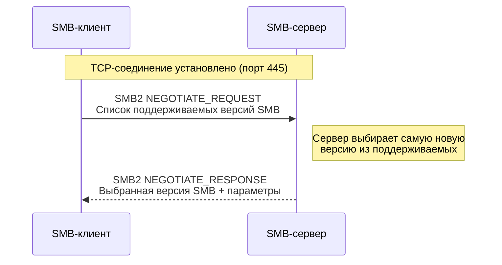
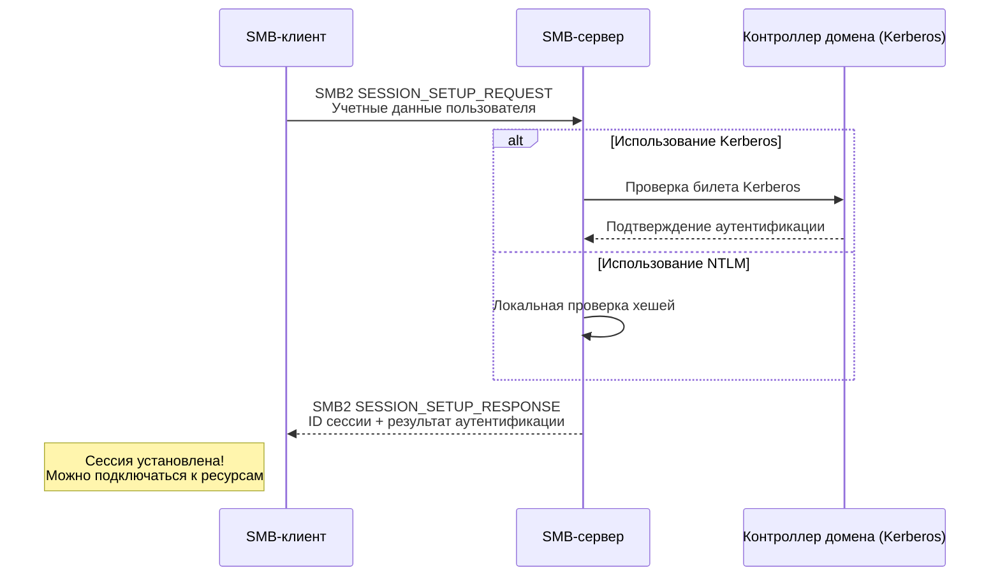
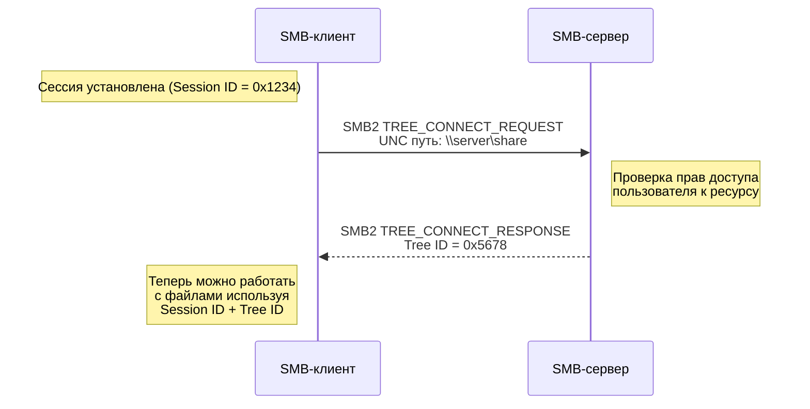
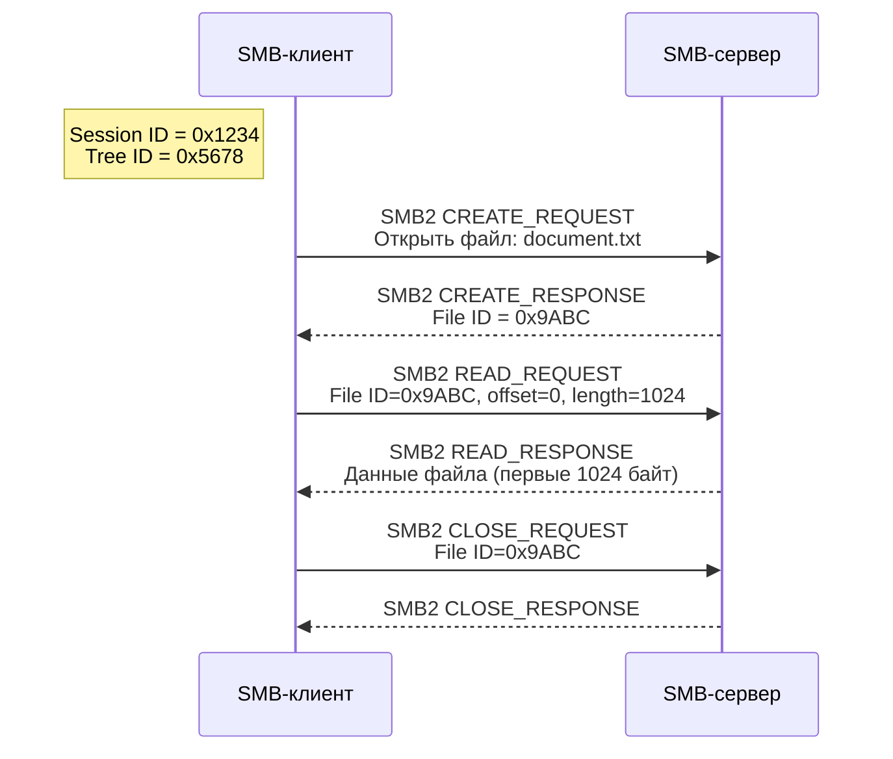
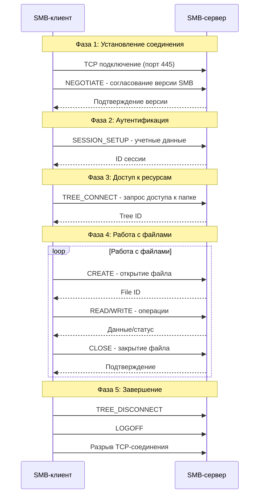
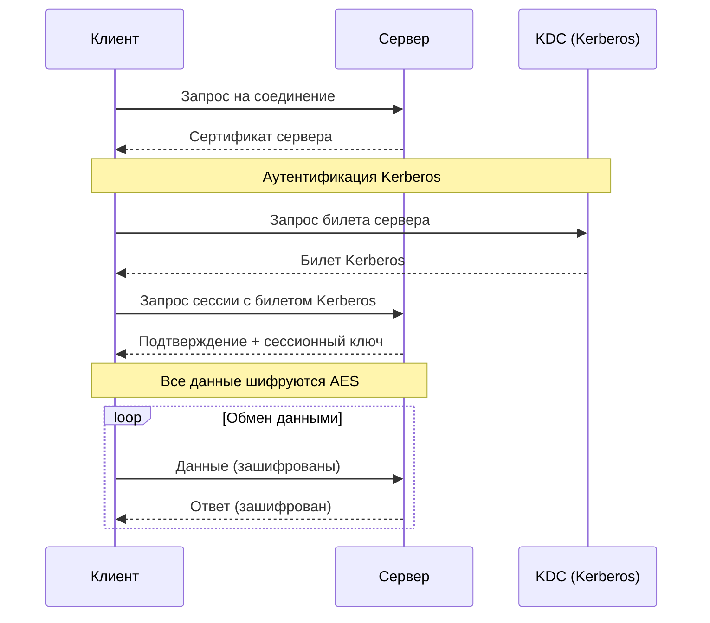

## Что такое SMB?

**SMB (Server Message Block)** — это сетевой протокол прикладного уровня для предоставления общего доступа к файлам, принтерам и другим сетевым ресурсам.

**Простая аналогия:**
Представьте, что у вас есть офис с:
- **Общими папками** (общие шкафы с документами)
- **Сетевыми принтерами** (общие принтеры)
- **Серверами** (главные хранилища)

SMB — это "правила общения", по которым ваш компьютер запрашивает у сервера: "Дай мне доступ к общей папке" или "Распечатай этот документ".

---

## Эволюция SMB

| Версия | Название | Год | Основные улучшения |
|--------|----------|-----|-------------------|
| SMB 1.0 | CIFS | 1983 | Базовая функциональность |
| SMB 2.0 | - | 2006 | Улучшение производительности |
| SMB 2.1 | - | 2010 | Оптимизация энергосбережения |
| SMB 3.0 | - | 2012 | Шифрование, отказоустойчивость |
| SMB 3.1.1 | - | 2015 | Улучшенная безопасность |

> **Важно:** SMB 1.0 устарел и небезопасен! Рекомендуется использовать SMB 2.0 или выше.

---

## Как работает SMB: Основные понятия

### Участники системы:
- **SMB-клиент** — компьютер, который запрашивает доступ к ресурсам
- **SMB-сервер** — компьютер, который предоставляет ресурсы
- **Общие ресурсы** — папки, принтеры, named pipes

### Ключевые операции:
- **Negotiate** — согласование версии протокола
- **Session Setup** — установка сессии и аутентификация
- **Tree Connect** — подключение к общему ресурсу
- **File Operations** — работа с файлами
- **Tree Disconnect** — отключение от ресурса

---

## Процесс установления соединения SMB

Давайте рассмотрим полный процесс от установки соединения до работы с файлами.

### Шаг 1: Установление соединения и согласование протокола



**Что происходит:**
- Клиент подключается к серверу по TCP порту 445
- Клиент отправляет список поддерживаемых им версий SMB
- Сервер выбирает наиболее новую совместно поддерживаемую версию
- Устанавливаются параметры соединения (максимальный размер буфера и т.д.)

---

### Шаг 2: Аутентификация и установка сессии



**Что происходит:**
- Клиент отправляет учетные данные (используя Kerberos или NTLM)
- Сервер проверяет подлинность пользователя
- При успешной аутентификации создается сессия с уникальным ID
- Все последующие запросы используют этот ID сессии

---

### Шаг 3: Подключение к общему ресурсу (Tree Connect)



**Что происходит:**
- Клиент запрашивает доступ к конкретному ресурсу (например, `\\server\shared_folder`)
- Сервер проверяет права доступа пользователя к этому ресурсу
- При успехе сервер возвращает Tree ID для работы с этим ресурсом

---

### Шаг 4: Работа с файлами и папками

После установки соединения клиент может выполнять различные операции:



**Что происходит:**
1. **CREATE** — открытие файла или создание нового
2. **READ** — чтение данных из файла
3. **WRITE** — запись данных в файл  
4. **CLOSE** — закрытие файла

---

## Полная схема работы SMB

Вот как выглядит полный цикл работы с SMB:



---

## Типы сообщений в SMB

### Базовые операции:
- **Управление сессией:** Negotiate, Session Setup, Logoff
- **Управление файлами:** Create, Read, Write, Close, Delete
- **Управление каталогами:** Query Directory, Create Directory
- **Информационные:** Query Info, Set Info

### Пример структуры SMB-пакета:
```
┌─────────────────────────┐
│      SMB2 HEADER        │
├─────────────────────────┤
│   Protocol ID: 0xFE534D42│
│   Header Length         │
│   Credit Charge         │
│   Status/Command        │
│   Credits               │
│   Flags                 │
│   Next Command          │
│   Message ID            │
│   Process ID            │
│   Tree ID               │
│   Session ID            │
│   Signature (16 bytes)  │
├─────────────────────────┤
│      SMB2 DATA          │
│   (зависит от команды)  │
└─────────────────────────┘
```

---

## Безопасность в SMB

### Методы аутентификации:
1. **NTLMv2** - устаревший, но еще используется
2. **Kerberos** - предпочтительный метод в доменах
3. **Анонимный доступ** - небезопасно!

### Шифрование (SMB 3.0+):
- **AES-128-CCM** - шифрование данных
- **AES-128-GCM** - более эффективное шифрование (SMB 3.1.1)
- **Подписание SMB** - защита от модификации пакетов

### Диаграмма безопасного соединения SMB 3.0:



---

## Практическое использование SMB

### Подключение к общей папке в Windows:
```cmd
# Через командную строку
net use Z: \\server\share /user:username password

# Или через проводник
\\server\share
```

### В Linux (через smbclient):
```bash
# Просмотр доступных ресурсов
smbclient -L //server -U username

# Подключение к папке
smbclient //server/share -U username
```

### Мониторинг SMB-сессий:
```powershell
# PowerShell
Get-SmbSession
Get-SmbOpenFile
```

---

## Проблемы и решения

### Частые проблемы:
1. **"Сетевой путь не найден"** - проблемы с DNS или именованием
2. **"Отказано в доступе"** - проблемы с правами пользователя
3. **"Не удается установить соединение"** - блокировка брандмауэром

### Решения:
- Проверить работу брандмауэра (порт 445)
- Убедиться, что SMB 1.0 отключен
- Проверить настройки DNS
- Верифицировать учетные данные пользователя

## Итог

SMB — это мощный протокол, который обеспечивает:
- **Общий доступ** к файлам и принтерам
- **Безопасность** через Kerberos и шифрование
- **Надежность** через механизмы повторных передач
- **Эффективность** через кэширование и оптимизацию

Понимание работы SMB необходимо для администрирования любых сетей Windows и решения проблем с сетевыми ресурсами.